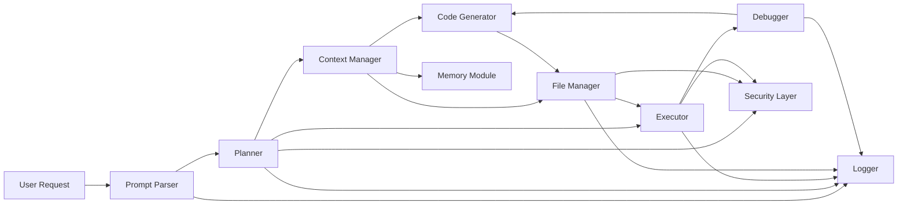
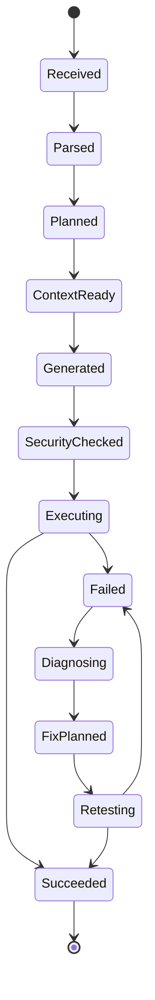

# 코딩 에이전트 아키텍처 및 기능 종합 명세서

## 1. 문서 개요

### 1.1 문서 목적

이 문서는 AI 기반 코딩 에이전트의 전체 기능, 구조, 동작 방식, 내부 로직, 제약사항을 실제 개발 및 운영에 즉시 활용 가능한 수준으로 설명하기 위한 종합 설계 문서다. 문서 수준은 단순 기능 설명이 아니라 다음 세 가지를 통합한 형태를 목표로 한다.

- 아키텍처 설계서
- 기능 명세서
- 운영 가이드의 기준 문서

### 1.2 대상 시스템

본 문서가 다루는 대상은 아래 능력을 가진 AI 기반 코딩 에이전트다.

- 코드 생성
- 기존 코드 수정
- 코드 분석 및 리뷰
- 코드 실행
- 테스트 및 디버깅
- 파일 시스템 조작
- 외부 API 및 SDK 호출
- 상태 관리 및 메모리 유지
- 보안 통제 및 감사 로깅

### 1.3 독자 대상

| 독자 | 활용 목적 |
|---|---|
| 개발자 | 실제 구현과 모듈 분리 기준 수립 |
| AI 엔지니어 | 프롬프트, 플래너, 컨텍스트, 메모리 전략 설계 |
| 플랫폼 엔지니어 | 실행 환경, 샌드박스, 권한 계층 설계 |
| QA | 기능 검증과 예외 시나리오 도출 |
| DevOps | 배포, 격리 실행, 모니터링, 감사 기준 수립 |

### 1.4 포함 범위

| 범위 | 포함 내용 |
|---|---|
| 입력 처리 | 사용자 요청 해석, 의도 분석, 작업 단위 분해 |
| 코드 생성 | 신규 코드 생성, diff 기반 수정, 리팩토링 |
| 실행 | 샌드박스 실행, stdout/stderr 수집, 종료 상태 관리 |
| 디버깅 | 오류 분석, 자동 수정, 재실행 |
| 파일 시스템 | 파일 생성/수정/삭제 제한, 디렉터리 탐색 및 구조 관리 |
| 외부 연동 | REST API, SDK, 도구 서버, 웹 요청 |
| 상태 관리 | 세션 상태, 작업 상태, 중간 산출물 상태 |
| 메모리 | 단기 메모리, 장기 메모리, 지식 캐시 |
| 보안 | 위험 코드 차단, 네트워크/파일 접근 제한, 승인 흐름 |
| 로그/감사 | 실행 로그, 사용자 행위 로그, 시스템 상태 로그 |

## 2. 전체 요구사항 구조

| 구분 | 상세 요구사항 |
|---|---|
| 문서 목적 | 코딩 에이전트의 전체 기능, 구조, 동작 방식, 내부 로직, 제약사항을 개발 및 운영에 즉시 활용 가능한 수준으로 문서화 |
| 대상 시스템 | 코드 생성, 수정, 분석, 실행, 테스트, 배포 지원까지 수행하는 AI 기반 코딩 에이전트 |
| 문서 수준 | 단순 설명이 아닌 아키텍처 설계서 + 기능 명세서 + 운영 가이드 통합 수준 |
| 독자 대상 | 개발자, AI 엔지니어, 플랫폼 엔지니어, QA, DevOps |
| 포함 범위 | 프롬프트 처리, 코드 생성, 코드 실행, 디버깅, 파일 시스템 조작, 외부 API 호출, 상태 관리, 메모리, 보안, 오류 처리 |

## 3. 시스템 목표와 비목표

### 3.1 목표

- 자연어 입력을 작업 가능한 실행 계획으로 변환한다.
- 기존 코드베이스를 안전하게 읽고 수정한다.
- 실행 결과와 오류를 바탕으로 반복 수정 루프를 수행한다.
- 파일/명령/API 접근을 보안 정책 안에서 통제한다.
- 세션과 메모리를 통해 작업 연속성을 유지한다.
- 모든 핵심 행위를 로그와 감사 데이터로 추적 가능하게 한다.

### 3.2 비목표

- 사용자 승인 없이 무제한 시스템 권한을 획득하지 않는다.
- 완전 자율 배포를 기본값으로 강제하지 않는다.
- 위험 명령 실행을 무조건 허용하지 않는다.
- 모든 외부 라이브러리/벤더의 세부 로직을 에이전트 내부에서 직접 구현하지 않는다.

## 4. 상위 아키텍처

### 4.1 구성 요소

| 구성 요소 | 역할 |
|---|---|
| Prompt Parser | 사용자 요청을 구조화된 작업 입력으로 변환 |
| Planner | 작업 단계 생성 및 실행 순서 설계 |
| Context Manager | 코드, 파일, 세션, 히스토리, 상태를 조합 |
| Code Generator | 신규 코드 생성, 코드 수정안 생성 |
| Executor | 샌드박스 환경에서 코드/명령 실행 |
| Debugger | 오류 원인 분석 및 수정 루프 수행 |
| File Manager | 파일 생성, 수정, 읽기, 디렉터리 탐색 |
| Memory Module | 세션 메모리와 장기 기억 관리 |
| Security Layer | 위험 제어, 정책 판정, 권한 승인 |
| Logger | 실행 로그, 감사 로그, 운영 지표 기록 |

### 4.2 아키텍처 다이어그램

### 4.3 설계 원칙

| 원칙 | 설명 |
|---|---|
| 구조적 분리 | 입력 해석, 계획, 실행, 디버깅, 파일 조작을 분리된 책임으로 유지 |
| 상태 명시화 | 세션, 작업, 실행, 오류 상태를 모두 명시적 상태 모델로 관리 |
| 보안 우선 | 실행 전 검증과 승인 체계를 기본 흐름에 포함 |
| 관측 가능성 | 모든 핵심 행위는 추적 가능해야 함 |
| 재현 가능성 | 실패 시 같은 입력과 상태로 재실행 가능해야 함 |

## 5. 기능 영역 분해

### 5.1 기능 목록

| 기능 영역 | 세부 기능 | 요구 상세 |
|---|---|---|
| 입력 처리 | 사용자 요청 해석 | 자연어를 작업 단위로 분해 |
| 입력 처리 | 의도 분석 | 생성, 수정, 디버깅, 분석, 실행 구분 |
| 입력 처리 | 컨텍스트 병합 | 기존 코드, 파일, 히스토리, 상태 결합 |
| 코드 생성 | 코드 작성 | 언어별 최적 코드 생성 |
| 코드 생성 | 코드 수정 | diff 기반 수정 |
| 코드 생성 | 리팩토링 | 구조 개선 및 최적화 |
| 실행 기능 | 코드 실행 | 샌드박스 환경 실행 |
| 실행 기능 | 결과 캡처 | stdout, stderr, exit code 처리 |
| 디버깅 | 오류 분석 | 에러 메시지 기반 원인 추론 |
| 디버깅 | 자동 수정 | 오류 해결 코드 재생성 |
| 파일 시스템 | 파일 생성 | 파일 생성, 덮어쓰기 |
| 파일 시스템 | 파일 수정 | 부분 수정 |
| 파일 시스템 | 디렉터리 관리 | 구조 생성 및 탐색 |
| 외부 연동 | API 호출 | REST, SDK 호출 |
| 상태 관리 | 세션 유지 | 작업 흐름 유지 |
| 상태 관리 | 메모리 | 단기, 장기 컨텍스트 |
| 보안 | 코드 제한 | 위험 코드 차단 |
| 보안 | 실행 제한 | 네트워크, 파일 접근 제어 |
| 로그 | 실행 로그 | 모든 작업 기록 |
| 로그 | 감사 로그 | 사용자 행위 기록 |

## 6. 기능별 상세 명세

### 6.1 사용자 요청 해석

- 기능명: 사용자 요청 해석
- 기능 개요: 자연어 입력을 실행 가능한 작업 단위로 파싱하는 기능
- 목적: 자유 형식의 요청을 내부적으로 처리 가능한 구조로 변환
- 입력 데이터:

| 필드 | 타입 | 설명 |
|---|---|---|
| raw_prompt | string | 사용자가 입력한 원문 |
| session_context | object | 현재 세션 상태 |
| user_profile | object | 권한, 선호, 역할 정보 |

- 출력 데이터:

| 필드 | 타입 | 설명 |
|---|---|---|
| normalized_request | object | 정규화된 요청 객체 |
| task_candidates | array | 추정된 작업 단위 리스트 |
| confidence | number | 해석 신뢰도 |

- 처리 흐름:
  1. 입력 텍스트를 문장 단위로 분리한다.
  2. 명령형 문장, 질문형 문장, 제약조건 문장을 구분한다.
  3. 작업 대상 파일, 언어, 기대 결과, 금지 조건을 추출한다.
  4. 구조화된 요청 객체로 변환한다.
- 내부 알고리즘:
  - 형태소/토큰 분석
  - 의도 분류 모델 또는 규칙 엔진
  - 엔터티 추출
  - 제약조건 정규화
- 상태 변화:
  - `raw_input_received` → `parsed` → `normalized`
- 의존성:
  - Prompt Parser
  - Context Manager
  - Logger
- 예외 처리:
  - 모호한 입력이면 clarification_required 상태로 전환
  - 빈 입력이면 no_op 처리
- 보안 제약:
  - 입력 텍스트 자체는 신뢰하지 않으며 위험 명령을 직접 실행하지 않음
- 로그 처리:
  - 원문 해시, 파싱 결과, 신뢰도 기록
- 테스트 포인트:
  - 생성/수정/디버깅 의도 분류
  - 다중 요청 분리
  - 모호한 요청 처리

### 6.2 의도 분석

- 기능명: 의도 분석
- 기능 개요: 요청을 생성, 수정, 디버깅, 분석, 실행, 배포 보조 중 하나 이상으로 분류
- 목적: 적절한 작업 파이프라인 선택
- 입력 데이터:

| 필드 | 설명 |
|---|---|
| normalized_request | 정규화된 요청 |
| prior_turns | 직전 대화 히스토리 |

- 출력 데이터:

| 필드 | 설명 |
|---|---|
| primary_intent | 주 의도 |
| secondary_intents | 보조 의도 |
| urgency | 긴급도 |

- 처리 흐름:
  1. 동사와 목적어 패턴을 분석한다.
  2. 현재 세션의 이전 상태와 비교한다.
  3. 의도 우선순위를 결정한다.
- 내부 알고리즘:
  - 다중 라벨 분류
  - 규칙 기반 우선순위 결합
- 상태 변화:
  - `parsed` → `intent_classified`
- 의존성:
  - Prompt Parser
  - Planner
- 예외 처리:
  - 의도 충돌 시 planner에 ambiguity flag 전달
- 보안 제약:
  - 배포 또는 파괴적 작업 의도는 항상 강화 검증 대상
- 로그 처리:
  - 의도, 신뢰도, 충돌 여부 기록
- 테스트 포인트:
  - 생성 vs 수정 구분
  - 디버깅 vs 분석 구분
  - 복합 의도 처리

### 6.3 컨텍스트 병합

- 기능명: 컨텍스트 병합
- 기능 개요: 코드, 파일, 대화 히스토리, 작업 상태를 하나의 작업 컨텍스트로 통합
- 목적: 모델이 필요한 정보만 정확히 참조하도록 지원
- 입력 데이터:

| 필드 | 설명 |
|---|---|
| working_directory | 현재 작업 루트 |
| referenced_files | 직접 지정된 파일 |
| session_history | 이전 메시지 |
| memory_entries | 단기/장기 메모리 |

- 출력 데이터:

| 필드 | 설명 |
|---|---|
| merged_context | 통합 컨텍스트 |
| missing_context | 추가 조회가 필요한 정보 |

- 처리 흐름:
  1. 직접 참조 파일을 우선 로드한다.
  2. 관련 파일과 심볼을 탐색한다.
  3. 세션과 메모리에서 필요한 배경 정보를 합친다.
  4. 토큰 예산에 맞게 요약 또는 축약한다.
- 내부 알고리즘:
  - relevance scoring
  - sliding window context selection
  - semantic retrieval
- 상태 변화:
  - `intent_classified` → `context_ready`
- 의존성:
  - File Manager
  - Memory Module
  - Planner
- 예외 처리:
  - 파일 없음이면 missing_context에 기록
  - 토큰 초과면 요약 모드로 전환
- 보안 제약:
  - 허용 경로 외 파일은 로드하지 않음
- 로그 처리:
  - 사용된 파일 목록, 생략된 파일, 요약 여부 기록
- 테스트 포인트:
  - 다중 파일 병합
  - 긴 히스토리 축약
  - 허용 경로 외 접근 차단

### 6.4 코드 작성

- 기능명: 코드 작성
- 기능 개요: 지정 언어와 프레임워크에 맞는 신규 코드를 생성
- 목적: 기능 개발 속도 향상과 반복 작업 자동화
- 입력 데이터:

| 필드 | 설명 |
|---|---|
| task_spec | 구현 대상 요구사항 |
| target_language | 언어 |
| project_conventions | 프로젝트 규칙 |

- 출력 데이터:

| 필드 | 설명 |
|---|---|
| generated_code | 생성된 코드 |
| rationale | 생성 근거 요약 |
| follow_up_actions | 추가 생성/수정 항목 |

- 처리 흐름:
  1. 요구사항과 프로젝트 규칙을 결합한다.
  2. 언어별 템플릿/패턴을 선택한다.
  3. 코드 초안을 생성한다.
  4. 정적 검토 규칙으로 1차 검증한다.
- 내부 알고리즘:
  - language-aware prompting
  - convention-aware synthesis
  - lightweight static lint heuristic
- 상태 변화:
  - `context_ready` → `code_draft_generated`
- 의존성:
  - Code Generator
  - Context Manager
  - Security Layer
- 예외 처리:
  - 요구사항 불충분 시 clarification_required
- 보안 제약:
  - 위험 API 사용 패턴은 security pre-check 수행
- 로그 처리:
  - 생성 범위, 대상 파일, 코드 길이 기록
- 테스트 포인트:
  - 언어별 생성 정확성
  - 프로젝트 규칙 반영
  - 보안 금지 패턴 차단

### 6.5 코드 수정

- 기능명: 코드 수정
- 기능 개요: 기존 코드의 일부를 변경하는 diff 중심 수정 기능
- 목적: 최소 변경 원칙으로 안정적인 코드 수정 지원
- 입력 데이터:

| 필드 | 설명 |
|---|---|
| target_file | 대상 파일 |
| existing_content | 기존 코드 |
| change_request | 수정 요구사항 |

- 출력 데이터:

| 필드 | 설명 |
|---|---|
| patch | diff 또는 패치 |
| updated_content | 수정 후 코드 |

- 처리 흐름:
  1. 대상 코드 범위를 식별한다.
  2. 변경 범위를 최소 단위로 계산한다.
  3. diff 또는 patch 형태의 수정안을 만든다.
  4. 충돌 가능성을 검사한다.
- 내부 알고리즘:
  - AST 기반 또는 라인 기반 diff
  - context-preserving patch generation
- 상태 변화:
  - `context_ready` → `patch_prepared` → `applied`
- 의존성:
  - File Manager
  - Code Generator
  - Logger
- 예외 처리:
  - 대상 블록 미발견 시 fallback search 또는 수동 확인 상태
  - 동시 수정 충돌 시 conflict 상태
- 보안 제약:
  - 허용되지 않은 파일에 대한 수정 금지
- 로그 처리:
  - patch metadata, 변경 라인 수 기록
- 테스트 포인트:
  - 부분 수정 정확성
  - 최소 diff 보장
  - 충돌 감지

### 6.6 리팩토링

- 기능명: 리팩토링
- 기능 개요: 기능은 유지하면서 구조, 가독성, 성능을 개선
- 목적: 코드 품질 향상과 유지보수 비용 절감
- 입력 데이터:

| 필드 | 설명 |
|---|---|
| codebase_slice | 리팩토링 대상 영역 |
| constraints | 동작 불변 조건 |

- 출력 데이터:

| 필드 | 설명 |
|---|---|
| refactor_plan | 단계별 리팩토링 계획 |
| patches | 적용 패치 |

- 처리 흐름:
  1. 냄새 코드와 중복 구조를 탐지한다.
  2. 불변 조건을 정의한다.
  3. 단계별 리팩토링 계획을 생성한다.
  4. 단계별 패치를 적용한다.
- 내부 알고리즘:
  - smell detection heuristics
  - dependency-aware refactor sequencing
- 상태 변화:
  - `analysis_complete` → `refactor_planned` → `refactor_applied`
- 의존성:
  - Planner
  - Code Generator
  - Executor
- 예외 처리:
  - 영향 범위가 클 경우 staged refactor 제안
- 보안 제약:
  - 인증/권한 로직 리팩토링은 추가 검증 필요
- 로그 처리:
  - 변경 이유, 영향 범위, 모듈 수 기록
- 테스트 포인트:
  - 동작 불변 확인
  - 퍼포먼스 회귀 방지

### 6.7 코드 실행

- 기능명: 코드 실행
- 기능 개요: 샌드박스 안에서 코드 또는 명령을 실행
- 목적: 생성/수정 결과를 실제로 검증
- 입력 데이터:

| 필드 | 설명 |
|---|---|
| command | 실행 명령 |
| runtime_config | timeout, 메모리 제한, 네트워크 정책 |
| working_dir | 실행 기준 경로 |

- 출력 데이터:

| 필드 | 설명 |
|---|---|
| exit_code | 종료 코드 |
| stdout | 표준 출력 |
| stderr | 표준 오류 |
| runtime_metrics | 시간, 메모리 사용량 |

- 처리 흐름:
  1. Security Layer가 실행 허용 여부를 판단한다.
  2. 샌드박스 실행 컨텍스트를 준비한다.
  3. 명령을 실행한다.
  4. stdout/stderr와 메트릭을 수집한다.
  5. 성공/실패 상태를 기록한다.
- 내부 알고리즘:
  - process supervisor
  - stream capture
  - timeout watchdog
- 상태 변화:
  - `ready_to_execute` → `running` → `succeeded` 또는 `failed` 또는 `timed_out`
- 의존성:
  - Executor
  - Security Layer
  - Logger
- 예외 처리:
  - timeout이면 즉시 프로세스 종료
  - 메모리 초과 시 강제 중단
- 보안 제약:
  - 허용된 명령/경로/네트워크만 실행 가능
- 로그 처리:
  - command hash, stdout/stderr, exit code 기록
- 테스트 포인트:
  - 정상 실행
  - timeout
  - memory limit 초과

### 6.8 결과 캡처

- 기능명: 실행 결과 캡처
- 기능 개요: stdout, stderr, exit code, 메트릭을 구조화해 후속 단계로 전달
- 목적: 디버깅과 자동 수정 루프에 필요한 근거 확보
- 입력 데이터:

| 필드 | 설명 |
|---|---|
| process_streams | 실행 스트림 |
| process_status | 종료 정보 |

- 출력 데이터:

| 필드 | 설명 |
|---|---|
| execution_result | 구조화된 실행 결과 |
| diagnostics_input | 디버깅용 입력 |

- 처리 흐름:
  1. stdout/stderr를 분리 수집한다.
  2. 종료 코드와 종료 사유를 추가한다.
  3. 길이가 긴 출력은 요약 가능한 형태로 분리 저장한다.
- 내부 알고리즘:
  - stream buffer management
  - structured result normalization
- 상태 변화:
  - `running` → `captured`
- 의존성:
  - Executor
  - Debugger
  - Logger
- 예외 처리:
  - 출력 과다 시 truncate + 별도 저장
- 보안 제약:
  - 민감 정보가 로그에 남지 않도록 redaction 필요
- 로그 처리:
  - 원문/요약본/마스킹 여부 기록
- 테스트 포인트:
  - stdout/stderr 분리
  - 긴 출력 처리
  - 민감정보 마스킹

### 6.9 오류 분석

- 기능명: 오류 분석
- 기능 개요: 문법 오류, 런타임 오류, 테스트 실패를 분석해 원인 후보를 도출
- 목적: 자동 수정 및 재시도 루프의 정확도 향상
- 입력 데이터:

| 필드 | 설명 |
|---|---|
| execution_result | 실행 결과 |
| recent_changes | 최근 변경 코드 |
| prior_failures | 이전 실패 기록 |

- 출력 데이터:

| 필드 | 설명 |
|---|---|
| root_cause_candidates | 원인 후보 리스트 |
| fix_strategy | 추천 수정 전략 |
| confidence | 추론 신뢰도 |

- 처리 흐름:
  1. 오류 메시지와 스택트레이스를 분석한다.
  2. 최근 변경 위치와 대조한다.
  3. 원인 후보를 점수화한다.
  4. 수정 전략을 선택한다.
- 내부 알고리즘:
  - error signature matching
  - stacktrace mapping
  - change impact correlation
- 상태 변화:
  - `failed` → `diagnosing`
  - `diagnosing` → `fix_planned`
- 의존성:
  - Debugger
  - Executor
  - Logger
- 예외 처리:
  - 원인 불명확 시 human_review_required 상태
- 보안 제약:
  - 외부 시스템 장애와 내부 코드 오류를 구분해야 함
- 로그 처리:
  - error type, signature, suspected files 기록
- 테스트 포인트:
  - 문법 오류 분석
  - 런타임 예외 분석
  - 테스트 실패 매핑

### 6.10 자동 수정

- 기능명: 자동 수정
- 기능 개요: 오류 원인 분석 결과를 바탕으로 코드 수정안을 생성하고 적용
- 목적: 반복적인 디버깅을 자동화
- 입력 데이터:

| 필드 | 설명 |
|---|---|
| fix_strategy | 수정 전략 |
| root_cause_candidates | 원인 후보 |
| target_files | 수정 대상 파일 |

- 출력 데이터:

| 필드 | 설명 |
|---|---|
| fix_patch | 수정 패치 |
| retry_plan | 재실행 계획 |

- 처리 흐름:
  1. 수정 가능한 원인 후보를 선택한다.
  2. 수정 패치를 생성한다.
  3. 패치를 적용한다.
  4. 제한된 횟수 내에서 재실행한다.
- 내부 알고리즘:
  - targeted repair generation
  - retry budget control
- 상태 변화:
  - `fix_planned` → `fix_applied` → `retesting`
- 의존성:
  - Code Generator
  - File Manager
  - Executor
- 예외 처리:
  - 수정 실패 또는 재실행 반복 실패 시 escalation
- 보안 제약:
  - 위험한 우회 수정은 금지
- 로그 처리:
  - fix iteration count, patch summary 기록
- 테스트 포인트:
  - 단일 수정 루프 성공
  - 반복 실패 후 중단
  - 수정 범위 최소화

### 6.11 파일 생성

- 기능명: 파일 생성
- 기능 개요: 새 파일을 생성하고 내용을 기록
- 목적: 신규 기능 파일, 설정 파일, 테스트 파일 생성 지원
- 입력 데이터:

| 필드 | 설명 |
|---|---|
| file_path | 생성 경로 |
| content | 파일 내용 |
| overwrite | 기존 파일 덮어쓰기 여부 |

- 출력 데이터:

| 필드 | 설명 |
|---|---|
| created | 생성 성공 여부 |
| file_metadata | 생성 시각, 크기, 경로 |

- 처리 흐름:
  1. 경로 유효성을 검사한다.
  2. 상위 디렉터리를 점검한다.
  3. overwrite 규칙에 따라 생성 또는 차단한다.
  4. 내용을 기록한다.
- 내부 알고리즘:
  - safe path resolution
  - atomic write where possible
- 상태 변화:
  - `pending_write` → `created` 또는 `write_denied`
- 의존성:
  - File Manager
  - Security Layer
- 예외 처리:
  - 파일 충돌 시 rollback 또는 overwrite 승인 요구
- 보안 제약:
  - 허용 경로 외 생성 금지
- 로그 처리:
  - 파일 경로, overwrite 여부 기록
- 테스트 포인트:
  - 신규 파일 생성
  - 동일 파일 존재 시 분기
  - 허용 경로 외 차단

### 6.12 파일 수정

- 기능명: 파일 수정
- 기능 개요: 기존 파일의 일부 또는 전체를 변경
- 목적: 정밀 수정과 대규모 패치 적용 지원
- 입력 데이터:

| 필드 | 설명 |
|---|---|
| file_path | 대상 경로 |
| patch | 변경 패치 |
| expected_base | 충돌 검사용 기준 내용 |

- 출력 데이터:

| 필드 | 설명 |
|---|---|
| modified | 수정 성공 여부 |
| conflict_detected | 충돌 여부 |

- 처리 흐름:
  1. 현재 파일 내용을 읽는다.
  2. expected_base와 비교한다.
  3. 충돌이 없으면 patch를 적용한다.
  4. 저장 후 검증한다.
- 내부 알고리즘:
  - optimistic concurrency control
  - patch apply engine
- 상태 변화:
  - `patch_prepared` → `patch_applying` → `modified` 또는 `conflict`
- 의존성:
  - File Manager
  - Logger
- 예외 처리:
  - 파일 충돌 시 merge 또는 재생성 필요
- 보안 제약:
  - 민감 파일은 추가 승인 필요
- 로그 처리:
  - 변경 블록, 충돌 여부 기록
- 테스트 포인트:
  - 부분 수정
  - 동시 변경 충돌
  - 저장 후 재검증

### 6.13 디렉터리 관리

- 기능명: 디렉터리 관리
- 기능 개요: 디렉터리 생성, 탐색, 구조 스캔, 트리 조회
- 목적: 코드베이스 구조 인지와 신규 디렉터리 생성 지원
- 입력 데이터:

| 필드 | 설명 |
|---|---|
| root_path | 기준 경로 |
| create_path | 생성 대상 경로 |
| scan_options | 깊이, 제외 패턴 |

- 출력 데이터:

| 필드 | 설명 |
|---|---|
| tree | 디렉터리 구조 |
| created_dirs | 생성된 디렉터리 목록 |

- 처리 흐름:
  1. 기준 경로를 정규화한다.
  2. 제외 규칙을 반영해 탐색한다.
  3. 필요 시 경로를 생성한다.
- 내부 알고리즘:
  - recursive traversal
  - ignore pattern filtering
- 상태 변화:
  - `dir_scan_requested` → `dir_scanned`
- 의존성:
  - File Manager
  - Security Layer
- 예외 처리:
  - 경로 없음 또는 권한 없음 처리
- 보안 제약:
  - 허용 경로 외 탐색 금지
- 로그 처리:
  - scan root, 생성 경로 기록
- 테스트 포인트:
  - 트리 조회
  - 중첩 디렉터리 생성
  - ignore 패턴 적용

### 6.14 외부 API 호출

- 기능명: 외부 API 호출
- 기능 개요: REST API 또는 SDK를 호출해 외부 시스템과 상호작용
- 목적: 저장소, 배포, 이슈 추적, 문서 서비스 등과 연동
- 입력 데이터:

| 필드 | 설명 |
|---|---|
| endpoint_or_sdk | 호출 대상 |
| method_or_operation | 메서드 또는 SDK 함수 |
| params | 파라미터 |
| auth_context | 인증 정보 |

- 출력 데이터:

| 필드 | 설명 |
|---|---|
| response | 응답 본문 |
| status | 응답 상태 |
| retryable | 재시도 가능 여부 |

- 처리 흐름:
  1. 호출 대상과 인증을 검증한다.
  2. request payload를 구성한다.
  3. timeout/retry 정책 하에 호출한다.
  4. 응답을 정규화한다.
- 내부 알고리즘:
  - request normalization
  - error classification
  - retry backoff
- 상태 변화:
  - `api_call_pending` → `api_calling` → `api_succeeded` 또는 `api_failed`
- 의존성:
  - Executor
  - Security Layer
  - Logger
- 예외 처리:
  - 5xx 및 일시적 실패는 retry
  - 인증 실패는 즉시 중단
- 보안 제약:
  - 허용 도메인, 허용 method만 호출 가능
- 로그 처리:
  - endpoint, latency, status code 기록
- 테스트 포인트:
  - 정상 REST 호출
  - timeout/retry
  - 인증 실패

### 6.15 세션 유지

- 기능명: 세션 유지
- 기능 개요: 다중 턴 작업 흐름과 중간 상태를 유지
- 목적: 긴 작업을 한 번의 요청으로 끝내지 않고 이어서 수행
- 입력 데이터:

| 필드 | 설명 |
|---|---|
| session_id | 세션 식별자 |
| user_messages | 사용자 메시지 |
| task_states | 현재 작업 상태 |

- 출력 데이터:

| 필드 | 설명 |
|---|---|
| updated_session | 갱신된 세션 상태 |
| resume_cursor | 재개용 포인터 |

- 처리 흐름:
  1. 세션을 조회 또는 생성한다.
  2. 메시지와 상태를 누적한다.
  3. 작업 포인터를 갱신한다.
  4. 재개 가능한 형태로 저장한다.
- 내부 알고리즘:
  - append-only transcript
  - resumable checkpointing
- 상태 변화:
  - `session_open` → `session_active` → `session_paused` 또는 `session_closed`
- 의존성:
  - Context Manager
  - Memory Module
  - Logger
- 예외 처리:
  - 세션 파일 손상 시 복구 가능한 범위까지 복원
- 보안 제약:
  - 민감 세션 데이터는 접근 권한 제어 필요
- 로그 처리:
  - session id, turn index, checkpoint 기록
- 테스트 포인트:
  - 장시간 세션 유지
  - 세션 재개
  - 손상 복구

### 6.16 메모리

- 기능명: 메모리
- 기능 개요: 단기 메모리와 장기 메모리를 통해 작업 연속성과 선호를 유지
- 목적: 매 턴마다 모든 배경 정보를 다시 주지 않아도 되도록 함
- 입력 데이터:

| 필드 | 설명 |
|---|---|
| short_term_buffer | 현재 세션 중심 정보 |
| long_term_store | 사용자/프로젝트 장기 정보 |
| retrieval_query | 회수 질의 |

- 출력 데이터:

| 필드 | 설명 |
|---|---|
| retrieved_memory | 회수된 메모리 |
| writeback_entries | 새로 저장할 메모리 |

- 처리 흐름:
  1. 세션 중 중요 정보를 단기 메모리에 저장한다.
  2. 반복적 가치가 있는 정보는 장기 메모리 후보로 승격한다.
  3. 새 요청 시 관련 메모리를 조회해 컨텍스트에 합친다.
- 내부 알고리즘:
  - salience scoring
  - memory promotion
  - retrieval ranking
- 상태 변화:
  - `ephemeral` → `short_term`
  - `short_term` → `long_term_candidate` → `long_term`
- 의존성:
  - Memory Module
  - Context Manager
- 예외 처리:
  - 메모리 충돌 시 최신값 우선 또는 병합 전략 사용
- 보안 제약:
  - 민감정보는 저장 금지 또는 마스킹 저장
- 로그 처리:
  - memory read/write 이벤트 기록
- 테스트 포인트:
  - 단기 메모리 회수
  - 장기 메모리 승격
  - 민감정보 필터링

### 6.17 코드 제한

- 기능명: 코드 제한
- 기능 개요: 위험 코드 패턴을 차단하거나 추가 승인을 요구
- 목적: 악성 코드, 파괴적 명령, 데이터 유출 경로 차단
- 입력 데이터:

| 필드 | 설명 |
|---|---|
| candidate_code | 생성 또는 수정 코드 |
| policy_rules | 금지/제한 규칙 |

- 출력 데이터:

| 필드 | 설명 |
|---|---|
| risk_assessment | 위험 평가 결과 |
| action | allow, deny, require_approval |

- 처리 흐름:
  1. 코드 패턴을 스캔한다.
  2. 정책 규칙과 비교한다.
  3. 위험도를 산정한다.
  4. 허용/차단/승인을 결정한다.
- 내부 알고리즘:
  - rule-based pattern matching
  - semantic risk classification
- 상태 변화:
  - `code_draft_generated` → `security_checked`
- 의존성:
  - Security Layer
  - Code Generator
- 예외 처리:
  - 판단 불가 시 require_approval
- 보안 제약:
  - shell injection, credential exfiltration, destructive file ops 감지 필요
- 로그 처리:
  - 정책 rule id, 판단 결과 기록
- 테스트 포인트:
  - 위험 코드 차단
  - 정상 코드 허용
  - 모호한 코드 승인 요구

### 6.18 실행 제한

- 기능명: 실행 제한
- 기능 개요: 파일, OS 명령, 네트워크, 자원 사용량을 제한
- 목적: 에이전트 실행 범위를 통제
- 입력 데이터:

| 필드 | 설명 |
|---|---|
| execution_request | 명령 또는 코드 실행 요청 |
| sandbox_profile | 제한 정책 |

- 출력 데이터:

| 필드 | 설명 |
|---|---|
| allowed | 실행 허용 여부 |
| applied_limits | 적용된 제한 |

- 처리 흐름:
  1. 요청 명령을 해석한다.
  2. sandbox profile과 비교한다.
  3. 허용 범위를 계산한다.
  4. 제한을 적용한 실행 컨텍스트를 만든다.
- 내부 알고리즘:
  - command allowlist/denylist
  - path sandbox resolution
  - network policy enforcement
- 상태 변화:
  - `execution_requested` → `approved_for_execution` 또는 `execution_denied`
- 의존성:
  - Security Layer
  - Executor
- 예외 처리:
  - 제한 위반 시 즉시 거부
- 보안 제약:
  - 허용 경로 밖 파일 접근 금지
  - 외부 네트워크 금지 또는 allowlist 기반 허용
- 로그 처리:
  - 차단 사유, policy id 기록
- 테스트 포인트:
  - 경로 제한
  - 명령 제한
  - 네트워크 제한

### 6.19 실행 로그

- 기능명: 실행 로그
- 기능 개요: 에이전트의 모든 주요 작업을 운영용 로그로 기록
- 목적: 재현, 디버깅, 운영 모니터링 지원
- 입력 데이터:

| 필드 | 설명 |
|---|---|
| event_type | 이벤트 종류 |
| event_payload | 상세 데이터 |

- 출력 데이터:

| 필드 | 설명 |
|---|---|
| log_entry | 저장된 로그 |

- 처리 흐름:
  1. 이벤트를 표준 스키마로 변환한다.
  2. 레벨을 분류한다.
  3. 적절한 sink에 기록한다.
- 내부 알고리즘:
  - structured logging
  - sink routing
- 상태 변화:
  - `event_emitted` → `logged`
- 의존성:
  - Logger
- 예외 처리:
  - 로그 저장 실패 시 fallback sink 사용
- 보안 제약:
  - 비밀정보 마스킹
- 로그 처리:
  - 이 기능 자체가 로그 기록 기능임
- 테스트 포인트:
  - 정상 로그 적재
  - 마스킹 검증
  - sink failover

### 6.20 감사 로그

- 기능명: 감사 로그
- 기능 개요: 사용자 행위, 승인, 거부, 민감 작업 수행 이력을 추적
- 목적: 보안 감사, 운영 추적, 책임성 확보
- 입력 데이터:

| 필드 | 설명 |
|---|---|
| actor | 사용자 또는 시스템 주체 |
| action | 수행 행위 |
| resource | 대상 리소스 |
| decision | 승인/거부/실행 결과 |

- 출력 데이터:

| 필드 | 설명 |
|---|---|
| audit_record | 감사 레코드 |

- 처리 흐름:
  1. 민감 이벤트를 식별한다.
  2. actor, resource, decision을 구조화한다.
  3. tamper-resistant 저장소 또는 별도 sink에 기록한다.
- 내부 알고리즘:
  - immutable audit append
  - actor/resource normalization
- 상태 변화:
  - `auditable_event_detected` → `audited`
- 의존성:
  - Security Layer
  - Logger
- 예외 처리:
  - 감사 로그 sink 장애 시 경고와 fallback 저장
- 보안 제약:
  - 임의 수정 불가 저장 전략 필요
- 로그 처리:
  - actor, time, action, decision, trace id 기록
- 테스트 포인트:
  - 승인/거부 이벤트 감사 기록
  - 민감 파일 수정 감사 기록
  - fallback sink 동작

## 7. 상태 모델

### 7.1 작업 상태 전이

### 7.2 세션 상태

| 상태 | 설명 |
|---|---|
| open | 새 세션 생성 직후 |
| active | 현재 턴 처리 중 |
| waiting | 사용자 입력 대기 |
| paused | 백그라운드 또는 중단 상태 |
| resumed | 저장 세션 복원 후 |
| closed | 종료됨 |

## 8. 내부 의존성 구조

| 모듈 | 직접 의존성 |
|---|---|
| Prompt Parser | Logger |
| Planner | Prompt Parser, Context Manager, Security Layer |
| Context Manager | File Manager, Memory Module, Logger |
| Code Generator | Planner, Context Manager, Security Layer |
| Executor | Security Layer, Logger |
| Debugger | Executor, Code Generator, Logger |
| File Manager | Security Layer, Logger |
| Memory Module | Context Manager, Logger |
| Security Layer | Policy Store, Logger |
| Logger | Storage, Metrics Sink |

## 9. 구현 시 권장 분리 단위

| 레이어 | 구현 권장 단위 |
|---|---|
| API/Entry | request handler, session router |
| Orchestration | planner, task coordinator |
| Domain | code generation, debug, security, memory |
| Infra | sandbox, fs adapter, api client, logger |
| Storage | session store, memory store, audit store |

## 10. 운영 관점 체크리스트

- 샌드박스 제한이 실제로 적용되는가
- 로그와 감사 로그가 분리되어 수집되는가
- 세션 복구가 가능한가
- timeout과 retry가 무한 반복되지 않는가
- 위험 명령과 위험 코드가 승인 없이 실행되지 않는가

## 11. 연계 문서

- 데이터 흐름/보안/오류 처리 문서: [coding-agent-flow-security-spec-ko.md](D:/project/openpro/docs/coding-agent-flow-security-spec-ko.md)
- OpenPro 제품 기준 문서: [openpro-functional-spec-ko.md](D:/project/openpro/docs/openpro-functional-spec-ko.md)
