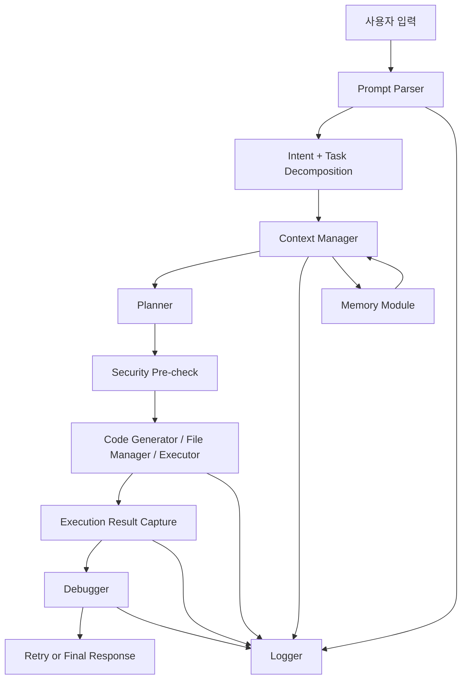
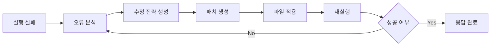

# 코딩 에이전트 데이터 흐름, 보안, 오류 처리 명세서

## 1. 문서 목적

이 문서는 코딩 에이전트의 내부 데이터 흐름, 실행 흐름, 보안 제어, 오류 및 예외 처리 방식을 별도로 설명하는 구현/운영 보조 문서다. 아키텍처 전체 설명은 [coding-agent-architecture-spec-ko.md](D:/project/openpro/docs/coding-agent-architecture-spec-ko.md)를 기준으로 한다.

## 2. 데이터 흐름 개요

### 2.1 상위 흐름

### 2.2 단계별 데이터 흐름

| 단계 | 입력 | 처리 | 출력 |
|---|---|---|---|
| 입력 수신 | raw_prompt, session_id | 입력 파싱 | normalized_request |
| 의도 분석 | normalized_request | intent classification | task_spec |
| 컨텍스트 수집 | task_spec, files, session, memory | 컨텍스트 병합 | merged_context |
| 계획 수립 | merged_context | 실행 계획 생성 | plan |
| 보안 점검 | plan, policy | 허용/차단 판정 | gated_plan |
| 생성/수정 | gated_plan | 코드 생성/파일 수정안 계산 | patch 또는 generated_code |
| 실행 | command/runtime config | 샌드박스 실행 | stdout, stderr, exit_code |
| 오류 분석 | 실행 결과 | 원인 추론 | root_cause_candidates |
| 자동 수정 | 원인/전략 | patch 생성 및 적용 | fix_patch |
| 응답 정리 | 결과/로그 | 사용자 응답 구성 | final_response |

## 3. 상세 데이터 모델

### 3.1 RequestEnvelope

| 필드 | 타입 | 설명 |
|---|---|---|
| request_id | string | 요청 추적 ID |
| session_id | string | 세션 식별자 |
| actor_id | string | 사용자 또는 시스템 주체 |
| raw_prompt | string | 원문 프롬프트 |
| metadata | object | 채널, 시간, client 정보 |

### 3.2 TaskSpec

| 필드 | 타입 | 설명 |
|---|---|---|
| task_id | string | 작업 식별자 |
| primary_intent | enum | `generate`, `modify`, `debug`, `analyze`, `execute`, `deploy_support` |
| targets | array | 파일, 디렉터리, 서비스 대상 |
| constraints | array | 금지 조건, 스타일 조건, 보안 조건 |
| expected_output | object | 결과 기대 형태 |

### 3.3 ContextBundle

| 필드 | 타입 | 설명 |
|---|---|---|
| files | array | 로드된 파일 목록 |
| symbols | array | 관련 심볼 |
| history | array | 최근 턴 히스토리 |
| memory | object | 회수된 단기/장기 메모리 |
| env | object | 실행 관련 환경 |

### 3.4 ExecutionResult

| 필드 | 타입 | 설명 |
|---|---|---|
| exit_code | int | 종료 코드 |
| stdout | string | 표준 출력 |
| stderr | string | 표준 오류 |
| timed_out | boolean | 타임아웃 여부 |
| memory_exceeded | boolean | 메모리 초과 여부 |
| metrics | object | 시간, 메모리, CPU 등의 메트릭 |

## 4. 실행 흐름 상세

### 4.1 정상 흐름

1. 사용자가 요청을 입력한다.
2. Prompt Parser가 요청을 구조화한다.
3. Planner가 작업 단계를 정의한다.
4. Context Manager가 필요한 파일과 상태를 불러온다.
5. Security Layer가 실행 가능성을 검사한다.
6. Code Generator 또는 File Manager가 변경안을 만든다.
7. Executor가 샌드박스에서 실행한다.
8. Debugger가 필요 시 실패를 분석한다.
9. 최종 응답과 변경 결과를 사용자에게 반환한다.

### 4.2 디버깅 루프

### 4.3 재시도 예산

| 항목 | 권장 정책 |
|---|---|
| 문법 오류 자동 수정 | 1~3회 |
| 런타임 오류 자동 수정 | 1~2회 |
| 외부 API 일시 실패 | backoff 포함 3~10회 |
| 동일 원인 반복 | 원인 중복 감지 시 즉시 중단 |

## 5. 보안 및 제한 요구

### 5.1 실행 제한

| 구분 | 상세 요구 |
|---|---|
| OS 명령 제한 | 허용된 명령만 실행, 파괴적 명령은 차단 또는 승인 필요 |
| 프로세스 제한 | timeout, memory limit, CPU limit 적용 |
| 하위 프로세스 | 지정된 샌드박스 내부에서만 실행 |

### 5.2 파일 접근 제한

| 구분 | 상세 요구 |
|---|---|
| 허용 경로 | 워크스페이스 및 승인된 경로만 허용 |
| 쓰기 제한 | 민감 파일, 설정 파일, 키 파일은 추가 승인 필요 |
| 충돌 방지 | expected base 비교 또는 체크포인트 기반 수정 |

### 5.3 네트워크 제한

| 구분 | 상세 요구 |
|---|---|
| 외부 호출 제한 | 기본 차단 또는 allowlist 기반 허용 |
| 도메인 정책 | 신뢰 도메인만 허용 |
| 메서드 제한 | 필요 메서드만 허용 |
| 데이터 유출 차단 | 비밀정보 포함 요청 금지 또는 마스킹 |

### 5.4 코드 필터링

| 구분 | 상세 요구 |
|---|---|
| 위험 코드 차단 | shell injection, credential exfiltration, destructive ops 탐지 |
| 승인 필요 코드 | 시스템 설정 변경, 외부 배포, root 권한 요청 |
| 차단 우선 | 안전 판단 불가 시 기본 deny 또는 approval |

### 5.5 사용자 권한

| 역할 | 허용 범위 예시 |
|---|---|
| 일반 개발자 | 프로젝트 코드 읽기/수정, 제한된 실행 |
| QA | 읽기, 테스트 실행, 일부 수정 제한 |
| 운영자 | 설정 변경, 로그 조회, MCP/플러그인 제어 |
| 관리자 | 정책 변경, 감사 로그 조회, 원격 제어 허용 관리 |

### 5.6 샌드박스 요구

| 항목 | 요구 내용 |
|---|---|
| 격리 실행 환경 | 파일, 네트워크, 프로세스 자원을 격리 |
| 경로 해석 | 실제 허용 경로로 정규화 후 비교 |
| 네트워크 정책 | allowlist 또는 완전 차단 |
| 임시 작업 영역 | 재현 가능한 임시 디렉터리 또는 worktree 사용 가능 |

## 6. 오류 및 예외 처리 요구

### 6.1 오류 유형별 정책

| 유형 | 처리 방식 |
|---|---|
| 문법 오류 | 자동 수정 시도 후 재실행 |
| 런타임 오류 | 원인 분석 후 제한 횟수 내 재시도 |
| 무한 루프 | timeout 후 강제 종료 |
| 메모리 초과 | 실행 중단 후 자원 초과 오류 반환 |
| 외부 API 실패 | 재시도 정책 적용 |
| 파일 충돌 | rollback 또는 conflict 상태 반환 |

### 6.2 세부 처리 흐름

#### 문법 오류

1. 컴파일러 또는 인터프리터 오류 메시지 수집
2. 오류 위치와 최근 변경 라인 매핑
3. 자동 수정 패치 생성
4. 재검증

#### 런타임 오류

1. stderr, stacktrace, exit code 수집
2. 원인 후보 생성
3. 재현 가능한 경우 테스트/실행 재시도
4. 동일 오류 반복 시 중단

#### 무한 루프

1. watchdog timer가 실행 시간 측정
2. timeout 초과 시 프로세스 종료
3. 부분 stdout/stderr와 timeout 사유 기록

#### 메모리 초과

1. 샌드박스 자원 사용량 감시
2. 임계치 초과 시 강제 종료
3. memory_exceeded flag 기록

#### 외부 API 실패

1. 상태 코드와 오류 유형 분류
2. retryable 여부 판단
3. backoff 후 재시도
4. 비재시도 오류는 즉시 반환

#### 파일 충돌

1. patch 적용 전 현재 파일과 expected base 비교
2. 차이가 있으면 conflict_detected=true
3. 자동 merge 가능 여부 판단
4. 불가 시 사용자 확인 또는 작업 중단

## 7. 롤백 전략

### 7.1 파일 롤백

| 상황 | 롤백 방식 |
|---|---|
| 단일 파일 수정 실패 | 직전 백업 또는 in-memory snapshot 복구 |
| 다중 파일 중 일부 실패 | 트랜잭션 단위 롤백 또는 성공분만 유지 여부 정책화 |
| 충돌 감지 | 실제 저장 전 중단, 롤백 불필요 |

### 7.2 실행 롤백

| 상황 | 처리 |
|---|---|
| 배포 보조 작업 실패 | 후속 단계 차단 |
| 외부 시스템 호출 일부 성공 | 보상 트랜잭션 또는 경고 상태 유지 |
| 장기 작업 중단 | 마지막 checkpoint 기준 재개 |

## 8. 로그 및 감사 요구

### 8.1 로그 유형

| 로그 유형 | 목적 | 저장 예시 |
|---|---|---|
| 실행 로그 | 디버깅, 운영 관측 | stdout/stderr, exit code, latency |
| 시스템 로그 | 상태 진단 | 모듈 상태, worker 상태, timeout |
| 감사 로그 | 사용자 행위 추적 | 승인/거부, 파일 수정, 정책 차단 |
| 보안 로그 | 위험 탐지 | 차단된 명령, 위험 코드 탐지 결과 |

### 8.2 최소 로그 필드

| 필드 | 설명 |
|---|---|
| trace_id | 전체 요청 추적 ID |
| session_id | 세션 식별자 |
| actor_id | 사용자/시스템 주체 |
| event_time | 이벤트 시각 |
| event_type | 이벤트 종류 |
| status | 성공/실패/차단 |
| payload_summary | 요약 정보 |

### 8.3 감사 로그 필수 이벤트

- 권한 승인/거부
- 민감 파일 수정
- 외부 네트워크 호출
- 정책 차단
- 실행 제한 위반
- 배포/릴리즈 관련 명령

## 9. 운영 모니터링 포인트

| 항목 | 의미 | 경고 조건 예시 |
|---|---|---|
| parse_failure_rate | 입력 해석 실패율 | 특정 임계치 초과 |
| execution_failure_rate | 실행 실패율 | 최근 1시간 증가 |
| retry_count | 자동 수정 반복 횟수 | 평균 초과 |
| timeout_rate | timeout 발생 비율 | 급증 시 sandbox 점검 |
| blocked_action_count | 차단된 행위 수 | 정책 오탐 또는 공격 시도 의심 |

## 10. 구현 체크리스트

### 10.1 개발 체크리스트

- Prompt Parser와 Planner가 분리되어 있는가
- Context 병합 시 토큰 예산 전략이 있는가
- 파일 수정이 optimistic concurrency 기반인가
- Executor에 timeout과 memory limit가 있는가
- Debugger에 retry budget이 있는가
- Security Layer가 실행 전과 실행 후 모두 동작하는가
- Logger와 Audit Logger가 분리되어 있는가

### 10.2 QA 체크리스트

- 생성/수정/디버깅/분석 의도 분류가 가능한가
- 실패 후 자동 수정 루프가 제한 횟수 내에서 동작하는가
- 허용 경로 밖 파일 수정이 차단되는가
- 네트워크 차단 정책이 실제로 동작하는가
- timeout, memory exceeded, conflict 상태가 구분되는가

### 10.3 운영 체크리스트

- 로그 수집 경로와 보관 기간이 정의되었는가
- 감사 로그에 tamper protection이 있는가
- 정책 업데이트 시 즉시 반영 가능한가
- 민감정보 마스킹이 운영 로그에도 일관되게 적용되는가

## 11. 연계 문서

- 상위 아키텍처 문서: [coding-agent-architecture-spec-ko.md](D:/project/openpro/docs/coding-agent-architecture-spec-ko.md)
- 제품 기준 문서: [openpro-functional-spec-ko.md](D:/project/openpro/docs/openpro-functional-spec-ko.md)
