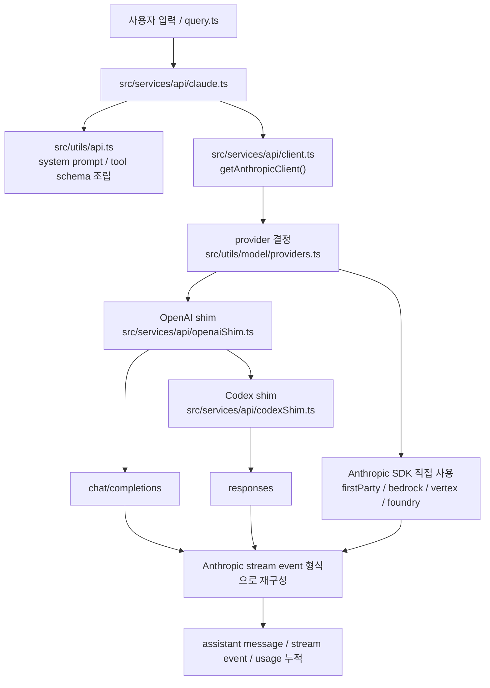

# OpenPro API 가이드

## 1. 문서 목적

이 문서는 OpenPro가 실제로 어떤 API 계층을 통해 모델과 통신하는지, provider가 어떻게 선택되는지, 요청이 어떤 형태로 변환되는지, 스트리밍과 재시도가 어디서 처리되는지를 소스 기준으로 이해하기 쉽게 정리한 개발자용 가이드다.

이 문서는 다음 독자를 대상으로 한다.

- OpenPro의 API 호출 경로를 처음 따라가려는 개발자
- 새 provider를 붙이거나 기존 provider 동작을 수정하려는 AI 엔지니어
- 인증, 네트워크, 재시도, 업로드/다운로드 API를 운영 관점에서 확인하려는 플랫폼 엔지니어
- API 오류 재현과 회귀 테스트 포인트를 잡아야 하는 QA

이 문서는 기존 [openpro-api-integration-spec-ko.md](D:/project/openpro/docs/openpro-api-integration-spec-ko.md)보다 더 소스 코드 중심이다. 기존 문서가 “무슨 연동이 있는가”에 가깝다면, 이 문서는 “어느 파일에서 어떻게 호출하고 어떤 규칙으로 변환되는가”에 초점을 둔다.

---

## 2. 먼저 이해할 핵심 4가지

1. OpenPro의 API 계층은 하나가 아니다. `firstParty`, `bedrock`, `vertex`, `foundry`, `openai`, `gemini`, `github`, `codex`가 공존한다.
2. 런타임 공통 인터페이스는 Anthropic SDK 형태를 기준으로 잡혀 있다. 다른 provider는 shim으로 Anthropic 형식처럼 보이게 맞춘다.
3. 실제 요청 조립은 `src/services/api/claude.ts`, 클라이언트 생성은 `src/services/api/client.ts`, 3자 provider 변환은 `src/services/api/openaiShim.ts`와 `src/services/api/codexShim.ts`가 담당한다.
4. 모델 호출 API 외에도 bootstrap, files, session ingress, teleport events 같은 보조 API가 따로 존재한다.

---

## 3. 핵심 소스 지도

| 파일 | 역할 | 언제 보면 좋은가 |
|---|---|---|
| `src/utils/model/providers.ts` | 현재 세션의 API provider를 결정 | 지금 어떤 provider 경로를 타는지 알고 싶을 때 |
| `src/services/api/client.ts` | Anthropic SDK 클라이언트 또는 shim 클라이언트 생성 | 인증과 base client 생성 로직을 볼 때 |
| `src/services/api/providerConfig.ts` | OpenAI/Codex/GitHub 계열 base URL, model, auth 해석 | `OPENAI_BASE_URL`, `OPENAI_MODEL`, Codex alias가 헷갈릴 때 |
| `src/services/api/claude.ts` | 실제 모델 요청 조립, 스트리밍, fallback, usage 누적 | 메인 API 호출 흐름을 이해할 때 |
| `src/utils/api.ts` | tool schema 변환, system prompt block 분리, cache control 부착 | API로 넘기기 직전 payload 규칙을 볼 때 |
| `src/services/api/openaiShim.ts` | OpenAI 호환 API를 Anthropic 스트림 형식으로 변환 | OpenAI, Ollama, Azure, GitHub Models, Gemini 경로를 볼 때 |
| `src/services/api/codexShim.ts` | Codex Responses API를 Anthropic 형식으로 변환 | `codexplan`, `gpt-5.4`, `/responses` 경로를 볼 때 |
| `src/services/api/withRetry.ts` | 재시도, 백오프, stale connection 처리 | 429/529/401/ECONNRESET 대응을 볼 때 |
| `src/services/api/bootstrap.ts` | Claude CLI bootstrap API 호출 및 캐시 저장 | 기동 시 추가 모델 옵션과 client data를 받는 흐름을 볼 때 |
| `src/services/api/filesApi.ts` | 파일 업로드, 다운로드, 목록 조회 | 세션 첨부파일 처리 로직을 볼 때 |
| `src/services/api/sessionIngress.ts` | 세션 로그 append/read, teleport events 조회 | 원격 세션, CCR, 세션 복원 흐름을 볼 때 |
| `src/services/api/errorUtils.ts` | SSL/TLS, 연결 오류 해석 | 프록시, 인증서 문제를 디버깅할 때 |

---

## 4. 전체 API 흐름

이 구조의 핵심은 “상위 레이어는 가능하면 Anthropic 형식만 본다”는 점이다. 그래서 OpenAI 계열이나 Codex 계열도 내부에서는 Anthropic 메시지 스트림처럼 변환된다.

---

## 5. Provider 선택 규칙

Provider 선택의 최상위 엔트리는 `src/utils/model/providers.ts`의 `getAPIProvider()`다.

결정 순서는 다음과 같다.

| 조건 | 반환 provider |
|---|---|
| `CLAUDE_CODE_USE_GEMINI=1` | `gemini` |
| `CLAUDE_CODE_USE_GITHUB=1` | `github` |
| `CLAUDE_CODE_USE_OPENAI=1` 이고 `OPENAI_MODEL`이 Codex alias 또는 Codex 모델 | `codex` |
| `CLAUDE_CODE_USE_OPENAI=1` | `openai` |
| `CLAUDE_CODE_USE_BEDROCK=1` | `bedrock` |
| `CLAUDE_CODE_USE_VERTEX=1` | `vertex` |
| `CLAUDE_CODE_USE_FOUNDRY=1` | `foundry` |
| 위 조건이 없으면 | `firstParty` |

중요한 포인트는 두 가지다.

- `CLAUDE_CODE_USE_OPENAI=1`이어도 모델 이름이 `codexplan`, `codexspark`, `gpt-5.4`, `gpt-5.3-codex` 같은 Codex 계열이면 일반 OpenAI chat completions가 아니라 Codex Responses 경로를 탈 수 있다.
- `CLAUDE_CODE_USE_GITHUB=1`과 `CLAUDE_CODE_USE_GEMINI=1`은 내부적으로 OpenAI shim을 재사용하지만, provider 분기는 별도로 잡힌다.

관련 소스:

- `src/utils/model/providers.ts`
- `src/services/api/providerConfig.ts`

---

## 6. 모델, base URL, transport 결정 방식

### 6.1 `resolveProviderRequest()`가 하는 일

`src/services/api/providerConfig.ts`의 `resolveProviderRequest()`는 OpenAI 호환 계열 요청에서 다음 값을 확정한다.

- 요청 모델명 `requestedModel`
- 실제 전송 모델명 `resolvedModel`
- transport 종류 `chat_completions` 또는 `codex_responses`
- 최종 base URL
- Codex reasoning effort

### 6.2 기본 URL 규칙

| 상황 | 기본값 |
|---|---|
| 일반 OpenAI 호환 | `https://api.openai.com/v1` |
| Codex Responses | `https://chatgpt.com/backend-api/codex` |
| GitHub Models | 내부적으로 `https://models.github.ai/inference` |
| Gemini | OpenAI 호환 endpoint로 매핑 |

### 6.3 Codex 경로로 갈지 결정하는 기준

Codex transport는 다음 둘 중 하나면 활성화된다.

- `OPENAI_BASE_URL`이 명시적으로 Codex endpoint를 가리킴
- custom base URL이 없고, 모델이 Codex alias 또는 Codex 계열 모델임

즉, custom `OPENAI_BASE_URL`이 있으면 모델 이름이 Codex처럼 보여도 base URL이 우선한다. 이 규칙은 Azure, OpenRouter, 사내 proxy 같은 custom OpenAI 호환 endpoint를 보호하기 위한 것이다.

### 6.4 GitHub Models 모델명 정규화

GitHub Models는 `github:copilot` 같은 표현을 내부 모델명으로 정규화한다.

- 입력이 `github:copilot` 또는 `copilot`이면 기본값 `openai/gpt-4.1`
- `github:<model>` 형식이면 `<model>` 부분만 추출

### 6.5 로컬 provider URL 판단

`isLocalProviderUrl()`은 `localhost`, `127.0.0.0/8`, `.local`, 사설 IP, 일부 IPv6 private 범위를 로컬 provider로 판단한다. 이 값은 다음 동작에 영향을 준다.

- 일부 로컬 provider는 API key 없이 동작할 수 있다.
- OpenAI streaming 요청에서 `stream_options.include_usage` 부착 여부가 달라진다.

관련 소스:

- `src/services/api/providerConfig.ts`

---

## 7. 메인 모델 호출 경로

메인 호출 흐름의 중심은 `src/services/api/claude.ts`다.

### 7.1 호출 엔트리

상위에서 주로 보는 공개 함수는 다음이다.

| 함수 | 역할 |
|---|---|
| `queryModelWithStreaming()` | 스트리밍 모드 질의 |
| `queryModelWithoutStreaming()` | 비스트리밍 질의 |
| `queryWithModel()` | 특정 모델로 직접 질의하는 편의 함수 |
| `queryHaiku()` | 작은 빠른 모델용 질의 |
| `verifyApiKey()` | API key 유효성 검사 |

일반적인 REPL, 에이전트, 도구 호출 연계는 결국 `queryModelWithStreaming()` 또는 `queryModelWithoutStreaming()`으로 모인다.

### 7.2 공통 준비 단계

실제 요청 직전에는 다음이 준비된다.

1. 메시지 배열 정규화
2. system prompt block 구성
3. tool schema를 API 스키마로 변환
4. beta header와 extra body 조립
5. provider에 맞는 client 획득
6. 재시도 래퍼 `withRetry()`를 통해 실행

이때 `src/utils/api.ts`가 중요한 이유는 상위 메시지나 도구 정의를 실제 API가 받아들일 수 있는 구조로 바꾸기 때문이다.

---

## 8. System Prompt와 Tool Schema가 API로 가는 방식

### 8.1 `buildSystemPromptBlocks()`

`src/services/api/claude.ts`의 `buildSystemPromptBlocks()`는 `src/utils/api.ts`의 `splitSysPromptPrefix()` 결과를 사용해 system prompt를 block 단위로 분리한다.

이 단계에서 하는 일:

- attribution header 분리
- prefix block 분리
- boundary 기준 static/dynamic block 분리
- prompt caching용 `cache_control` 부착

즉, prompt caching은 단순히 전체 prompt를 통째로 cache하는 것이 아니라 block 단위 cache control을 붙이는 방식으로 구현된다.

### 8.2 `toolToAPISchema()`

`src/utils/api.ts`의 `toolToAPISchema()`는 각 Tool 객체를 API 전송용 schema로 바꾼다.

핵심 처리:

- Zod schema 또는 raw JSON schema를 Anthropic Tool schema로 변환
- feature flag에 따라 `strict` 부착
- fine-grained tool streaming용 `eager_input_streaming` 부착
- tool search용 `defer_loading` 부착
- cache control 부착
- experimental beta kill switch가 켜져 있으면 허용되지 않은 필드를 제거

중요한 점은 tool schema도 provider에 따라 제약이 달라진다는 것이다. 예를 들어 OpenAI/Codex는 schema strictness 요구가 훨씬 강하다.

---

## 9. Client 생성과 인증 처리

Client 생성 엔트리는 `src/services/api/client.ts`의 `getAnthropicClient()`다.

### 9.1 공통 헤더

기본 헤더에는 다음이 들어간다.

- `User-Agent`
- `X-Claude-Code-Session-Id`
- container ID
- remote session ID
- client app 식별값
- custom headers

필요 시 추가 보호 헤더도 붙는다.

### 9.2 OAuth / API key 처리

Client 생성 직전에는 `checkAndRefreshOAuthTokenIfNeeded()`가 호출된다. 이후 구독자 여부에 따라 Claude.ai OAuth 또는 x-api-key 계열 헤더 조합이 결정된다.

### 9.3 provider별 실제 client

| provider | 실제 client 경로 |
|---|---|
| `firstParty` | Anthropic SDK |
| `bedrock` | `@anthropic-ai/bedrock-sdk` |
| `vertex` | `@anthropic-ai/vertex-sdk` |
| `foundry` | `@anthropic-ai/foundry-sdk` |
| `openai`, `github`, `gemini`, `codex` | `createOpenAIShimClient()` |

### 9.4 cloud provider 인증 차이

| provider | 인증 특징 |
|---|---|
| Bedrock | AWS credential refresh와 region 결정 포함 |
| Vertex | GCP credential refresh와 project/region 결정 포함 |
| Foundry | API key 또는 Azure AD token provider |
| firstParty | OAuth 또는 x-api-key |
| OpenAI 호환 | `OPENAI_API_KEY`, 일부 local mode는 key 생략 가능 |
| Codex | `CODEX_API_KEY` 또는 `~/.codex/auth.json` + account id |

---

## 10. First-party Anthropic 경로

이 경로는 `CLAUDE_CODE_USE_OPENAI`, `CLAUDE_CODE_USE_GITHUB`, `CLAUDE_CODE_USE_GEMINI`, `CLAUDE_CODE_USE_BEDROCK`, `CLAUDE_CODE_USE_VERTEX`, `CLAUDE_CODE_USE_FOUNDRY`가 모두 꺼져 있을 때 기본으로 사용된다.

### 10.1 요청 생성

`src/services/api/claude.ts`는 Anthropic SDK의 messages API 요청 파라미터를 조립한다.

주요 구성요소:

- `model`
- `messages`
- `system`
- `tools`
- `max_tokens`
- `thinking`
- `metadata`
- `betas`
- `output_config`
- `extra body`

### 10.2 prompt caching과 beta

이 경로에서는 first-party Anthropic base URL 여부에 따라 다음 기능이 달라진다.

- global cache scope 사용 여부
- fine-grained tool streaming 사용 여부
- 일부 beta header 첨부 여부

즉, 같은 Anthropic SDK를 쓰더라도 진짜 `api.anthropic.com`인지, proxy나 cloud provider를 거치는지에 따라 기능 지원 범위가 달라진다.

### 10.3 비스트리밍 fallback

스트리밍 요청이 실패하면 일부 상황에서 `executeNonStreamingRequest()`로 비스트리밍 fallback을 시도한다.

이때:

- 별도 timeout을 적용한다.
- `MAX_NON_STREAMING_TOKENS` cap을 적용한다.
- thinking budget이 max token cap보다 커지지 않도록 `adjustParamsForNonStreaming()`으로 보정한다.

이 fallback은 느리거나 불안정한 backend에서 완전 실패 대신 복구 가능성을 높이기 위한 장치다.

---

## 11. OpenAI 호환 경로

OpenAI, Ollama, Azure OpenAI, OpenRouter, LM Studio, Together, Groq, Fireworks, DeepSeek, Mistral, GitHub Models, Gemini는 공통적으로 `src/services/api/openaiShim.ts`를 통해 Anthropic 형식으로 맞춰진다.

### 11.1 OpenAI shim의 역할

OpenAI shim은 내부적으로 두 방향 변환을 동시에 담당한다.

- Anthropic 형식 요청을 OpenAI chat completions 형식으로 변환
- OpenAI SSE 응답을 Anthropic streaming event 형식으로 변환

즉, 상위 코드 입장에서는 provider가 바뀌어도 가능하면 같은 메시지 모델을 유지한다.

### 11.2 요청 변환

요청 시 다음 함수가 핵심이다.

| 함수 | 역할 |
|---|---|
| `convertSystemPrompt()` | system prompt를 문자열로 평탄화 |
| `convertMessages()` | Anthropic 메시지 배열을 OpenAI messages 배열로 변환 |
| `convertTools()` | Anthropic tool schema를 OpenAI function tool schema로 변환 |
| `normalizeSchemaForOpenAI()` | OpenAI strict schema 제약에 맞게 required/additionalProperties 보정 |

특히 `tool_result`는 OpenAI의 `tool` role message로, `tool_use`는 assistant의 `tool_calls`로 매핑된다.

### 11.3 OpenAI 경로별 세부 규칙

#### 일반 OpenAI 호환

- endpoint: `{baseUrl}/chat/completions`
- `Authorization: Bearer <OPENAI_API_KEY>`
- `max_tokens` 대신 `max_completion_tokens` 사용

#### Azure OpenAI

- hostname 기반으로 Azure endpoint를 식별한다.
- `Authorization`이 아니라 `api-key` 헤더를 사용한다.
- endpoint는 deployment path 형태로 조립된다.
- 기본 API version은 `2024-12-01-preview`

#### GitHub Models

- base URL 기본값: `https://models.github.ai/inference`
- `Accept: application/vnd.github.v3+json`
- `X-GitHub-Api-Version: 2022-11-28`
- 429 발생 시 최대 3회 exponential backoff 재시도

#### Gemini

- Gemini 전용 env를 OpenAI 호환 env로 매핑한 뒤 기존 shim 경로를 재사용한다.
- 기본 base URL은 `https://generativelanguage.googleapis.com/v1beta/openai`

### 11.4 스트리밍 응답 변환

`openaiStreamToAnthropic()`는 OpenAI SSE stream을 읽으면서 다음 Anthropic 형식 이벤트를 합성한다.

- `message_start`
- `content_block_start`
- `content_block_delta`
- `content_block_stop`
- `message_delta`
- `message_stop`

tool call도 같은 방식으로 `input_json_delta`까지 쪼개서 재구성한다. 이 레이어 덕분에 상위 소비자는 OpenAI provider라도 Anthropic식 stream parser를 그대로 사용할 수 있다.

### 11.5 안전 필터 메시지 처리

Gemini나 Azure 계열이 `content_filter`, `safety` finish reason을 보내면 shim은 단순 종료 대신 사용자에게 보이는 텍스트 블록을 주입한다.

- `[Content blocked by provider safety filter]`

이 처리는 “아무 응답도 없이 끊겼다”처럼 보이는 UX를 막기 위한 것이다.

---

## 12. Codex 경로

Codex는 OpenAI shim 내부의 또 다른 분기지만, 실제로는 별도 프로토콜이라고 보는 편이 맞다. 구현은 `src/services/api/codexShim.ts`에 있다.

### 12.1 언제 Codex 경로를 타는가

- 모델이 `codexplan`, `codexspark`, `gpt-5.4`, `gpt-5.3-codex`, `gpt-5.2-codex`, `gpt-5.1-codex-max`, `gpt-5.1-codex-mini` 계열
- 또는 base URL이 Codex endpoint

### 12.2 인증 정보 해석

`resolveCodexApiCredentials()`는 다음 순서로 인증을 찾는다.

1. `CODEX_API_KEY`
2. `CODEX_ACCOUNT_ID` 또는 `CHATGPT_ACCOUNT_ID`
3. `CODEX_AUTH_JSON_PATH`
4. `CODEX_HOME/auth.json`
5. 기본 `~/.codex/auth.json`

필수 조건은 두 가지다.

- API key 또는 auth.json access token
- account id

둘 중 account id가 없으면 요청 전에 오류를 내고 중단한다.

### 12.3 요청 본문 특징

Codex는 `chat/completions`가 아니라 `responses` endpoint를 사용한다.

- endpoint: `{baseUrl}/responses`
- body는 `messages`가 아니라 `input`
- `tool_use`는 `function_call`
- `tool_result`는 `function_call_output`
- `instructions` 필드로 system prompt를 보낸다

### 12.4 strict schema 강제

Codex는 tool schema 요구사항이 더 강해서 `enforceStrictSchema()`가 다음 규칙을 강제한다.

- 모든 object에 `additionalProperties: false`
- properties의 모든 키를 `required`에 포함
- nested schema까지 재귀적으로 동일 규칙 적용
- URI format 같은 일부 필드는 제거

이 부분이 약하면 Codex Responses API는 schema mismatch를 쉽게 반환한다.

### 12.5 스트리밍 변환

Codex Responses stream은 다시 `codexStreamToAnthropic()`로 Anthropic event처럼 재구성된다. 따라서 상위에서 보면 Codex도 결국 동일한 event 소비 패턴을 따른다.

---

## 13. 재시도, 타임아웃, 연결 오류 처리

재시도 중심 구현은 `src/services/api/withRetry.ts`다.

### 13.1 기본 원칙

- 기본 최대 재시도 횟수는 10
- foreground query source는 529도 재시도
- stale keep-alive connection은 `ECONNRESET`, `EPIPE`로 감지
- 필요 시 keep-alive를 끄고 새 client를 만든다

### 13.2 재시도 중 특별 처리

| 상황 | 처리 |
|---|---|
| 401 | OAuth refresh 후 client 재생성 |
| revoked token | OAuth 재처리 |
| Bedrock auth 오류 | 자격 증명 refresh 후 재시도 |
| Vertex auth 오류 | GCP credential refresh 후 재시도 |
| 429 / 529 | backoff 후 재시도 |
| foreground source가 아닌 529 | 빠르게 중단 |
| stale connection | keep-alive 비활성화 후 새 연결 |

### 13.3 persistent retry

특정 기능 플래그와 `CLAUDE_CODE_UNATTENDED_RETRY`가 켜져 있으면 unattended 세션은 더 오래 재시도할 수 있다. 이 모드는 장시간 백그라운드 실행 환경을 위한 옵션이다.

### 13.4 SSL/TLS 오류 해석

`src/services/api/errorUtils.ts`는 연결 오류의 `cause` chain을 따라가며 OpenSSL/Node/Bun 계열 SSL 코드까지 파악한다.

주요 사용 목적:

- 사내 TLS intercept proxy 환경에서 `UNABLE_TO_VERIFY_LEAF_SIGNATURE`류 오류를 사람이 이해할 수 있는 문장으로 변환
- `/doctor`나 onboarding 단계에서 actionable hint 제공

---

## 14. Bootstrap API

Bootstrap API 구현은 `src/services/api/bootstrap.ts`에 있다.

### 14.1 목적

기동 시 추가 모델 옵션과 client data를 받아 전역 캐시에 저장한다.

### 14.2 호출 조건

다음 조건을 만족해야 호출된다.

- nonessential traffic가 허용됨
- provider가 `firstParty`
- usable OAuth 또는 API key가 존재함

### 14.3 endpoint와 timeout

- endpoint: `${BASE_API_URL}/api/claude_cli/bootstrap`
- timeout: 5초

### 14.4 응답 처리

응답 schema는 Zod로 검증한 뒤 다음 캐시에 저장된다.

- `clientDataCache`
- `additionalModelOptionsCache`

기존 값과 동일하면 디스크 쓰기를 생략한다. 즉, bootstrap은 매 기동마다 네트워크를 타더라도 항상 디스크를 덮어쓰는 구조는 아니다.

---

## 15. Files API

Files API 구현은 `src/services/api/filesApi.ts`에 있다.

### 15.1 역할

세션 첨부파일을 다운로드하거나 업로드하고, 일정 시점 이후 생성된 파일 목록을 조회한다.

### 15.2 인증 방식

- OAuth Bearer token
- beta header: `files-api-2025-04-14,oauth-2025-04-20`

### 15.3 주요 endpoint

| 기능 | endpoint |
|---|---|
| 파일 다운로드 | `/v1/files/{fileId}/content` |
| 파일 업로드 | `/v1/files` |
| 파일 목록 조회 | `/v1/files` |

### 15.4 다운로드 규칙

`downloadAndSaveFile()`는 다운로드 전에 저장 경로를 `buildDownloadPath()`로 검증한다.

핵심 보호 규칙:

- 상대 경로 정규화
- `..` 시작 경로 차단
- 세션별 `uploads` 하위에만 저장

즉, file attachment가 로컬 워크스페이스 바깥으로 탈출하지 못하게 막는다.

### 15.5 업로드 규칙

업로드 시에는 다음 순서를 따른다.

1. 로컬 파일 읽기
2. 최대 크기 500MB 확인
3. multipart body 생성
4. retryWithBackoff로 네트워크 업로드

401, 403, 413은 비재시도 오류로 분류된다. 네트워크 계열만 재시도한다.

### 15.6 파일 목록 조회

`listFilesCreatedAfter()`는 `after_created_at`, `after_id`를 사용해 페이지네이션을 수행한다.

이 함수는 “최근 생성된 원격 파일만 다시 찾아오기” 같은 흐름에 적합하다.

---

## 16. Session Ingress와 Teleport Events

원격 세션 로그와 복원 관련 구현은 `src/services/api/sessionIngress.ts`에 있다.

### 16.1 appendSessionLog()

세션 로그 append는 optimistic concurrency 방식이다.

핵심 메커니즘:

- `Last-Uuid` 헤더 사용
- 세션별 sequential wrapper로 동시 쓰기 방지
- 409가 나면 서버의 last UUID를 채택해서 재시도

즉, 죽은 프로세스의 in-flight write나 복수 writer 상황에서도 로그 체인을 최대한 이어 붙이도록 설계되어 있다.

### 16.2 세션 로그 조회

조회 방식은 두 갈래다.

| 함수 | 역할 |
|---|---|
| `getSessionLogs()` | 세션 토큰 기반 조회 |
| `getSessionLogsViaOAuth()` | OAuth + org UUID 기반 조회 |

OAuth 경로의 기본 endpoint는 다음과 같다.

- `/v1/session_ingress/session/{sessionId}`

### 16.3 Teleport events

`getTeleportEvents()`는 더 새로운 CCR v2 세션 API다.

- endpoint: `/v1/code/sessions/{sessionId}/teleport-events`
- 페이지네이션 지원
- 404 시 migration window를 고려해 fallback 여지를 남김

이 함수는 session-ingress가 완전히 사라지기 전까지 과도기 호환까지 감안한 구현이다.

---

## 17. API key 검증과 onboarding 관점

`verifyApiKey()`는 매우 작은 테스트 요청으로 API key를 확인한다.

특징:

- non-interactive session에서는 검증을 건너뜀
- 빠른 small model을 사용
- 최소 payload로 직접 messages API 호출
- 실패 시 authentication error를 구분해서 false 반환

이 함수는 `/provider`나 onboarding UX에서 “지금 넣은 키가 진짜로 동작하는가”를 빠르게 확인하는 용도에 가깝다.

---

## 18. 새 provider를 붙일 때 어디를 수정해야 하나

새 API provider를 추가할 때는 보통 아래 순서로 본다.

### 18.1 1단계: provider 분기 추가

- `src/utils/model/providers.ts`

해야 할 일:

- env flag 또는 profile 결과에 따라 새 provider 값 반환
- statsig/telemetry용 provider 이름 영향 확인

### 18.2 2단계: client 생성 경로 연결

- `src/services/api/client.ts`

해야 할 일:

- 새 provider가 Anthropic SDK 직접 사용인지
- 아니면 shim 계층 재사용인지
- 별도 SDK가 필요한지

### 18.3 3단계: model/base URL/auth 해석

- `src/services/api/providerConfig.ts`

해야 할 일:

- 기본 base URL
- 모델 alias 규칙
- 인증 정보 위치
- transport 구분 규칙

### 18.4 4단계: 메시지/도구 변환 계층

- OpenAI 계열이면 `src/services/api/openaiShim.ts`
- Responses 계열이면 `src/services/api/codexShim.ts`
- 완전히 다른 프로토콜이면 새 shim 파일

해야 할 일:

- system prompt 변환
- message 변환
- tool schema strictness 대응
- streaming event를 Anthropic 형식으로 재구성

### 18.5 5단계: 재시도와 오류 분류 확인

- `src/services/api/withRetry.ts`
- `src/services/api/errorUtils.ts`

해야 할 일:

- 401 refresh 가능한지
- 429/5xx 재시도 가능한지
- SSL/TLS나 proxy 환경에서 어떤 메시지를 보여줄지

### 18.6 6단계: 설정/UI/onboarding 연결

이 문서 범위 바깥이지만 실제 제품 반영에는 다음도 같이 봐야 한다.

- `/provider` 관련 UI
- secure storage 저장 위치
- README / setup guide
- smoke test, provider test

---

## 19. 디버깅 시작 순서

API 이슈를 디버깅할 때는 아래 순서가 가장 효율적이다.

1. `src/utils/model/providers.ts`에서 실제 provider가 무엇으로 잡혔는지 확인
2. `src/services/api/providerConfig.ts`에서 model, base URL, transport가 어떻게 확정됐는지 확인
3. `src/services/api/client.ts`에서 어떤 client가 생성됐는지 확인
4. `src/services/api/claude.ts`에서 요청 조립과 fallback 여부를 확인
5. 3자 provider면 `src/services/api/openaiShim.ts` 또는 `src/services/api/codexShim.ts`를 확인
6. 재시도 반복이면 `src/services/api/withRetry.ts`를 확인
7. SSL, proxy, certificate 문제면 `src/services/api/errorUtils.ts`를 확인

---

## 20. 자주 보는 환경 변수

| 환경 변수 | 의미 |
|---|---|
| `CLAUDE_CODE_USE_OPENAI` | OpenAI 호환 provider 사용 |
| `CLAUDE_CODE_USE_GITHUB` | GitHub Models 사용 |
| `CLAUDE_CODE_USE_GEMINI` | Gemini 사용 |
| `CLAUDE_CODE_USE_BEDROCK` | Bedrock 사용 |
| `CLAUDE_CODE_USE_VERTEX` | Vertex 사용 |
| `CLAUDE_CODE_USE_FOUNDRY` | Foundry 사용 |
| `OPENAI_BASE_URL` | OpenAI 호환 base URL |
| `OPENAI_MODEL` | OpenAI/Codex/GitHub 계열 모델 선택 |
| `OPENAI_API_KEY` | OpenAI 호환 API key |
| `GITHUB_TOKEN`, `GH_TOKEN` | GitHub Models 인증 |
| `GEMINI_API_KEY`, `GOOGLE_API_KEY` | Gemini 인증 |
| `CODEX_API_KEY` | Codex 인증 |
| `CODEX_ACCOUNT_ID`, `CHATGPT_ACCOUNT_ID` | Codex account id |
| `CODEX_AUTH_JSON_PATH`, `CODEX_HOME` | Codex auth.json 경로 결정 |
| `API_TIMEOUT_MS` | client timeout override |
| `CLAUDE_CODE_EXTRA_BODY` | 추가 body 주입 |
| `CLAUDE_CODE_UNATTENDED_RETRY` | unattended persistent retry |
| `NODE_EXTRA_CA_CERTS` | 사내 TLS 인증서 번들 지정 |

---

## 21. 테스트할 때 꼭 봐야 하는 포인트

| 테스트 포인트 | 확인 내용 |
|---|---|
| provider 분기 | env 조합에 따라 의도한 provider가 잡히는지 |
| transport 분기 | Codex alias가 `chat_completions`로 잘못 가지 않는지 |
| base URL 우선순위 | custom `OPENAI_BASE_URL`이 model alias보다 우선하는지 |
| schema strictness | OpenAI/Codex에서 tool schema 400이 나지 않는지 |
| streaming 변환 | text/tool call delta가 Anthropic event로 정상 재구성되는지 |
| GitHub 429 | 재시도와 Retry-After 힌트가 정상인지 |
| OAuth refresh | 401 후 토큰 재갱신이 되는지 |
| stale socket | `ECONNRESET`, `EPIPE` 후 keep-alive 비활성화가 되는지 |
| files path 보호 | `..` 경로가 다운로드 저장 경로를 탈출하지 못하는지 |
| session 409 복구 | `Last-Uuid` 충돌 후 서버 UUID 채택으로 회복되는지 |

---

## 22. 추천 읽기 순서

처음 보는 개발자라면 다음 순서가 가장 이해가 빠르다.

1. `src/utils/model/providers.ts`
2. `src/services/api/providerConfig.ts`
3. `src/services/api/client.ts`
4. `src/services/api/claude.ts`
5. `src/utils/api.ts`
6. `src/services/api/openaiShim.ts`
7. `src/services/api/codexShim.ts`
8. `src/services/api/withRetry.ts`
9. `src/services/api/filesApi.ts`
10. `src/services/api/sessionIngress.ts`

---

## 23. 한 줄 정리

OpenPro의 API 구조는 “Anthropic 형식을 기준 인터페이스로 삼고, provider별 차이는 client 생성과 shim 계층에서 흡수하는 구조”라고 이해하면 가장 빠르다. 모델 호출 흐름을 따라갈 때는 `providers.ts -> providerConfig.ts -> client.ts -> claude.ts -> openaiShim/codexShim -> withRetry.ts` 순서로 읽으면 된다.

추가로 direct connect 서버 기동과 `cc://` 연결 흐름이 궁금하면 [openpro-server-mode-guide-ko.md](D:/project/openpro/docs/openpro-server-mode-guide-ko.md)를 함께 보면 된다.
