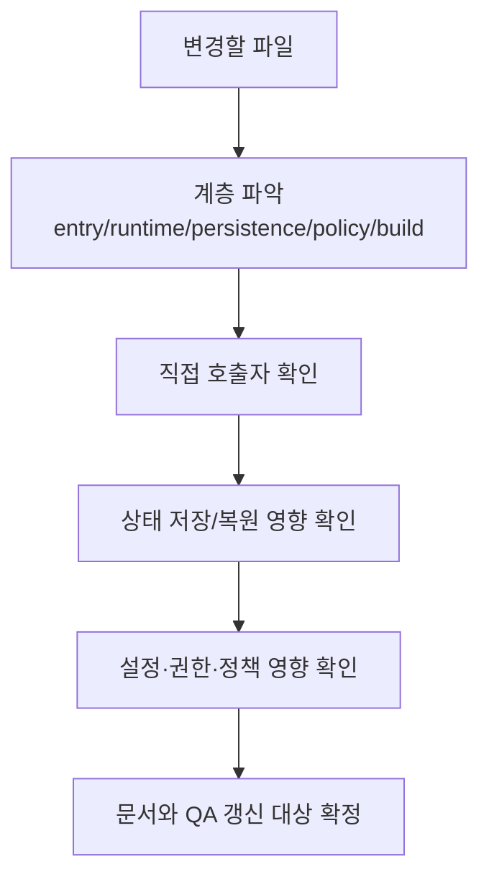

# OpenPro 변경 영향도 맵

## 1. 문서 목적

이 문서는 OpenPro 소스를 수정할 때 어떤 파일과 문서, 테스트 범위를 함께 봐야 하는지 빠르게 판단하기 위한 유지보수 가이드다.

특히 아래 상황을 바로 돕는 것을 목표로 한다.

- 핵심 파일 수정 전 영향 반경 파악
- 문서와 QA 회귀 범위 선정
- “이 파일만 바꾸면 되는지” 또는 “흐름 전체를 봐야 하는지” 판단

---

## 2. 먼저 기억할 원칙

1. OpenPro는 CLI 하나처럼 보여도 실제로는 `entrypoint -> bootstrap -> query loop -> tools -> persistence -> settings/policy`가 강하게 연결된 구조다.
2. `query`, `permissions`, `sessionStorage`, `provider`, `plugin`, `mcp`, `build` 축은 서로 영향이 크다.
3. 파일 하나를 수정해도 보통 아래 네 층을 같이 봐야 한다.

- 사용자 진입점
- 상태 저장/복원
- 설정/권한/정책
- 문서/QA

---

## 3. 영향도 판별 흐름

---

## 4. 고위험 축

| 영역 | 대표 파일 | 위험 이유 |
|---|---|---|
| 요청 메인 루프 | `src/query.ts`, `src/query/config.ts` | 모델 호출, tool loop, compact, hook, transcript 저장이 함께 연결됨 |
| 권한 / 파일 접근 | `src/utils/permissions/filesystem.ts`, `src/utils/permissions/permissionSetup.ts` | 보안, ask/deny UX, 자동 승인, 민감 경로 보호가 동시에 바뀜 |
| 세션 저장 / 복원 | `src/utils/sessionStorage.ts`, `src/utils/sessionStoragePortable.ts`, `src/types/logs.ts` | resume, compact boundary, sidechain, metadata 복원이 깨질 수 있음 |
| provider / API | `src/utils/model/providers.ts`, `src/services/api/providerConfig.ts`, `src/services/api/client.ts` | 인증, transport, 요청 shape, startup validation이 함께 바뀜 |
| 플러그인 / 훅 | `src/utils/plugins/pluginLoader.ts`, `src/utils/plugins/loadPlugin*.ts`, `src/utils/hooks.ts` | 명령 노출, agent 로딩, hook 실행, 정책 제약이 연결됨 |
| MCP | `src/services/mcp/config.ts`, `src/services/mcp/useManageMCPConnections.ts`, `src/services/mcp/auth.ts` | scope 병합, OAuth, 상태값, doctor, enterprise 정책이 얽혀 있음 |
| 빌드 / 패키징 | `package.json`, `scripts/build.ts`, `bin/openpro`, `src/cli/update.ts` | 배포 결과물, 버전 표기, 업데이트, 내부 기능 제거가 함께 바뀜 |

---

## 5. 영역별 상세 영향도

### 5.1 요청 메인 루프와 tool orchestration

핵심 파일:

- `src/query.ts`
- `src/query/config.ts`
- `src/services/tools/toolOrchestration.ts`
- `src/services/tools/StreamingToolExecutor.ts`
- `src/utils/messages.ts`
- `src/services/compact/*`

| 변경 포인트 | 같이 확인할 코드 | 같이 갱신할 문서 |
|---|---|---|
| tool loop 순서 | `src/utils/messages.ts`, `src/utils/toolResultStorage.ts` | 요청 처리 흐름 가이드, 오류 카탈로그 |
| compact 진입 조건 | `src/services/compact/autoCompact.ts`, `microCompact.ts`, `compact.ts` | 메모리/컨텍스트 압축 문서, 요청 처리 흐름 가이드 |
| stop hook / post hook | `src/query/stopHooks.ts`, `src/utils/hooks/postSamplingHooks.ts` | 플러그인/훅 가이드 |
| token budget | `src/query/tokenBudget.ts`, `src/bootstrap/state.ts`, `src/utils/tokens.ts` | 요청 처리 흐름 가이드, QA 문서 |

최소 회귀 체크:

- 일반 1턴
- tool use 포함 턴
- tool error 후 복구
- compact 유발 turn
- prompt too long 또는 max output recovery

### 5.2 권한 / 보안 / 파일 접근

핵심 파일:

- `src/utils/permissions/filesystem.ts`
- `src/utils/permissions/permissionSetup.ts`
- `src/utils/permissions/permissions.ts`
- `src/utils/permissions/pathValidation.ts`
- `src/components/permissions/*`

| 변경 포인트 | 같이 확인할 코드 | 같이 갱신할 문서 |
|---|---|---|
| 민감 파일/디렉터리 목록 | `src/utils/fsOperations.ts`, settings 보호 로직 | 권한/보안 매트릭스, 트러블슈팅 |
| symlink/UNC/path 정규화 | `src/utils/windowsPaths.ts`, `src/utils/path.ts` | 권한/보안 매트릭스 |
| auto mode / classifier 승인 | `src/utils/permissions/yoloClassifier.ts`, `classifierDecision.ts` | 권한/보안 매트릭스, 명령어 가이드 |
| 승인 UI 흐름 | `src/components/permissions/*` | 기능 명세, QA 문서 |

`filesystem.ts`를 바꿀 때는 아래를 특히 같이 봐야 한다.

- symlink resolved path 검사
- settings 파일 보호
- memory carve-out
- tool output dir 예외
- project root 밖 경로 처리

### 5.3 세션 저장소 / transcript / resume

핵심 파일:

- `src/utils/sessionStorage.ts`
- `src/utils/sessionStoragePortable.ts`
- `src/types/logs.ts`
- `src/commands/resume/resume.tsx`

| 변경 포인트 | 같이 확인할 코드 | 같이 갱신할 문서 |
|---|---|---|
| Entry 타입 추가/변경 | `src/types/logs.ts`, `src/utils/sessionStoragePortable.ts` | 세션 저장소 가이드, 오류 카탈로그 |
| compact boundary 저장 | `src/services/compact/*`, `src/utils/messages.ts` | 세션 저장소 가이드, 메모리/컨텍스트 압축 문서 |
| content replacement | `src/utils/toolResultStorage.ts` | 세션 저장소 가이드 |
| subagent transcript | `src/utils/task/diskOutput.ts`, agent metadata 저장 | 세션 저장소 가이드 |

최소 회귀 체크:

- 일반 resume
- compact 이후 resume
- sidechain/subagent 포함 resume
- title, summary, mode, worktree state 보존

### 5.4 메모리 / session memory / compact

핵심 파일:

- `src/memdir/*`
- `src/services/SessionMemory/*`
- `src/services/compact/*`
- `src/utils/claudemd.ts`
- `src/constants/prompts.ts`

| 변경 포인트 | 같이 확인할 코드 | 같이 갱신할 문서 |
|---|---|---|
| auto memory 경로 | `src/memdir/paths.ts`, `src/utils/permissions/filesystem.ts` | 메모리/컨텍스트 압축 문서, 설정 문서 |
| session memory extraction | `sessionMemoryUtils.ts`, `src/commands/compact/compact.ts` | 메모리/컨텍스트 압축 문서 |
| `CLAUDE.md` 병합 우선순위 | `src/utils/config.ts`, `src/utils/systemPrompt.ts` | 기능 명세, 메모리 문서 |

### 5.5 Provider / API / 인증

핵심 파일:

- `src/utils/model/providers.ts`
- `src/services/api/providerConfig.ts`
- `src/services/api/client.ts`
- `src/services/api/openaiShim.ts`
- `src/services/api/codexShim.ts`
- `src/entrypoints/cli.tsx`

| 변경 포인트 | 같이 확인할 코드 | 같이 갱신할 문서 |
|---|---|---|
| provider 판정 우선순위 | `src/utils/providerFlag.ts`, `src/utils/providerProfile.ts` | API 가이드, provider 매트릭스, 인증 가이드 |
| transport 분기 | `client.ts`, `codexShim.ts`, `openaiShim.ts` | API 가이드, provider 매트릭스 |
| 인증 입력 소스 | `src/utils/auth.ts`, `githubModelsCredentials.ts` | 인증 가이드, 트러블슈팅 |
| first-party 전용 보조 기능 | `src/services/policyLimits/*`, `src/services/mcp/claudeai.ts` | provider 매트릭스, MCP 운영 가이드 |

### 5.6 플러그인 / 훅 / 사용자 확장

핵심 파일:

- `src/utils/plugins/pluginLoader.ts`
- `src/utils/plugins/loadPluginCommands.ts`
- `src/utils/plugins/loadPluginAgents.ts`
- `src/utils/plugins/loadPluginHooks.ts`
- `src/utils/plugins/schemas.ts`
- `src/utils/hooks.ts`

| 변경 포인트 | 같이 확인할 코드 | 같이 갱신할 문서 |
|---|---|---|
| manifest 스키마 | `validatePlugin.ts`, `schemas.ts` | 플러그인/훅 가이드 |
| hooks 병합 규칙 | `src/schemas/hooks.ts`, `src/types/hooks.ts` | 플러그인/훅 가이드 |
| plugin cache / symlink | `zipCache.ts`, `pluginDirectories.ts` | 플러그인/훅 가이드, 트러블슈팅 |
| slash command surface | `src/commands.ts`, `processSlashCommand.tsx` | 명령어 가이드 |

### 5.7 MCP

핵심 파일:

- `src/services/mcp/config.ts`
- `src/services/mcp/useManageMCPConnections.ts`
- `src/services/mcp/auth.ts`
- `src/services/mcp/doctor.ts`
- `src/cli/handlers/mcp.tsx`

| 변경 포인트 | 같이 확인할 코드 | 같이 갱신할 문서 |
|---|---|---|
| config scope 우선순위 | `src/services/mcp/utils.ts`, `src/utils/config.ts` | MCP 운영 가이드 |
| 상태값 모델 | `src/services/mcp/types.ts`, `src/cli/print.ts` | MCP 운영 가이드, 오류 카탈로그 |
| OAuth 흐름 | `src/utils/auth.ts` | MCP 운영 가이드, 인증 가이드 |
| 정책 필터 | `src/services/policyLimits/*` | MCP 운영 가이드, 권한/보안 매트릭스 |

### 5.8 빌드 / 패키징 / 배포

핵심 파일:

- `package.json`
- `bin/openpro`
- `scripts/build.ts`
- `src/entrypoints/cli.tsx`
- `src/cli/update.ts`
- `src/utils/doctorDiagnostic.ts`
- `src/utils/nativeInstaller/*`

| 변경 포인트 | 같이 확인할 코드 | 같이 갱신할 문서 |
|---|---|---|
| 패키지명 / bin | `package.json`, `bin/openpro`, README | 패키징/포크 가이드 |
| build macro | `scripts/build.ts`, `src/entrypoints/cli.tsx`, `src/cli/update.ts` | Feature Flag / 빌드 가이드, 패키징/포크 가이드 |
| native installer 경로 | `doctorDiagnostic.ts`, `installer.ts` | 패키징/포크 가이드, 트러블슈팅 |
| 내부 기능 제거 | `scripts/build.ts`, `src/entrypoints/cli.tsx` | Feature Flag / 빌드 가이드, 명령어 가이드 |

---

## 6. 문서 갱신 맵

| 바꾼 코드 축 | 최소 문서 갱신 대상 |
|---|---|
| `src/query.ts` 계열 | 요청 처리 흐름 가이드, 메모리/컨텍스트 압축 문서 |
| `src/utils/sessionStorage*.ts` | 세션 저장소 가이드, 메모리/컨텍스트 압축 문서 |
| `src/utils/permissions/*` | 권한/보안 매트릭스, 트러블슈팅 가이드 |
| `src/services/api/*`, `src/utils/model/providers.ts` | API 가이드, provider 매트릭스, 인증 가이드 |
| `src/services/mcp/*` | MCP 운영 가이드, 트러블슈팅 가이드 |
| `src/utils/plugins/*`, `src/utils/hooks.ts` | 플러그인/훅 가이드, 명령어 가이드 |
| `scripts/build.ts`, `package.json`, `bin/openpro` | Feature Flag / 빌드 가이드, 릴리즈/패키징/포크 가이드 |

---

## 7. 자주 놓치는 연결 지점

- `providerConfig.ts`만 수정하고 startup validation 메시지는 안 바꾸는 경우
- `sessionStorage.ts`만 수정하고 `sessionStoragePortable.ts` 복원 로직은 안 보는 경우
- `pluginLoader.ts`만 수정하고 schema/validation/reload 흐름은 안 보는 경우
- `filesystem.ts`만 수정하고 symlink resolved path 검사나 memory carve-out은 안 보는 경우
- `scripts/build.ts`를 수정하고 README와 build guide는 안 고치는 경우

---

## 8. 결론

OpenPro에서 고위험 변경은 대부분 “파일 하나”가 아니라 “흐름 하나”를 건드린다.  
실무적으로는 아래 두 문장만 기억해도 안전하다.

1. `query`, `permissions`, `sessionStorage`, `provider`, `plugin`, `mcp`, `build` 중 하나를 건드리면 연관 문서와 QA 범위를 같이 본다.
2. 수정이 끝났다고 느껴질 때는 항상 `resume`, `policy`, `build`, `docs` 네 가지를 한 번 더 떠올린다.
