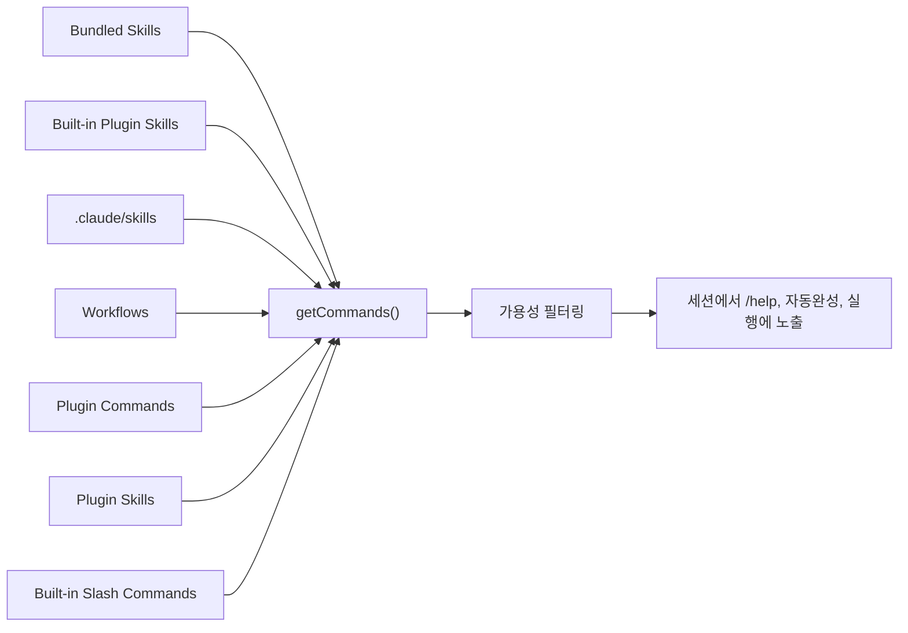

# OpenPro 명령어 실전 가이드

## 1. 문서 목적

이 문서는 OpenPro의 명령 체계를 소스 기준으로 풀어서, 어떤 명령이 어디에서 등록되고, 어떤 상황에서 어떤 진입점을 선택해야 하는지 빠르게 이해할 수 있게 만든 운영 가이드입니다.

분석 기준 파일:

- `src/commands.ts`
- `src/main.tsx`
- `src/entrypoints/cli.tsx`
- `src/types/command.ts`

중요한 전제:

- 저장소 내부 소스와 help 문자열에는 아직 `claude` 명칭이 남아 있는 부분이 있습니다.
- 이 저장소 패키지의 실제 실행 예시는 `openpro` 기준으로 읽는 것이 안전합니다.

## 2. 명령 표면 구조

OpenPro의 명령 표면은 크게 네 층으로 나뉩니다.

| 구분 | 진입 방식 | 주 용도 |
|---|---|---|
| 시작 옵션 | `openpro --flag ...` | 실행 모드, 권한, 모델, 세션 제어 |
| CLI 서브커맨드 | `openpro auth ...`, `openpro plugin ...` | 관리형 작업, 설치, 상태 조회 |
| REPL 슬래시 명령 | 세션 내부에서 `/command` | 대화 중 상태 변경, 탐색, 운영 |
| 동적 명령 | skill, plugin, workflow가 등록 | 확장 기능, 조직 전용 작업 |

## 3. 명령 등록 구조

`src/commands.ts` 기준으로 REPL 명령은 아래 순서로 모입니다.



핵심 해석:

- 기본 명령만 있는 구조가 아니라, 플러그인과 skill이 런타임에 명령 집합을 확장합니다.
- 같은 세션이라도 provider, 인증 상태, feature gate에 따라 노출 명령이 달라질 수 있습니다.
- `getCommands()`는 단순 상수 목록이 아니라 캐시와 동적 로더를 함께 사용합니다.

## 4. REPL 슬래시 명령 분류

아래 표는 `src/commands.ts` 기준으로 자주 쓰는 내장 명령을 기능별로 정리한 것입니다.

### 4.1 세션과 컨텍스트 관리

| 명령 | 역할 |
|---|---|
| `/help` | 사용 가능한 명령과 기본 도움말 |
| `/status` | 현재 세션 상태, 모델, 권한, 환경 확인 |
| `/context` | 현재 컨텍스트 사용량과 compact 관점 상태 확인 |
| `/compact` | 수동 compact 실행 |
| `/resume` | 이전 세션 재개 |
| `/session` | 세션 관련 작업 |
| `/rename` | 세션 표시 이름 변경 |
| `/clear` | 현재 화면/맥락 정리 |
| `/exit` | 세션 종료 |

### 4.2 작업 흐름과 계획

| 명령 | 역할 |
|---|---|
| `/plan` | 계획 수립 중심 흐름 |
| `/tasks` | 작업 목록/태스크 상태 확인 |
| `/agents` | 에이전트 목록과 활용 |
| `/advisor` | 보조 분석 도구 흐름 |
| `/effort` | 추론 강도 조정 |
| `/model` | 세션 모델 전환 |
| `/branch` | 브랜치 컨텍스트 작업 |

### 4.3 파일, 변경점, 메모리

| 명령 | 역할 |
|---|---|
| `/files` | 파일 관련 탐색 |
| `/diff` | 변경점 확인 |
| `/memory` | 메모리 파일 진입 |
| `/rewind` | 파일 체크포인트 기반 되감기 |
| `/copy` | 결과 복사 |

### 4.4 확장과 연동

| 명령 | 역할 |
|---|---|
| `/provider` | provider 설정과 전환 |
| `/mcp` | MCP 구성 점검과 관리 |
| `/plugin` | 플러그인 흐름 |
| `/reload-plugins` | 플러그인 재로딩 |
| `/hooks` | 훅 관련 흐름 |
| `/ide` | IDE 연결 |
| `/skills` | skill 탐색 |

### 4.5 품질과 보안

| 명령 | 역할 |
|---|---|
| `/review` | 코드 리뷰 흐름 |
| `/security-review` | 보안 관점 리뷰 |
| `/doctor` | 진단 |
| `/permissions` | 권한 정책 점검과 조정 |
| `/usage` | 사용량 확인 |
| `/stats` | 통계 확인 |

추가 참고:

- `src/commands.ts`에는 internal-only 명령도 함께 존재합니다.
- `buddy`, `assistant`, `voice`, `bridge`, `web`, `fork` 같은 명령은 feature gate가 열려야 노출됩니다.

## 5. 시작 옵션 실전 정리

`src/main.tsx` 기준으로 운영자가 자주 쓰는 시작 옵션은 아래처럼 묶어 보는 것이 이해하기 쉽습니다.

### 5.1 입출력과 headless 실행

| 옵션 | 의미 |
|---|---|
| `-p`, `--print` | 응답을 출력하고 종료하는 headless 모드 |
| `--output-format` | `text`, `json`, `stream-json` 선택 |
| `--input-format` | 기본 text 또는 `stream-json` 입력 |
| `--json-schema` | 구조화 출력 검증 스키마 |
| `--include-hook-events` | stream-json에 hook 이벤트 포함 |
| `--include-partial-messages` | 부분 메시지 스트림 포함 |
| `--replay-user-messages` | 입력 메시지를 다시 출력 스트림에 실어줌 |

### 5.2 세션 제어

| 옵션 | 의미 |
|---|---|
| `-c`, `--continue` | 현재 디렉터리 최근 세션 계속 |
| `-r`, `--resume [value]` | 세션 ID로 재개 또는 검색어로 선택 |
| `--fork-session` | 재개 시 기존 세션을 복제해 새 세션으로 진행 |
| `--session-id` | 특정 세션 ID 강제 |
| `-n`, `--name` | 세션 표시 이름 설정 |
| `--prefill` | 프롬프트 입력창만 미리 채움 |

### 5.3 모델과 추론

| 옵션 | 의미 |
|---|---|
| `--model` | 세션 모델 지정 |
| `--fallback-model` | 과부하 시 fallback 모델 지정 |
| `--effort` | 추론 강도 지정 |
| `--thinking` | thinking 모드 지정 |
| `--max-turns` | headless 최대 턴 수 |
| `--max-budget-usd` | headless 최대 비용 한도 |

### 5.4 권한, 도구, 설정

| 옵션 | 의미 |
|---|---|
| `--permission-mode` | 권한 모드 지정 |
| `--dangerously-skip-permissions` | 모든 권한 체크 우회 |
| `--allow-dangerously-skip-permissions` | bypass 모드를 선택 가능하게만 노출 |
| `--allowed-tools` | 허용 도구 제한 |
| `--disallowed-tools` | 금지 도구 지정 |
| `--tools` | 세션에서 노출할 내장 도구 집합 지정 |
| `--mcp-config` | MCP 구성 파일 또는 JSON 직접 주입 |
| `--strict-mcp-config` | `--mcp-config`만 사용하고 다른 MCP 소스 무시 |
| `--settings` | 추가 settings 파일 또는 JSON 주입 |
| `--setting-sources` | `user`, `project`, `local` 중 로딩 대상 제한 |
| `--add-dir` | 추가 작업 디렉터리 허용 |
| `--agents` | 커스텀 에이전트 JSON 주입 |

### 5.5 세션 커스터마이징

| 옵션 | 의미 |
|---|---|
| `--system-prompt` | 시스템 프롬프트 전체 교체 |
| `--append-system-prompt` | 기본 시스템 프롬프트 뒤에 추가 |
| `--agent` | 메인 스레드 에이전트 지정 |
| `--plugin-dir` | 세션 전용 플러그인 디렉터리 추가 |
| `--disable-slash-commands` | skill 기반 slash command 비활성화 |
| `--ide` | 시작 시 IDE 자동 연결 |
| `--chrome` / `--no-chrome` | Chrome 연동 토글 |

## 6. 주요 CLI 서브커맨드

### 6.1 운영자가 가장 자주 쓰는 서브커맨드

| 명령 | 목적 |
|---|---|
| `openpro auth login` | Anthropic 계정 로그인 |
| `openpro auth status` | 현재 인증 상태 확인 |
| `openpro auth logout` | 인증 종료 |
| `openpro plugin validate <path>` | 플러그인/마켓플레이스 manifest 검증 |
| `openpro plugin install <plugin>` | 플러그인 설치 |
| `openpro plugin update <plugin>` | 플러그인 업데이트 |
| `openpro plugin disable [plugin]` | 플러그인 비활성화 |
| `openpro mcp serve` | MCP 서버 기동 |
| `openpro mcp add-json <name> <json>` | MCP 서버 정의 추가 |
| `openpro mcp get <name>` | MCP 서버 상태 확인 |
| `openpro doctor` | 환경 진단 |
| `openpro agents` | 설정된 에이전트 목록 조회 |
| `openpro setup-token` | 장기 토큰 설정 |

### 6.2 feature gate 또는 특수 모드 기반 서브커맨드

| 명령 | 조건 | 설명 |
|---|---|---|
| `openpro server` | `DIRECT_CONNECT` | direct connect 세션 서버 시작 |
| `openpro open <cc-url>` | `DIRECT_CONNECT` | `cc://` 또는 `cc+unix://`로 서버 연결 |
| `openpro ssh <host> [dir]` | `SSH_REMOTE` | 원격 호스트에서 CLI 실행 |
| `openpro remote-control` | `BRIDGE_MODE` | remote control 연결 |
| `openpro assistant [sessionId]` | `KAIROS` | assistant 모드 |
| `openpro auto-mode` | feature gate | auto mode 관련 흐름 |

## 7. 명령 노출에 영향을 주는 요소

명령이 보인다고 항상 실행 가능한 것은 아닙니다. 소스 기준으로 아래 요소가 실제 가용성을 바꿉니다.

| 요소 | 영향 |
|---|---|
| 인증 상태 | `claude-ai`, `console` 전용 명령 노출 여부 |
| provider 상태 | provider 의존 기능의 실행 가능 여부 |
| feature gate | `server`, `ssh`, `assistant`, `voice`, `bridge` 등 노출 여부 |
| remote mode | 일부 명령 필터링 |
| plugin/skill 로드 결과 | 사용자 정의 명령 추가 |
| workspace trust | 확장 서버, LSP, 일부 도구 가동 시점 |

추가 주의사항:

- `remote-control`, `ssh`, `open`은 `src/entrypoints/cli.tsx`에서 argv 전처리와 조기 분기 로직이 일부 들어갑니다.
- 따라서 Commander에 등록된 help만 읽으면 실제 실행 흐름을 일부 놓칠 수 있습니다.
- 문제를 재현할 때는 `main.tsx`와 함께 `entrypoints/cli.tsx`를 같이 보는 편이 안전합니다.

## 8. 운영 관점 추천 사용 시나리오

### 8.1 대화형 세션 시작

```powershell
openpro
```

권장 상황:

- 일반적인 개발 보조
- slash command, plugin, MCP를 함께 쓰는 세션

### 8.2 비대화형 한 번 실행

```powershell
openpro -p "현재 저장소의 변경점을 요약해줘" --output-format text
```

권장 상황:

- 스크립트에서 요약 1회 호출
- CI 보조 리포트

### 8.3 특정 설정 소스만 켜고 재현

```powershell
openpro --setting-sources project,local
```

권장 상황:

- 사용자 전역 설정 영향을 배제하고 프로젝트 설정만 재현

### 8.4 플러그인 검증

```powershell
openpro plugin validate D:\project\sample-plugin
```

권장 상황:

- 새 플러그인 작성 후 manifest 검증

### 8.5 direct connect 서버 기동

```powershell
openpro server --host 127.0.0.1 --port 8080
```

권장 상황:

- direct connect 기능이 포함된 빌드에서 세션 서버가 필요할 때

## 9. 실무 팁

- REPL 안에서 가능한 작업인지, CLI 서브커맨드로만 가능한 작업인지 먼저 구분하면 명령 탐색 시간이 크게 줄어듭니다.
- `--print`는 대화형 UX를 많이 건너뛰므로, trust dialog나 plugin 초기화 동작이 일반 세션과 다를 수 있습니다.
- `--bare`는 문제 재현용으로 매우 유용합니다. hooks, auto-memory, plugin sync 등 부가 요소를 줄여서 순수 런타임 문제를 확인하기 쉽습니다.
- feature-gated 명령이 문서에는 있는데 실행 파일에 없으면 빌드 구성 차이를 먼저 의심합니다.
- 확장 명령이 안 보일 때는 플러그인 로딩 실패, workspace trust, `--disable-slash-commands`, feature gate를 순서대로 확인합니다.

연관 문서:

- [openpro-feature-flag-build-guide-ko.md](D:/project/openpro/docs/openpro-feature-flag-build-guide-ko.md)
- [openpro-plugin-hook-guide-ko.md](D:/project/openpro/docs/openpro-plugin-hook-guide-ko.md)
- [openpro-server-mode-guide-ko.md](D:/project/openpro/docs/openpro-server-mode-guide-ko.md)
- [openpro-troubleshooting-guide-ko.md](D:/project/openpro/docs/openpro-troubleshooting-guide-ko.md)
