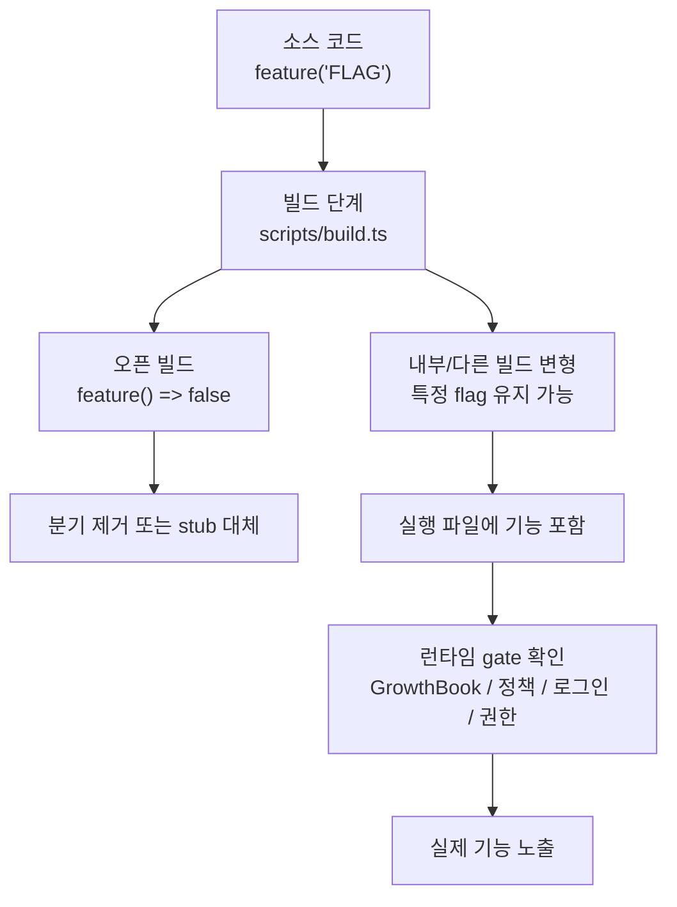

# OpenPro Feature Flag / Build Variant Guide

## 1. 문서 목적

이 문서는 OpenPro 소스에 보이는 기능 플래그가 실제 빌드 결과에서 어떻게 해석되는지, 왜 어떤 명령은 코드에 있는데도 실행 파일에는 나타나지 않는지, 오픈 빌드와 내부 빌드가 어떤 구조로 갈라지는지를 이해하기 쉽게 정리한 운영형 가이드다.

특히 다음 질문에 답하도록 작성했다.

- `feature('KAIROS')`, `feature('BRIDGE_MODE')`, `feature('DIRECT_CONNECT')` 같은 분기가 실제로 무엇을 의미하는가
- 소스에는 있는데 현재 배포된 `openpro` 바이너리에서는 왜 명령이 안 보이는가
- 빌드 타임 플래그와 런타임 gate는 어떻게 다른가
- 유지보수자가 기능 가용 여부를 어디서 확인해야 하는가

---

## 2. 먼저 알아야 할 핵심 결론

1. OpenPro의 기능 플래그는 단순 런타임 설정이 아니라 빌드 타임 분기다.
2. 오픈 빌드에서는 `scripts/build.ts`가 `bun:bundle`의 `feature()` 호출을 전부 `false`로 치환한다.
3. 따라서 소스에 `feature('DIRECT_CONNECT')` 같은 코드가 있어도, 오픈 빌드 결과물에서는 그 분기가 통째로 사라질 수 있다.
4. GrowthBook gate, 조직 정책, 로그인 상태 같은 런타임 조건은 빌드 타임 분기를 통과한 뒤에야 의미가 있다.
5. “코드에 문자열이 보인다”와 “현재 실행 파일에서 쓸 수 있다”는 전혀 다른 판단이다.

---

## 3. 플래그 구조 한눈에 보기



이 구조를 이해할 때 중요한 점은 다음 두 가지다.

- 빌드 타임 분기: 코드가 최종 번들에 포함될지 결정한다.
- 런타임 gate: 번들에 포함된 기능을 현재 사용자와 세션에서 실제로 열어줄지 결정한다.

---

## 4. 오픈 빌드에서 실제로 무슨 일이 일어나는가

핵심 파일은 `scripts/build.ts`다.

이 파일은 두 가지 방식으로 오픈 빌드의 기능 범위를 제한한다.

### 4.1 `feature()`를 전역적으로 `false`로 만든다

`scripts/build.ts` 안의 `bun-bundle-shim`은 `import { feature } from 'bun:bundle'`를 가로채고 아래와 같은 shim을 넣는다.

```ts
export function feature(name) { return false; }
```

즉, 특정 기능명이 `featureFlags` 객체에 명시되어 있든 아니든, 오픈 빌드에서는 `feature('무엇이든')`가 모두 `false`가 된다.

### 4.2 일부 내부 모듈은 명시적 stub로 바꾼다

빌드 스크립트는 몇몇 내부 전용 모듈을 아예 stub 구현으로 치환한다. 대표 예시는 다음과 같다.

| 모듈 | 오픈 빌드 동작 |
|---|---|
| `../daemon/main.js` | `Daemon mode is unavailable in the open build.` 오류 |
| `../daemon/workerRegistry.js` | daemon worker 사용 불가 |
| `../cli/bg.js` | background sessions 관련 명령 전부 사용 불가 |
| `../cli/handlers/templateJobs.js` | template jobs 사용 불가 |
| `../environment-runner/main.js` | BYOC environment runner 사용 불가 |
| `../self-hosted-runner/main.js` | self-hosted runner 사용 불가 |

이 때문에 유지보수자는 “빌드에서 false가 된 분기”와 “예외 메시지를 던지는 stub 모듈”을 모두 구분해서 봐야 한다.

---

## 5. 빌드 타임 플래그와 런타임 gate의 차이

둘은 역할이 다르다.

| 구분 | 어디서 결정 | 의미 |
|---|---|---|
| 빌드 타임 플래그 | `scripts/build.ts`, `feature('...')` | 최종 번들에 기능 코드를 포함할지 결정 |
| 런타임 gate | GrowthBook, 정책, 로그인, 구독, 설정 | 번들에 포함된 기능을 지금 이 세션에서 열지 결정 |

예를 들어 `remote-control`은 원래 런타임에서 다음 조건을 본다.

- Claude.ai 구독 여부
- profile scope가 있는 OAuth 토큰 여부
- 조직 UUID 해석 가능 여부
- GrowthBook gate
- 조직 정책 `allow_remote_control`

하지만 오픈 빌드에서는 `feature('BRIDGE_MODE')` 자체가 `false`라서, 이 런타임 검사들까지 도달하지 못한다.

---

## 6. 유지보수자가 자주 헷갈리는 플래그들

아래 표는 운영과 문서 유지보수 관점에서 자주 마주치는 플래그를 정리한 것이다.

| 플래그 | 소스에서 보이는 역할 | 대표 위치 | 오픈 빌드 기준 해석 |
|---|---|---|---|
| `DIRECT_CONNECT` | `server`, `open`, `cc://` 계열 direct connect 세션 경로 | `src/main.tsx`, `src/server/*` | 소스는 남아 있어도 오픈 빌드에서는 기본적으로 비활성 |
| `BRIDGE_MODE` | `remote-control`, `rc`, `bridge`, `sync` 경로 | `src/entrypoints/cli.tsx`, `src/main.tsx`, `src/bridge/*` | 비활성 |
| `KAIROS` | assistant 모드, 일부 bridge resume, brief/teammate 계열 | `src/main.tsx`, `src/bridge/bridgeMain.ts` | 비활성 |
| `SSH_REMOTE` | SSH 원격 연결 진입점 | `src/main.tsx` | 비활성 |
| `BG_SESSIONS` | `ps`, `logs`, `attach`, `kill`, `--bg` | `src/entrypoints/cli.tsx` | 비활성 + stub 오류 경로 존재 |
| `DAEMON` | daemon supervisor / worker | `src/entrypoints/cli.tsx` | 비활성 + stub 오류 경로 존재 |
| `CONTEXT_COLLAPSE` | `/context` 출력 및 컨텍스트 collapse 관련 보조 로직 | `src/commands/context/*`, `src/utils/analyzeContext.ts` | 비활성 |
| `TEAMMEM` | team memory sync / memdir 확장 | `src/setup.ts`, `src/memdir/*` | 비활성 |
| `VOICE_MODE` | 음성 입력 및 voice 명령 | `src/commands.ts`, `src/voice/*` | 비활성 |
| `WEB_BROWSER_TOOL` | 웹 브라우저 도구 노출 | `src/main.tsx` | 비활성 |
| `BUDDY` | buddy UI / companion sprite | `src/commands.ts`, `src/buddy/*` | 비활성 |
| `CHICAGO_MCP` | computer-use MCP 계열 | `src/entrypoints/cli.tsx`, `src/main.tsx` | 비활성 |

중요한 점:

- `scripts/build.ts`의 `featureFlags` 객체에 적힌 이름은 “대표 내부 기능 목록”에 가깝다.
- 실제 오픈 빌드의 결정권은 `feature() => false` shim이 쥐고 있다.
- 따라서 `DIRECT_CONNECT`, `SSH_REMOTE`처럼 객체에 안 보이는 이름도 오픈 빌드에서는 꺼질 수 있다.

---

## 7. 명령이 실제로 사라지는 위치

기능이 사용자 눈에 보일지 판단할 때는 보통 아래 세 층을 차례대로 보면 된다.

### 7.1 CLI fast-path

`src/entrypoints/cli.tsx`는 빠른 경로로 다음 같은 명령을 먼저 가로챈다.

- `remote-control`
- `daemon`
- `ps`, `logs`, `attach`, `kill`
- template job
- environment runner

이 경로는 대부분 `feature('...')` 조건으로 감싸져 있다.

### 7.2 Commander 등록

`src/main.tsx`는 실제 서브커맨드와 옵션을 등록한다.

대표적으로 다음 분기들이 있다.

- `feature('DIRECT_CONNECT')`일 때 `server`, `open`
- `feature('BRIDGE_MODE')`일 때 `remote-control`
- `feature('KAIROS')`일 때 `assistant`
- `feature('SSH_REMOTE')`일 때 ssh 관련 진입

즉, 소스에 등록 코드가 있어도 빌드 결과물에서 분기 자체가 제거되면 도움말과 실행 경로 모두 사라질 수 있다.

### 7.3 실제 기능 파일

세 번째는 실제 하위 시스템 파일이다.

- `src/server/*`
- `src/bridge/*`
- `src/daemon/*`
- `src/voice/*`

하위 폴더가 존재한다는 사실만으로 기능 사용 가능성을 판단하면 안 된다.

---

## 8. “소스에는 있는데 왜 안 되지?”가 생기는 대표 패턴

### 8.1 코드 검색에서는 보이는데 바이너리에는 명령이 없다

원인:

- 오픈 빌드에서 `feature()`가 모두 `false`

확인 순서:

1. `scripts/build.ts` 확인
2. 해당 명령 등록이 `src/entrypoints/cli.tsx` 또는 `src/main.tsx`에서 `feature('...')`로 감싸져 있는지 확인
3. 실제 배포 빌드가 오픈 빌드인지 확인

### 8.2 명령은 있는데 실행하면 “open build unavailable” 류 오류가 난다

원인:

- 빌드 스크립트가 내부 모듈을 stub로 바꿨을 가능성

대표 예:

- daemon
- background sessions
- template jobs

### 8.3 코드에는 런타임 entitlement 검사가 보이는데 실제로는 거기까지 도달하지 않는다

원인:

- build-time gate가 먼저 분기를 잘라냈기 때문

대표 예:

- `remote-control`의 구독/GrowthBook/정책 검사
- `server`의 direct connect 경로

---

## 9. 기능 가용 여부를 확인하는 가장 빠른 방법

### 9.1 전체 플래그 사용처 찾기

```powershell
rg "feature\\('" src scripts
```

### 9.2 특정 기능의 진입점 찾기

예를 들어 `DIRECT_CONNECT`를 보려면:

```powershell
rg -n "feature\\('DIRECT_CONNECT'\\)|cc://|server" src/main.tsx src/server
```

`BRIDGE_MODE`를 보려면:

```powershell
rg -n "feature\\('BRIDGE_MODE'\\)|remote-control|bridgeMain" src/entrypoints/cli.tsx src/main.tsx src/bridge
```

### 9.3 오픈 빌드에서 정말 살아 있는지 판단하기

다음 세 파일을 함께 읽는 것이 가장 빠르다.

1. `scripts/build.ts`
2. `src/entrypoints/cli.tsx`
3. `src/main.tsx`

---

## 10. 문서 유지보수 기준

다음 중 하나라도 바뀌면 이 문서를 같이 갱신하는 것이 좋다.

- `scripts/build.ts`의 `bun-bundle-shim` 동작
- internal stub 대상 모듈 목록
- `feature('...')` 기반 서브커맨드 등록 구조
- 오픈 빌드와 내부 빌드의 분기 정책
- `DIRECT_CONNECT`, `BRIDGE_MODE`, `KAIROS`, `SSH_REMOTE` 같은 대형 기능군의 노출 방식

---

## 11. 관련 문서

- API 호출 구조는 `openpro-api-guide-ko.md`
- direct connect 서버 쪽은 `openpro-server-mode-guide-ko.md`
- Remote Control 브리지 쪽은 `openpro-remote-control-bridge-guide-ko.md`
- 인증 우선순위는 `openpro-auth-credential-guide-ko.md`
- 증상별 대응은 `openpro-troubleshooting-guide-ko.md`

---

## 12. 한 줄 요약

OpenPro에서 기능 가용 여부를 판단할 때는 반드시 “소스에 코드가 있는가”가 아니라 “오픈 빌드에서 `feature()` 분기가 살아남는가”부터 확인해야 한다.
