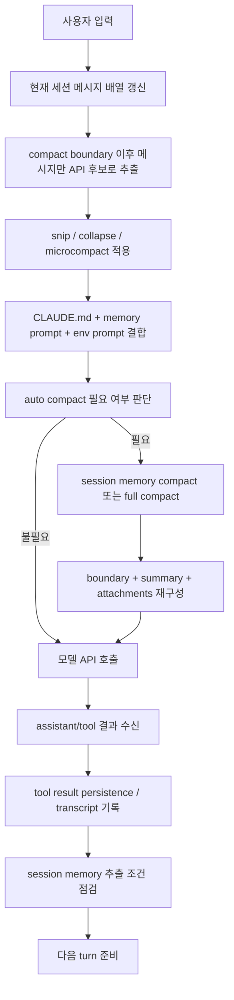
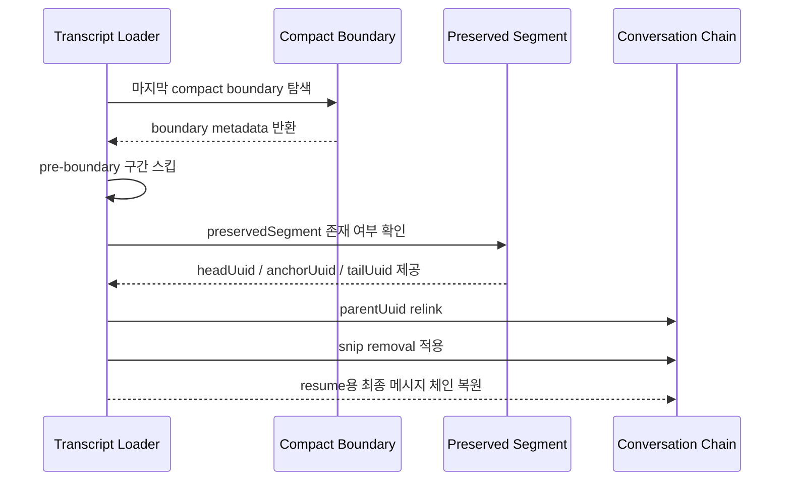

# OpenPro 메모리 구조 및 컨텍스트 압축 상세 설계

## 1. 문서 목적

이 문서는 OpenPro의 메모리 계층, 메모리 사용 방식, 세션 메모리, 컨텍스트 압축, 복원 로직을 실제 코드 기준으로 정리한 구현 문서입니다.  
대상 독자는 개발자, AI 엔지니어, 플랫폼 엔지니어, QA, 운영 담당자이며, 코드 수정이나 기능 확장 전에 내부 동작을 빠르게 파악할 수 있도록 작성합니다.

## 2. 범위

본 문서는 다음 범위를 다룹니다.

- `CLAUDE.md` 계열 지시문 메모리
- auto memory와 team memory
- agent memory
- session memory
- `/memory`, `/context`, `/compact` 등 관련 사용자 진입점
- microcompact, session memory compact, full compact, reactive compact
- transcript 저장 및 resume 복원
- 권한, 설정, 로그, 운영 시 유의사항

## 3. 핵심 개념 요약

OpenPro의 메모리는 단일 저장소가 아니라 목적이 다른 여러 계층으로 분리되어 있습니다.

| 구분 | 주 목적 | 대표 저장 위치 | 지속 범위 | API 컨텍스트 반영 방식 |
|---|---|---|---|---|
| 관리형 지시문 | 조직/정책 강제 | Managed `CLAUDE.md` | 전역 | system prompt에 주입 |
| 사용자 지시문 | 사용자 전역 협업 규칙 | `~/.claude/CLAUDE.md` | 전역 | system prompt에 주입 |
| 프로젝트 지시문 | 저장소 공통 규칙 | `<cwd>/CLAUDE.md`, `.claude/rules/*.md` | 프로젝트 | system prompt에 주입 |
| 로컬 지시문 | 개인용 프로젝트 규칙 | `<cwd>/CLAUDE.local.md` | 프로젝트 로컬 | system prompt에 주입 |
| auto memory | 장기 개인 기억 | `~/.claude/projects/<repo>/memory/` | 프로젝트 간 세션 지속 | memory prompt + `MEMORY.md` 인덱스 |
| team memory | 공유 기억 | `<auto-memory>/team/` | 팀/조직 | team memory prompt |
| agent memory | 에이전트별 장기 기억 | `agent-memory/`, `agent-memory-local/` | agent별 | agent system prompt에 주입 |
| session memory | 현재 세션 요약 | `<projectDir>/<sessionId>/session-memory/summary.md` | 현재 세션 | session memory compact 요약 원문 |
| transcript | 전체 대화 이력 | session jsonl | 현재 세션 | resume, compact 복원, 분석 |

핵심 원칙은 다음과 같습니다.

- 지시문 메모리와 장기 기억은 분리한다.
- 장기 기억은 파일 기반으로 저장하고, 인덱스 파일을 짧게 유지한다.
- 현재 세션 연속성은 session memory가 담당한다.
- 컨텍스트 한도 관리는 단계적 압축 파이프라인으로 처리한다.
- compact 이후에도 plan, discovered tools, agent 상태, skill 정보는 최대한 보존한다.

## 4. 메모리 계층 상세

### 4.1 지시문 메모리 계층

지시문 메모리는 모델이 항상 따라야 하는 규칙, 코딩 스타일, 작업 규율, 프로젝트 제약을 담는 계층입니다. 이 계층은 일반적인 “기억”이 아니라 “항상 읽히는 명시 규칙”에 가깝습니다.

구현 기준 로딩 순서는 다음과 같습니다.

1. Managed memory
2. User memory
3. Project memory
4. Local memory

구현 파일:

- `src/utils/config.ts`
- `src/utils/claudemd.ts`

주요 특징:

- `@include` 문법을 지원합니다.
- `claudeMdExcludes` 설정으로 User, Project, Local 계열만 제외할 수 있습니다.
- `Managed`, `AutoMem`, `TeamMem`은 제외 대상이 아닙니다.
- project memory는 현재 디렉터리에서 루트까지 상향 탐색하며 가까운 디렉터리가 더 높은 우선순위를 갖습니다.

### 4.2 auto memory

auto memory는 대화 간에 유지되는 장기 기억 저장소입니다. 사용자의 작업 방식, 선호, 프로젝트 맥락, 반복적으로 필요한 비코드성 배경 정보를 저장하는 데 사용됩니다.

기본 경로 규칙:

- 기본: `~/.claude/projects/<canonical-git-root>/memory/`
- 엔트리 파일: `MEMORY.md`
- 로그형 보조 경로: `logs/YYYY/MM/YYYY-MM-DD.md`

구현 파일:

- `src/memdir/paths.ts`
- `src/memdir/memdir.ts`

핵심 동작:

- 디렉터리가 없으면 prompt 생성 단계에서 `ensureMemoryDirExists()`로 생성 시도합니다.
- `MEMORY.md`는 인덱스 용도이며, 실제 메모리 내용은 개별 파일에 저장하는 것이 기본 규칙입니다.
- `MEMORY.md`는 항상 line cap, byte cap 기준으로 잘려서 prompt에 들어갑니다.
- extract/daily-log 계열 모드에서는 오늘 날짜 로그 파일에 append하고, 별도 consolidation이 `MEMORY.md`를 갱신합니다.

### 4.3 team memory

team memory는 auto memory 하위에 위치하는 공유 기억 저장소입니다.

특징:

- team memory는 auto memory가 활성화된 경우에만 사용됩니다.
- team memory 경로는 auto memory 하위 경로로 구성됩니다.
- telemetry에서는 auto memory와 team memory를 별도 이벤트로 집계합니다.
- 경로 구조상 team path는 auto memory path에도 포함되므로, 스코프 판별 시 team을 먼저 체크합니다.

구현 파일:

- `src/memdir/teamMemPaths.ts`
- `src/memdir/teamMemPrompts.ts`
- `src/utils/memoryFileDetection.ts`
- `src/utils/teamMemoryOps.ts`

### 4.4 agent memory

agent memory는 메인 스레드가 아니라 특정 agent definition에 종속된 장기 기억입니다.

scope별 저장 위치:

| scope | 저장 위치 | 의미 |
|---|---|---|
| `user` | `<memoryBase>/agent-memory/<agentType>/` | 프로젝트를 넘는 agent 공통 기억 |
| `project` | `<cwd>/.claude/agent-memory/<agentType>/` | 저장소 공유형 agent 기억 |
| `local` | `<cwd>/.claude/agent-memory-local/<agentType>/` | 로컬 머신 전용 agent 기억 |

구현 파일:

- `src/tools/AgentTool/agentMemory.ts`
- `src/utils/plugins/loadPluginAgents.ts`

핵심 동작:

- plugin agent frontmatter의 `memory: user|project|local` 선언을 읽습니다.
- memory가 켜져 있으면 Read, Edit, Write 도구를 agent에 추가합니다.
- agent system prompt에 해당 scope의 memory prompt를 덧붙입니다.

### 4.5 session memory

session memory는 현재 세션의 요약 노트입니다. 장기 기억이 아니라 “이번 대화에서 지금 무엇을 하고 있는가”를 유지하기 위한 요약 계층입니다.

기본 경로:

- `{projectDir}/{sessionId}/session-memory/summary.md`

기본 템플릿 섹션:

- Session Title
- Current State
- Task specification
- Learnings
- Key results
- Worklog

구현 파일:

- `src/services/SessionMemory/sessionMemoryUtils.ts`
- `src/services/SessionMemory/prompts.ts`
- `src/services/compact/sessionMemoryCompact.ts`

핵심 상태값:

- `lastSummarizedMessageId`
- `extractionStartedAt`
- `tokensAtLastExtraction`
- `sessionMemoryInitialized`

기본 threshold:

| 항목 | 기본값 |
|---|---|
| 초기화 최소 컨텍스트 토큰 | 10,000 |
| 다음 업데이트까지 필요한 증가 토큰 | 5,000 |
| 업데이트 사이 도구 호출 수 | 3 |

## 5. 메모리 경로 및 권한 구조

메모리 파일은 일반 파일과 동일하게 취급되지 않습니다. 권한 계층에서 세션 메모리, auto memory, agent memory는 별도 allow carve-out을 가집니다.

구현 파일:

- `src/utils/permissions/filesystem.ts`
- `src/utils/memoryFileDetection.ts`

주요 규칙:

- session memory는 읽기 허용 내부 경로입니다.
- agent memory는 읽기/쓰기 허용 내부 경로입니다.
- auto memory는 기본 경로인 경우 읽기/쓰기 carve-out이 존재합니다.
- 단, `CLAUDE_COWORK_MEMORY_PATH_OVERRIDE`로 override된 auto memory는 자동 쓰기 carve-out이 해제되고 일반 권한 흐름을 따릅니다.
- `autoMemoryDirectory` 설정은 `policy/local/user settings`만 신뢰하며, 체크인된 `projectSettings` 값은 보안상 무시합니다.

보안 배경:

- 악성 저장소가 checked-in 설정으로 민감 경로를 auto memory 디렉터리로 지정하는 것을 막기 위함입니다.

## 6. 메모리 로딩 순서와 실제 프롬프트 반영

메모리 반영은 단일 함수가 아니라 여러 계층이 합쳐져 이뤄집니다.

### 6.1 시스템 프롬프트 단계

- `src/constants/prompts.ts`에서 `loadMemoryPrompt()`를 호출합니다.
- `src/utils/systemPrompt.ts`가 전체 system prompt 조립 과정에서 memory 섹션을 포함합니다.
- system prompt에는 “컨텍스트 한도에 가까워지면 이전 메시지를 자동 압축한다”는 운영 규칙도 포함됩니다.

### 6.2 CLAUDE.md 로딩 단계

- `src/utils/claudemd.ts`의 `getMemoryFiles()`가 Managed, User, Project, Local, AutoMem을 수집합니다.
- AutoMem/TeamMem은 instruction hook 대상이 아니라 별도 memory 시스템으로 취급합니다.

### 6.3 API 직전 메시지 뷰 단계

실제 API에 전달되는 메시지는 raw transcript 전체가 아닙니다.

적용 순서:

1. 마지막 compact boundary 이후 메시지 추출
2. 필요 시 context collapse view 투영
3. microcompact 적용
4. auto compact 필요 여부 판정
5. 최종 message array를 API 요청에 사용

구현 파일:

- `src/query.ts`
- `src/commands/context/context-noninteractive.ts`

## 7. 실제 turn 기준 데이터 흐름

### 7.1 상세 절차

1. 사용자의 입력과 기존 메시지가 `query.ts` 루프에 들어갑니다.
2. 가장 최근 `compact_boundary` 이전 메시지는 API 후보군에서 제거됩니다.
3. 대용량 tool result는 필요 시 디스크 파일로 치환되거나 microcompact 대상으로 등록됩니다.
4. system prompt에는 memory와 CLAUDE.md 규칙이 포함됩니다.
5. 현재 token 사용량이 auto compact threshold를 넘는지 검사합니다.
6. 넘지 않으면 그대로 모델 호출을 수행합니다.
7. 넘으면 우선 session memory compact를 시도하고, 불가능하면 full compact를 수행합니다.
8. compact 결과는 boundary message, summary message, 보존 메시지, attachment, hook result로 다시 조립됩니다.
9. 새 메시지 집합으로 모델을 다시 호출합니다.
10. 응답 후 transcript, content replacement, tool result persistence, session memory 관련 상태를 갱신합니다.

## 8. 컨텍스트 압축 계층

OpenPro의 압축은 한 가지 방식이 아니라 여러 단계가 결합된 구조입니다.

| 단계 | 목적 | 특징 | 주요 구현 |
|---|---|---|---|
| snip | 중간 구간 제거 | 현재 소스 스냅샷에서는 stub, 복원 로직은 존재 | `src/services/compact/snipCompact.ts` |
| microcompact | 오래된 tool result 축소 | full summary 없이 일부 콘텐츠만 정리 | `src/services/compact/microCompact.ts` |
| session memory compact | 현재 세션 요약 활용 | session-memory 파일을 summary 원문으로 사용 | `src/services/compact/sessionMemoryCompact.ts` |
| full compact | 대화 전체 요약 | boundary + summary로 재구성 | `src/services/compact/compact.ts` |
| reactive compact | API 실패 후 반응형 복구 | prompt-too-long 이후 재시도 경로 | `src/services/compact/reactiveCompact.ts` |

### 8.1 microcompact

microcompact는 full compact 전에 먼저 context를 덜 공격적으로 줄이는 계층입니다.

모드:

- cached microcompact
- time-based microcompact

cached microcompact 특징:

- 로컬 메시지 본문은 바꾸지 않습니다.
- cache editing API를 이용해 오래된 tool result를 삭제합니다.
- 삭제 경계 메시지는 API 응답 후 실제 삭제 토큰 수를 받아 생성합니다.

time-based microcompact 특징:

- 마지막 assistant 응답 후 시간이 오래 지나 cache가 식었을 때 동작합니다.
- 오래된 tool result의 내용을 직접 `[Old tool result content cleared]`로 교체합니다.
- 다음 turn의 cache 오탐을 막기 위해 관련 state를 reset합니다.

### 8.2 session memory compact

session memory compact는 기존 session-memory 파일을 summary의 진실 원천으로 사용합니다.

핵심 규칙:

- `lastSummarizedMessageId` 이후 메시지만 우선 보존 대상으로 계산합니다.
- 최근 맥락이 너무 적으면 뒤로 확장해 최소 토큰 수와 최소 텍스트 메시지 수를 맞춥니다.
- tool_use/tool_result 쌍을 끊지 않도록 시작 index를 되감습니다.
- 같은 `message.id`를 공유하는 assistant 조각도 함께 보존해 thinking merge 불변식을 지킵니다.
- compact 후 토큰 수가 auto compact threshold를 넘으면 이 경로를 포기하고 full compact로 떨어집니다.

기본 keep 정책:

- 최소 10,000 토큰
- 텍스트 블록 메시지 최소 5개
- 최대 40,000 토큰

### 8.3 full compact

full compact는 LLM을 사용해 conversation summary를 생성하는 경로입니다.

post-compact 조립 순서:

1. `compact_boundary`
2. summary user message
3. `messagesToKeep`
4. attachments
5. session start hook 결과

추가 보존 요소:

- `plan_file_reference`
- async agent attachment
- plan mode attachment
- invoked skill attachment
- deferred tool delta
- agent listing delta
- MCP instructions delta
- `preCompactDiscoveredTools`

### 8.4 reactive compact

reactive compact는 proactive auto compact가 아니라 실제 API가 `prompt too long` 또는 media size 오류를 낸 뒤에 복구하는 경로입니다.

특징:

- collapse drain 이후에도 overflow가 해결되지 않으면 실행됩니다.
- 동일 turn에서 반복적으로 무한 재시도하지 않도록 guard를 둡니다.
- 성공 시 buildPostCompactMessages 결과로 즉시 재시도합니다.

## 9. 자동 압축 임계치

구현 파일:

- `src/services/compact/autoCompact.ts`

핵심 값:

| 항목 | 값 |
|---|---|
| summary용 output reserve 상한 | 20,000 |
| autocompact buffer | 13,000 |
| warning buffer | 20,000 |
| error buffer | 20,000 |
| manual compact 여유분 | 3,000 |
| 연속 실패 차단 횟수 | 3 |

기본 계산식:

- `effectiveContextWindow = modelContextWindow - reservedSummaryTokens`
- `autoCompactThreshold = effectiveContextWindow - 13,000`

특징:

- `DISABLE_COMPACT`는 전체 compact를 끕니다.
- `DISABLE_AUTO_COMPACT`는 자동 compact만 끄고 수동 `/compact`는 유지합니다.
- context collapse가 활성화된 경우 proactive autocompact는 비활성화되어 서로 경쟁하지 않도록 합니다.

## 10. compact 이후 무엇이 보존되는가

compact는 단순히 “앞부분 삭제 + 요약 1개”가 아닙니다. compact 이후에도 작업 연속성을 위해 여러 메타데이터가 살아남습니다.

보존 대상:

- session summary
- 최근 keep 메시지
- plan 내용
- 읽은 파일 재주입 attachment
- background agent 상태
- invoked skill 내용
- discovered tool 집합
- MCP/agent/tool delta attachment

핵심 구현:

- `buildPostCompactMessages()`  
- `annotateBoundaryWithPreservedSegment()`  
- `createPlanAttachmentIfNeeded()`  
- `extractDiscoveredToolNames()`

## 11. transcript 저장과 resume 복원

compact 이후 resume가 정상 동작하려면 단순 파일 append만으로는 부족합니다. OpenPro는 transcript 로더 단계에서 compact 관련 메타데이터를 해석하고 parent chain을 다시 연결합니다.

구현 파일:

- `src/utils/sessionStorage.ts`
- `src/utils/sessionStoragePortable.ts`

주요 개념:

- `compact_boundary`
- `preservedSegment`
- `summaryUuid`
- `summaryContent`
- `preCompactDiscoveredTools`
- `removedUuids` for snip

복원 전략:

- 큰 transcript는 마지막 compact boundary 이후만 forward scan으로 읽습니다.
- pre-boundary metadata는 별도로 수집해 session metadata를 잃지 않게 합니다.
- preserved segment가 있으면 boundary와 keep tail 사이 parent chain을 재연결합니다.
- snip removal이 있으면 중간 제거 구간의 dangling parent를 relink합니다.

## 12. 설정 및 환경변수 정리

### 12.1 settings.json 핵심 값

| 설정명 | 의미 |
|---|---|
| `autoMemoryEnabled` | auto memory 사용 여부 |
| `autoMemoryDirectory` | auto memory 사용자 정의 경로 |
| `autoDreamEnabled` | background memory consolidation 사용 여부 |
| `claudeMdExcludes` | 일부 CLAUDE.md 계열 제외 |
| `cleanupPeriodDays` | transcript 보존 기간 |

### 12.2 환경변수 핵심 값

| 환경변수 | 의미 |
|---|---|
| `CLAUDE_CODE_DISABLE_AUTO_MEMORY` | auto memory 전체 비활성화 |
| `CLAUDE_CODE_REMOTE_MEMORY_DIR` | remote memory base 경로 |
| `CLAUDE_COWORK_MEMORY_PATH_OVERRIDE` | auto memory 전체 경로 override |
| `CLAUDE_COWORK_MEMORY_EXTRA_GUIDELINES` | memory prompt 추가 가이드라인 |
| `DISABLE_COMPACT` | 수동/자동 compact 전체 비활성화 |
| `DISABLE_AUTO_COMPACT` | 자동 compact만 비활성화 |
| `CLAUDE_CODE_AUTO_COMPACT_WINDOW` | autocompact window override |
| `CLAUDE_AUTOCOMPACT_PCT_OVERRIDE` | autocompact threshold 퍼센트 override |
| `ENABLE_CLAUDE_CODE_SM_COMPACT` | session memory compact 강제 활성화 |
| `DISABLE_CLAUDE_CODE_SM_COMPACT` | session memory compact 비활성화 |

## 13. 로그 및 관측 포인트

메모리와 압축은 analytics 이벤트를 통해 관찰됩니다.

주요 이벤트 예시:

- `tengu_session_memory_accessed`
- `tengu_transcript_accessed`
- `tengu_memdir_accessed`
- `tengu_memdir_file_read`
- `tengu_memdir_file_edit`
- `tengu_memdir_file_write`
- `tengu_agent_memory_loaded`
- `tengu_session_memory_loaded`
- `tengu_sm_compact_*`
- `tengu_auto_compact_succeeded`
- `tengu_cached_microcompact`
- `tengu_time_based_microcompact`
- `tengu_post_autocompact_turn`

운영 해석 포인트:

- memdir read/write 이벤트 증가는 장기 기억 활용도를 뜻합니다.
- `tengu_sm_compact_threshold_exceeded` 증가는 session memory 요약이 비대해졌음을 시사합니다.
- autocompact 연속 실패는 threshold, prompt inflation, resume 불일치 이슈를 의심해야 합니다.
- cache deletion 관련 이벤트가 과도하면 microcompact 또는 compact 직후 cache miss와 구분해서 봐야 합니다.

## 14. 디버깅 가이드

### 14.1 “왜 메모리가 안 읽히는가”

확인 순서:

1. `autoMemoryEnabled`가 꺼져 있지 않은지 확인
2. `CLAUDE_CODE_DISABLE_AUTO_MEMORY`가 설정되지 않았는지 확인
3. 실제 `MEMORY.md`가 비어 있지 않은지 확인
4. `claudeMdExcludes`가 instruction memory를 제외하고 있지 않은지 확인
5. override 경로를 사용하는 경우 권한 carve-out이 달라졌는지 확인

### 14.2 “왜 compact가 안 일어나는가”

확인 순서:

1. `DISABLE_COMPACT`, `DISABLE_AUTO_COMPACT` 여부 확인
2. query source가 `compact`, `session_memory`, 특정 subagent인지 확인
3. context collapse가 proactive compact를 대신하고 있는지 확인
4. 연속 실패 circuit breaker가 걸렸는지 확인

### 14.3 “resume 후 문맥이 이상한가”

확인 순서:

1. compact boundary가 잘 기록됐는지 확인
2. preserved segment가 있는지 확인
3. `preCompactDiscoveredTools`가 carry 되었는지 확인
4. snip removal relink가 필요한 세션인지 확인
5. `checkResumeConsistency()` 이벤트 delta를 확인

## 15. 구현 파일 맵

| 주제 | 주요 파일 |
|---|---|
| 메모리 경로 | `src/utils/config.ts`, `src/memdir/paths.ts` |
| 메모리 프롬프트 | `src/memdir/memdir.ts`, `src/constants/prompts.ts`, `src/utils/systemPrompt.ts` |
| CLAUDE.md 로더 | `src/utils/claudemd.ts` |
| session memory 상태 | `src/services/SessionMemory/sessionMemoryUtils.ts` |
| session memory 템플릿 | `src/services/SessionMemory/prompts.ts` |
| 수동 compact | `src/commands/compact/compact.ts` |
| auto compact | `src/services/compact/autoCompact.ts` |
| full compact | `src/services/compact/compact.ts` |
| session memory compact | `src/services/compact/sessionMemoryCompact.ts` |
| microcompact | `src/services/compact/microCompact.ts` |
| query 루프 | `src/query.ts` |
| transcript 저장/복원 | `src/utils/sessionStorage.ts`, `src/utils/sessionStoragePortable.ts` |
| 권한 | `src/utils/permissions/filesystem.ts` |
| 메모리 접근 탐지 | `src/utils/sessionFileAccessHooks.ts`, `src/utils/memoryFileDetection.ts` |

## 16. 결론

OpenPro의 메모리 시스템은 “지시문”, “장기 기억”, “세션 요약”, “압축 복원 메타데이터”를 역할별로 분리한 구조입니다.  
컨텍스트 압축 역시 한 번의 요약이 아니라 `microcompact -> session memory compact -> full compact -> reactive compact`로 이어지는 다단계 파이프라인이며, transcript 복원 계층까지 포함해 설계되어 있습니다.

따라서 메모리 관련 기능을 수정할 때는 단순히 prompt만 보는 것이 아니라 아래 네 축을 함께 확인해야 합니다.

- 어떤 메모리 계층에 저장되는가
- 언제 system prompt나 API message에 포함되는가
- compact 이후 무엇이 보존되는가
- resume 시 어떻게 다시 복원되는가
