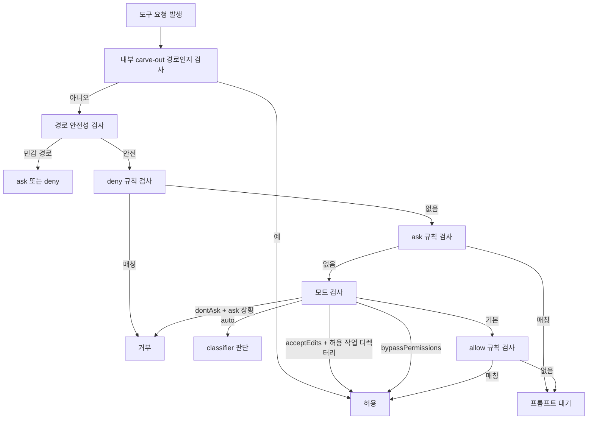

# OpenPro 권한 및 보안 매트릭스

## 1. 문서 목적

이 문서는 OpenPro의 권한 모드, 규칙 우선순위, 파일시스템 보호, 관리형 정책, 원격 모드 제한을 한 문서에서 볼 수 있도록 만든 소스 기준 보안 운영 가이드입니다.

분석 기준 파일:

- `src/types/permissions.ts`
- `src/utils/permissions/PermissionMode.ts`
- `src/utils/permissions/permissions.ts`
- `src/utils/permissions/permissionSetup.ts`
- `src/utils/permissions/permissionsLoader.ts`
- `src/utils/permissions/filesystem.ts`
- `src/utils/permissions/pathValidation.ts`
- `src/utils/settings/types.ts`

## 2. 보안 계층 한눈에 보기

OpenPro의 권한 시스템은 단일 스위치가 아니라 여러 계층이 겹쳐 동작합니다.

| 계층 | 역할 | 핵심 파일 |
|---|---|---|
| 권한 모드 | 세션 기본 행동 결정 | `PermissionMode.ts`, `permissionSetup.ts` |
| 규칙 엔진 | allow, deny, ask 규칙 적용 | `permissions.ts`, `permissionsLoader.ts` |
| 경로 검증 | 위험 파일/디렉터리 차단 | `filesystem.ts`, `pathValidation.ts` |
| 관리형 정책 | 기업 강제 정책 반영 | `settings.ts`, `permissionsLoader.ts` |
| 원격 제한 | remote 환경에서 위험 모드 축소 | `permissionSetup.ts` |
| 분류기 기반 자동판단 | feature gate 환경에서 ask를 classifier로 전환 | `permissions.ts` |

## 3. 권한 모드 매트릭스

`src/types/permissions.ts`와 `src/utils/permissions/PermissionMode.ts` 기준의 사용자 체감 의미는 아래처럼 정리할 수 있습니다.

| 모드 | 외부 노출 여부 | 핵심 의미 | 주의사항 |
|---|---|---|---|
| `default` | 예 | 기본 모드 | 규칙과 도구별 권한 체크를 정상 수행 |
| `plan` | 예 | 계획 중심 모드 | feature gate 상태에 따라 auto mode와 결합될 수 있음 |
| `acceptEdits` | 예 | 허용 작업 디렉터리 안의 쓰기를 크게 완화 | 그래도 민감 경로, 설정 파일, 위험 파일은 별도 안전 체크를 통과해야 함 |
| `bypassPermissions` | 예 | 대부분의 권한 프롬프트를 우회 | deny 규칙, content-specific ask 규칙, safety check는 우회하지 못함 |
| `dontAsk` | 예 | ask를 deny로 바꿈 | 프롬프트 없이 거부되므로 자동화 실패 원인이 될 수 있음 |
| `auto` | 내부/feature gate | ask를 classifier 판단으로 대체 | 외부 일반 빌드에서는 항상 노출되지 않음 |
| `bubble` | 내부 전용 | 내부 상태 전달용 | 일반 사용자 설정 대상으로 보지 않음 |

### 3.1 `acceptEdits`의 실제 의미

`src/utils/permissions/filesystem.ts` 기준으로 `acceptEdits`는 허용 작업 디렉터리 안의 쓰기를 자동 허용하는 빠른 경로를 가집니다.

하지만 아래 항목은 여전히 보호됩니다.

- `.claude/settings.json`, `.claude/settings.local.json`
- `.claude/commands`, `.claude/agents`, `.claude/skills`
- `.git`, `.vscode`, `.idea`, `.claude` 같은 위험 디렉터리
- `.gitconfig`, `.bashrc`, `.mcp.json`, `.claude.json` 같은 민감 파일
- 수상한 Windows 경로 패턴과 UNC 우회 시도
- 원본 경로와 symlink 해석 경로 모두

### 3.2 `dontAsk`의 실제 의미

`src/utils/permissions/permissions.ts` 기준으로 `dontAsk`는 ask 결과를 마지막 단계에서 deny로 변환합니다.

즉:

- 허용 규칙은 그대로 허용됩니다.
- ask 상황은 프롬프트 대신 즉시 거부됩니다.
- 자동화 파이프라인에서는 조용한 실패처럼 보일 수 있어 주의가 필요합니다.

### 3.3 `bypassPermissions`의 한계

`bypassPermissions`는 강력하지만 완전 무제한 모드는 아닙니다.

우회되지 않는 대표 케이스:

- 명시적 deny 규칙
- 특정 내용에 대해 ask로 강제한 규칙
- `.git`, `.claude`, `.vscode`, 쉘 설정 파일 같은 safety check 대상

즉, “모든 것을 무조건 허용”이 아니라 “일반 권한 대화상자를 가능한 한 우회”에 가깝게 해석해야 안전합니다.

## 4. 권한 규칙 소스와 우선순위

### 4.1 규칙 소스

| 소스 | 의미 |
|---|---|
| `userSettings` | 사용자 전역 설정 규칙 |
| `projectSettings` | 프로젝트 공유 규칙 |
| `localSettings` | 로컬 개인 규칙 |
| `flagSettings` | `--settings`로 주입된 규칙 |
| `policySettings` | 관리형 정책 규칙 |
| `cliArg` | CLI 인자에서 온 일시 규칙 |
| `command` | 명령 실행 과정에서 만든 규칙 |
| `session` | 현재 세션에만 유지되는 규칙 |

### 4.2 적용 원칙

| 항목 | 동작 |
|---|---|
| 기본 우선순위 | user < project < local < flag < policy |
| 편집 가능한 소스 | `userSettings`, `projectSettings`, `localSettings` |
| 읽기 전용 소스 | `policySettings`, `flagSettings` |
| 관리형 강제 | `allowManagedPermissionRulesOnly=true`면 정책 규칙만 적용 |
| UI 영향 | 위 옵션이 켜지면 “Always allow”류 선택지가 숨겨질 수 있음 |

## 5. `permissions` 설정 키 정리

`src/utils/settings/types.ts` 기준으로 주요 보안 관련 키는 아래와 같습니다.

| 키 | 의미 | 운영 포인트 |
|---|---|---|
| `permissions.allow` | 항상 허용 규칙 | 과도한 와일드카드는 위험 |
| `permissions.deny` | 항상 거부 규칙 | 강제 차단용 |
| `permissions.ask` | 항상 물어보는 규칙 | 민감 명령 세분화에 유용 |
| `permissions.defaultMode` | 기본 권한 모드 | 팀 기본값으로 자주 사용 |
| `permissions.disableBypassPermissionsMode` | bypass 모드 비활성화 | 관리형 환경 권장 |
| `permissions.disableAutoMode` | auto mode 비활성화 | feature gate 환경에서만 의미 |
| `permissions.additionalDirectories` | 추가 작업 디렉터리 | 읽기/쓰기 범위 확장 |
| `allowManagedPermissionRulesOnly` | 정책 규칙만 사용 | 사용자 규칙 무시 |
| `allowManagedHooksOnly` | 정책 훅만 실행 | hooks를 통한 우회 축소 |
| `allowManagedMcpServersOnly` | 관리형 MCP allowlist만 사용 | 외부 서버 표면 축소 |
| `strictPluginOnlyCustomization` | 비플러그인 커스터마이징 차단 | 조직 표준화 강화 |

## 6. 파일시스템 보안 매트릭스

### 6.1 경로 유형별 처리

| 경로 유형 | 읽기 | 쓰기 | 메모 |
|---|---|---|---|
| 현재 작업 디렉터리 내부 일반 파일 | 보통 허용 | `acceptEdits`면 자동 허용 가능, 아니면 규칙/프롬프트 | 가장 일반적인 개발 경로 |
| `additionalDirectories` 내부 파일 | 허용 범위에 포함 | `acceptEdits` 또는 allow 규칙 필요 | 범위 확장용 |
| 내부 세션 경로 | 읽기/쓰기 carve-out 존재 | 일부 내부 파일은 별도 허용 | session memory, plan, tool results 등 |
| `.claude/settings.json` 계열 | 읽기 가능 | 항상 민감 경로로 취급 | 자동 편집 방지 |
| `.claude/commands`, `.claude/agents`, `.claude/skills` | 제한적 | 항상 ask 성격으로 보호 | 커스터마이징 표면 |
| 위험 디렉터리 `.git`, `.vscode`, `.idea`, `.claude` | 제한적 | 민감 경로 보호 | 안전 체크 우선 |
| 위험 파일 `.gitconfig`, `.bashrc`, `.mcp.json`, `.claude.json` 등 | 제한적 | 민감 파일 보호 | 자동 편집 금지 쪽으로 동작 |
| 수상한 Windows 경로, UNC 우회 경로 | 매우 보수적 | 수동 승인 필요 | classifier도 승인하지 못하는 경우 존재 |

### 6.2 위험 파일과 위험 디렉터리

`src/utils/permissions/filesystem.ts`에 하드코딩된 대표 보호 대상:

위험 파일:

- `.gitconfig`
- `.gitmodules`
- `.bashrc`
- `.bash_profile`
- `.zshrc`
- `.zprofile`
- `.profile`
- `.ripgreprc`
- `.mcp.json`
- `.claude.json`

위험 디렉터리:

- `.git`
- `.vscode`
- `.idea`
- `.claude`

### 6.3 symlink와 우회 방지

경로 검증은 입력 경로 하나만 보지 않습니다.

- 원본 경로
- symlink 해석 경로
- Windows 혼합 대소문자 변형
- path traversal 흔적

를 함께 검사합니다. 따라서 “겉보기에는 안전한 경로로 보이게 만들기” 식의 우회가 잘 통하지 않도록 설계되어 있습니다.

## 7. 내부 경로 carve-out

모든 `.claude` 경로가 동일하게 막히는 것은 아닙니다. 내부 동작에 꼭 필요한 경로는 carve-out이 존재합니다.

대표 예시:

- session memory 파일
- 현재 세션 plan 파일
- scratchpad
- project temp 디렉터리
- tool result 저장 경로
- auto-memory 경로
- agent memory 경로

이 carve-out은 “시스템이 자기 자신을 운영하기 위한 내부 경로”를 살리기 위한 것이고, 일반 사용자 파일 경로 개방과는 목적이 다릅니다.

## 8. 원격 및 관리형 환경 제한

### 8.1 `CLAUDE_CODE_REMOTE`

`src/utils/permissions/permissionSetup.ts` 기준으로 remote 환경에서는 `permissions.defaultMode` 해석이 더 보수적입니다.

실질 규칙:

- `acceptEdits`, `plan`, `default`만 안전하게 취급합니다.
- `bypassPermissions` 같은 값은 설정에 있어도 무시될 수 있습니다.
- 이유는 원격 환경에서 무제한 권한이 묵시적으로 적용되는 상황을 피하기 위해서입니다.

### 8.2 bypass 비활성화

`bypassPermissions`는 두 방향에서 차단될 수 있습니다.

- 설정에서 `permissions.disableBypassPermissionsMode="disable"`
- 런타임 gate 또는 서버 측 killswitch

즉, 사용자가 CLI에서 모드를 시도해도 조직 정책이나 배포 제어로 비활성화될 수 있습니다.

## 9. 권한 결정 흐름

## 10. 운영 체크리스트

- 팀 정책으로 막아야 하는 것은 `deny`보다 관리형 설정 우선 적용 여부까지 함께 검토합니다.
- `acceptEdits`를 켜더라도 `.git`, `.claude`, 설정 파일은 보호된다는 점을 팀에 명확히 안내합니다.
- 자동화 세션에서 `dontAsk`를 쓸 경우 실패를 “무응답”으로 오해하지 않도록 stderr/log 수집을 함께 설계합니다.
- `additionalDirectories`는 최소 범위만 열고, 광범위한 상위 디렉터리 추가는 피합니다.
- remote 환경에서 권한 동작이 로컬과 다르다면 `CLAUDE_CODE_REMOTE` 적용 여부를 먼저 확인합니다.

## 11. QA 검증 포인트

- `acceptEdits`에서 일반 작업 디렉터리 파일은 자동 허용되고, `.claude/settings.json`은 계속 막히는지 확인합니다.
- `dontAsk`에서 ask 상황이 실제로 deny로 변환되는지 확인합니다.
- `bypassPermissions`에서도 `permissions.ask` 규칙과 safety check가 유지되는지 확인합니다.
- `allowManagedPermissionRulesOnly=true`일 때 user/project/local 규칙이 실제로 무시되는지 확인합니다.
- symlink를 통한 우회 쓰기가 차단되는지 확인합니다.
- Windows에서 혼합 대소문자 경로와 UNC 경로 우회가 막히는지 확인합니다.

연관 문서:

- [openpro-auth-credential-guide-ko.md](D:/project/openpro/docs/openpro-auth-credential-guide-ko.md)
- [openpro-feature-flag-build-guide-ko.md](D:/project/openpro/docs/openpro-feature-flag-build-guide-ko.md)
- [openpro-troubleshooting-guide-ko.md](D:/project/openpro/docs/openpro-troubleshooting-guide-ko.md)
