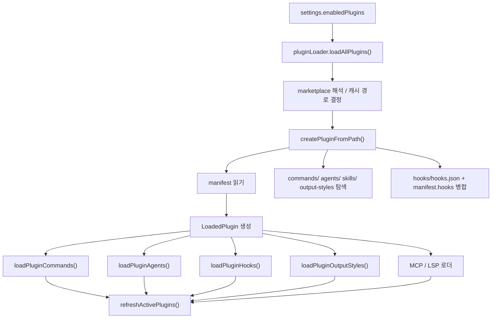
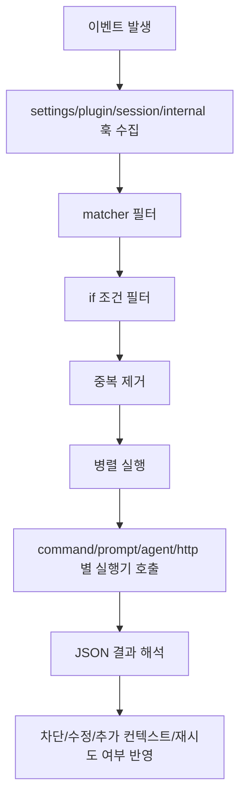

# OpenPro 플러그인 및 훅 추가 가이드

## 1. 문서 목적

이 문서는 OpenPro 소스를 기준으로 플러그인과 훅이 실제로 어떻게 로드되고 실행되는지 설명하고, 새 기능을 추가하려는 개발자가 바로 따라 할 수 있는 수준의 실전 가이드를 제공한다.

대상 독자는 다음과 같다.

- OpenPro에 새 확장 기능을 넣고 싶은 개발자
- 플러그인 구조를 이해하고 내부 로더와 연결 지점을 파악하려는 엔지니어
- 훅이 언제, 어떤 입력으로, 어떤 규칙으로 실행되는지 확인하려는 운영자와 QA

---

## 2. 먼저 이해해야 할 핵심 개념

플러그인과 훅은 비슷해 보이지만 역할이 다르다.

| 구분 | 한 줄 설명 | 대표 소스 |
|---|---|---|
| 플러그인 | OpenPro에 새 명령, 에이전트, 훅, MCP, LSP, 출력 스타일을 묶어서 추가하는 패키지 | `src/utils/plugins/pluginLoader.ts` |
| 훅 | 특정 이벤트가 발생했을 때 자동으로 실행되는 확장 포인트 | `src/utils/hooks.ts` |
| 플러그인 훅 | 플러그인이 제공하는 훅 정의 | `src/utils/plugins/loadPluginHooks.ts` |
| 설정 훅 | `settings.json` 계열에 직접 적는 훅 | `src/utils/hooks/hooksConfigSnapshot.ts` |
| 세션 훅 | skill/agent frontmatter에서 현재 세션에만 등록되는 훅 | `src/utils/hooks/registerSkillHooks.ts`, `src/utils/hooks/registerFrontmatterHooks.ts` |

가장 중요한 이해 포인트는 아래와 같다.

- 플러그인은 “기능 묶음”이다.
- 훅은 “이벤트에 반응하는 자동 실행 규칙”이다.
- 플러그인은 훅을 포함할 수 있다.
- 훅은 플러그인 없이도 설정 파일만으로 추가할 수 있다.

---

## 3. 플러그인 시스템 전체 구조

### 3.1 플러그인은 어디서 오나

OpenPro가 읽는 플러그인은 크게 3종류다.

1. 마켓플레이스 플러그인
2. 세션 전용 로컬 플러그인 `--plugin-dir`
3. 코드에 내장된 built-in 플러그인

관련 소스:

- `src/utils/plugins/pluginLoader.ts`
- `src/plugins/builtinPlugins.ts`
- `src/plugins/bundled/index.ts`

### 3.2 플러그인 로딩의 큰 흐름



핵심 진입점:

- 플러그인 디렉터리/캐시 해석: `src/utils/plugins/pluginDirectories.ts`
- 플러그인 발견과 manifest 해석: `src/utils/plugins/pluginLoader.ts`
- 활성 플러그인 반영: `src/utils/plugins/refresh.ts`

### 3.3 플러그인 디렉터리와 저장 위치

기본 플러그인 저장 루트는 `~/.claude/plugins`다.

관련 소스:

- `src/utils/plugins/pluginDirectories.ts`

핵심 규칙:

- `CLAUDE_CODE_PLUGIN_CACHE_DIR`를 설정하면 기본 루트를 덮어쓴다.
- `CLAUDE_CODE_USE_COWORK_PLUGINS` 또는 `--cowork`를 쓰면 `cowork_plugins`를 사용한다.
- 플러그인 캐시는 보통 `~/.claude/plugins/cache/{marketplace}/{plugin}/{version}` 구조를 따른다.
- 플러그인 고유 데이터는 캐시와 별도로 `~/.claude/plugins/data/{pluginId}` 밑에 유지된다.

여기서 중요한 차이는 아래와 같다.

- `CLAUDE_PLUGIN_ROOT`: 버전별 설치 캐시 경로, 업데이트 시 바뀔 수 있다.
- `CLAUDE_PLUGIN_DATA`: 업데이트 후에도 유지되는 영속 데이터 경로다.

즉, 플러그인이 파일을 써야 한다면 다음 원칙이 안전하다.

- 읽기 전용 리소스 참조는 `CLAUDE_PLUGIN_ROOT`
- 사용자 상태 저장은 `CLAUDE_PLUGIN_DATA`

---

## 4. 플러그인 디렉터리 구조

가장 기본적인 구조는 아래다.

```text
my-plugin/
  .claude-plugin/
    plugin.json
  commands/
    hello.md
  agents/
    reviewer.md
  hooks/
    hooks.json
  skills/
    code-review/
      SKILL.md
  output-styles/
    concise.md
```

### 4.1 반드시 기억할 규칙

1. manifest 파일은 루트가 아니라 `.claude-plugin/plugin.json`에 둔다.
2. 표준 훅 파일은 `hooks/hooks.json`이다.
3. 명령은 `commands/`, 에이전트는 `agents/`, 스킬은 `skills/`, 출력 스타일은 `output-styles/`가 기본 디렉터리다.
4. 상대 경로는 대부분 `./`로 시작해야 한다.
5. `..` 경로는 검증 단계에서 문제로 잡힌다.

관련 소스:

- manifest 스키마: `src/utils/plugins/schemas.ts`
- manifest 로딩: `src/utils/plugins/pluginLoader.ts`
- 검증 도구: `src/utils/plugins/validatePlugin.ts`

---

## 5. plugin.json에서 실제로 정의할 수 있는 것

### 5.1 핵심 필드

플러그인 manifest의 주요 필드는 아래와 같다.

| 필드 | 의미 | 비고 |
|---|---|---|
| `name` | 플러그인 식별자 | 공백 금지, 가능하면 kebab-case |
| `version` | 버전 | 없으면 로딩은 되지만 검증에서 경고 가능 |
| `description` | 설명 | 사용자 UI에 노출 가능 |
| `author` | 작성자 정보 | 선택 |
| `dependencies` | 의존 플러그인 | bare name이면 같은 marketplace로 해석 |
| `commands` | 추가 명령 경로 또는 인라인 명령 정의 | 기본 `commands/` 외 경로 추가 가능 |
| `agents` | 추가 에이전트 파일 경로 | 기본 `agents/` 외 경로 추가 가능 |
| `skills` | 추가 스킬 디렉터리 경로 | 기본 `skills/` 외 경로 추가 가능 |
| `outputStyles` | 추가 출력 스타일 경로 | 기본 `output-styles/` 외 경로 추가 가능 |
| `hooks` | 추가 훅 파일 또는 인라인 훅 | 표준 `hooks/hooks.json`에 추가 병합 |
| `mcpServers` | MCP 서버 정의 | 파일, 인라인, MCPB/DXT 지원 |
| `lspServers` | LSP 서버 정의 | 파일 또는 인라인 지원 |
| `userConfig` | 사용자 입력 옵션 스키마 | 비밀 값은 secure storage로 저장 가능 |
| `settings` | 플러그인 활성 시 병합할 설정 | 현재는 allowlist 기반으로 제한 |

관련 소스:

- `src/utils/plugins/schemas.ts`

### 5.2 매우 중요한 함정: manifest 필드를 쓰면 기본 디렉터리 자동 탐색이 꺼질 수 있다

`commands`, `agents`, `skills`, `outputStyles`는 manifest에 필드를 넣는 순간 “기본 디렉터리 자동 감지”가 생략된다.

즉 아래처럼 생각하면 된다.

- manifest에 `commands`가 없으면 `commands/` 디렉터리를 자동 탐색
- manifest에 `commands`가 있으면 그 값만 사용

이 규칙은 `agents`, `skills`, `outputStyles`도 동일하다.

관련 소스:

- `src/utils/plugins/pluginLoader.ts`

실무에서 가장 흔한 실수는 아래다.

- `plugin.json`에 `commands: "./extra"`만 적고 기본 `commands/`도 함께 읽힐 거라고 기대하는 경우

이 경우 기본 디렉터리는 자동으로 읽히지 않는다. 둘 다 쓰고 싶으면 둘 다 manifest에 명시하는 쪽이 안전하다.

---

## 6. 가장 쉬운 플러그인 추가 방법

### 6.1 명령 하나만 있는 최소 플러그인

예시 구조:

```text
my-plugin/
  .claude-plugin/
    plugin.json
  commands/
    hello.md
```

`plugin.json` 예시:

```json
{
  "name": "my-plugin",
  "version": "0.1.0",
  "description": "예제 플러그인"
}
```

`commands/hello.md` 예시:

```md
---
description: 간단한 인사 명령
allowed-tools: Read, Grep
argument-hint: [name]
---

사용자에게 친절하게 인사하라.
인자가 있으면 이름을 함께 사용하라.
```

이렇게 하면 명령 이름은 자동으로 `my-plugin:hello`가 된다.

관련 소스:

- 명령 이름 생성: `src/utils/plugins/loadPluginCommands.ts`

### 6.2 플러그인을 빠르게 테스트하는 방법

소스 기준으로 가장 빠른 테스트 전략은 아래 순서다.

1. 플러그인 디렉터리 작성
2. `openpro plugin validate <플러그인 경로 또는 plugin.json 경로>` 실행
3. 세션 플러그인 또는 설치된 플러그인으로 로드
4. `/reload-plugins` 실행
5. `/plugin`, `/hooks`, 명령 호출로 결과 확인

관련 소스:

- validate: `src/utils/plugins/validatePlugin.ts`
- 재로드: `src/commands/reload-plugins/reload-plugins.ts`
- 활성 반영: `src/utils/plugins/refresh.ts`

참고:

- 이 저장소의 패키지 실행 파일은 `openpro`다. 로컬 설치 환경에서 문서 예시를 그대로 따라 할 때는 `openpro plugin validate`를 기준으로 보면 된다.
- 상류 코드에서 가져온 일부 도움말 문자열이나 주석에는 아직 `claude plugin validate`가 남아 있을 수 있다. 이 문서는 실제 배포 패키지의 바이너리 이름 기준으로 정리했다.

---

## 7. 플러그인 명령 추가 방식

### 7.1 이름 규칙

플러그인 명령은 자동으로 플러그인 이름이 prefix로 붙는다.

예시:

- 파일 `commands/build.md`
- 플러그인 이름 `my-plugin`
- 실제 명령 이름 `my-plugin:build`

하위 디렉터리를 쓰면 namespace도 붙는다.

예시:

- `commands/release/deploy.md`
- 실제 명령 `my-plugin:release:deploy`

관련 소스:

- `src/utils/plugins/loadPluginCommands.ts`

### 7.2 skill 디렉터리도 명령으로 읽힌다

`skills/<name>/SKILL.md` 구조는 스킬이지만 내부적으로 플러그인 명령 로더가 함께 처리한다.

중요한 규칙:

- 디렉터리에 `SKILL.md`가 있으면 그 디렉터리의 일반 `.md` 파일보다 `SKILL.md`가 우선된다.
- skill 내용에는 `${CLAUDE_PLUGIN_ROOT}`, `${CLAUDE_SKILL_DIR}`, `${CLAUDE_SESSION_ID}` 치환이 가능하다.
- `userConfig` 값은 비민감 값만 skill/agent 본문에 치환된다.

관련 소스:

- `src/utils/plugins/loadPluginCommands.ts`

---

## 8. 플러그인 에이전트 추가 방식

플러그인 에이전트는 `agents/*.md` 또는 manifest의 `agents` 경로로 추가된다.

### 8.1 이름 규칙

에이전트도 플러그인 prefix를 가진다.

예시:

- `agents/reviewer.md`
- 실제 agent type `my-plugin:reviewer`

관련 소스:

- `src/utils/plugins/loadPluginAgents.ts`

### 8.2 플러그인 에이전트에서 특히 주의할 점

소스에서 명시적으로 막는 항목이 있다.

- plugin agent frontmatter의 `permissionMode`
- plugin agent frontmatter의 `hooks`
- plugin agent frontmatter의 `mcpServers`

이 값들은 있어도 무시된다.

이유는 간단하다.

- 플러그인은 제3자 코드일 수 있다.
- 에이전트 파일 하나가 몰래 권한, 훅, MCP를 늘리는 것을 막기 위해서다.
- 이런 수준의 제어는 플러그인 manifest나 사용자가 직접 관리하는 `.claude/agents/` 쪽에서만 허용한다.

관련 소스:

- `src/utils/plugins/loadPluginAgents.ts`

---

## 9. 플러그인 훅 추가 방식

플러그인이 훅을 제공하는 방식은 2개다.

1. 표준 위치 `hooks/hooks.json`
2. manifest의 `hooks` 필드

이 둘은 대체 관계가 아니라 병합 관계다.

### 9.1 표준 hooks 파일 형식

플러그인 훅 파일은 설정 파일의 `hooks`와 형식이 다르다. 최상위에 wrapper가 하나 더 있다.

예시:

```json
{
  "description": "내 플러그인의 훅",
  "hooks": {
    "PreToolUse": [
      {
        "matcher": "Bash",
        "hooks": [
          {
            "type": "command",
            "command": "node ${CLAUDE_PLUGIN_ROOT}/scripts/check.js",
            "if": "Bash(git *)",
            "timeout": 10
          }
        ]
      }
    ]
  }
}
```

중요 포인트:

- 플러그인 전용 `hooks.json`은 `{ description, hooks }` wrapper를 가진다.
- 설정 파일 `settings.json`의 hooks는 wrapper 없이 바로 event map이다.

관련 소스:

- `PluginHooksSchema`: `src/utils/plugins/schemas.ts`
- 실제 로딩: `src/utils/plugins/pluginLoader.ts`

### 9.2 manifest의 hooks 필드

`plugin.json`에서는 추가 훅을 아래처럼 적을 수 있다.

```json
{
  "name": "my-plugin",
  "hooks": "./extra-hooks.json"
}
```

또는 배열로 여러 개를 병합할 수 있다.

```json
{
  "name": "my-plugin",
  "hooks": ["./extra-hooks-a.json", "./extra-hooks-b.json"]
}
```

또는 인라인 훅 정의도 가능하다.

### 9.3 중복 파일 지정은 피해야 한다

`hooks/hooks.json`은 존재하면 자동 로드된다. 그런데 manifest `hooks`에서 같은 파일을 다시 가리키면 중복으로 판단될 수 있다.

즉 아래 패턴은 피하는 것이 맞다.

- `hooks/hooks.json` 파일이 있음
- manifest `hooks`에도 `./hooks/hooks.json`을 다시 적음

관련 소스:

- 중복 감지: `src/utils/plugins/pluginLoader.ts`

---

## 10. 훅 시스템 전체 구조

### 10.1 훅은 어디서 모이나

실행 시점의 훅은 아래 소스에서 합쳐진다.

1. settings snapshot 훅
2. 등록된 plugin 훅
3. 세션 훅
4. 내부 callback/function 훅

관련 소스:

- 훅 스냅샷: `src/utils/hooks/hooksConfigSnapshot.ts`
- plugin 훅 등록: `src/utils/plugins/loadPluginHooks.ts`
- session 훅 등록: `src/utils/hooks/registerSkillHooks.ts`, `src/utils/hooks/registerFrontmatterHooks.ts`
- 최종 매칭/실행: `src/utils/hooks.ts`

### 10.2 훅 소스별 특징

| 소스 | 어디서 정의하나 | 지속 범위 |
|---|---|---|
| user/project/local settings | `settings.json` 계열 | 설정 파일이 살아있는 동안 |
| plugin hook | 플러그인 내부 `hooks/hooks.json` 또는 manifest | 플러그인이 활성화된 동안 |
| session hook | skill/agent frontmatter | 현재 세션 또는 현재 agent 동안 |
| callback/function hook | 코드 내부 등록 | 런타임 내부 용도 |

---

## 11. 훅 이벤트는 무엇을 기준으로 실행되나

훅은 이벤트 이름 + matcher + 선택적으로 `if` 조건까지 통과해야 실행된다.

### 11.1 matcher 규칙

matcher는 아래 3형태를 지원한다.

1. 정확 일치
2. `|`
   로 연결한 다중 정확 일치
3. 정규식

예시:

- `"Write"`
- `"Write|Edit"`
- `"^(Write|Edit)$"`

관련 소스:

- `matchesPattern()`: `src/utils/hooks.ts`

### 11.2 `if` 조건

`if`는 permission rule 문법을 사용한다. 예를 들면 아래 같은 식이다.

- `Bash(git *)`
- `Read(*.ts)`

이 값은 모든 이벤트에서 다 쓸 수 있는 것이 아니라, 툴 관련 이벤트에서만 평가된다.

실질적으로 `if` 평가가 의미 있는 이벤트는 아래다.

- `PreToolUse`
- `PostToolUse`
- `PostToolUseFailure`
- `PermissionRequest`

관련 소스:

- `prepareIfConditionMatcher()`: `src/utils/hooks.ts`

---

## 12. 훅 타입 4가지

훅 타입은 크게 4개다.

### 12.1 command 훅

가장 일반적이다.

핵심 필드:

- `type: "command"`
- `command`
- `shell`
- `timeout`
- `if`
- `once`
- `async`
- `asyncRewake`

특징:

- 기본 shell은 bash다.
- Windows에서는 `shell: "powershell"`도 가능하다.
- stdin으로 hook input JSON이 전달된다.
- 필요 시 stdout의 첫 JSON 라인으로 async 프로토콜을 사용할 수 있다.

관련 소스:

- schema: `src/schemas/hooks.ts`
- 실행기: `execCommandHook()` in `src/utils/hooks.ts`

### 12.2 prompt 훅

작은 빠른 모델을 사용해 조건 검사나 정책 판단을 시키는 형태다.

특징:

- `$ARGUMENTS` 자리에 hook input JSON을 넣는다.
- 모델 응답은 JSON schema `{ ok: boolean, reason?: string }`여야 한다.
- 주로 “이 조건을 만족하면 통과, 아니면 차단” 같은 검사에 적합하다.

관련 소스:

- schema: `src/schemas/hooks.ts`
- 실행기: `src/utils/hooks/execPromptHook.ts`

### 12.3 agent 훅

더 복잡한 검증을 위해 multi-turn query 루프를 돌리는 훅이다.

특징:

- 실제 `query()`를 사용한다.
- structured output tool로 최종 결과를 내야 한다.
- 간단한 if 검사보다 무겁지만 더 정교하다.

관련 소스:

- schema: `src/schemas/hooks.ts`
- 실행기: `src/utils/hooks/execAgentHook.ts`

### 12.4 http 훅

외부 서버로 hook input JSON을 POST하는 방식이다.

특징:

- 응답은 JSON이어야 한다.
- URL allowlist 정책을 적용받는다.
- header에서 환경변수 치환을 지원한다.
- 허용된 env var만 치환할 수 있다.

관련 소스:

- schema: `src/schemas/hooks.ts`
- 실행기: `src/utils/hooks/execHttpHook.ts`

---

## 13. 훅 입력과 환경변수

### 13.1 공통 입력

대부분의 훅은 JSON input에 아래 같은 공통 정보를 가진다.

- `session_id`
- `transcript_path`
- `cwd`
- `permission_mode`
- `agent_id`
- `agent_type`

관련 소스:

- `createBaseHookInput()`: `src/utils/hooks.ts`

### 13.2 command 훅에서 자동으로 주입되는 환경변수

대표적으로 아래 값들을 사용할 수 있다.

| 환경변수 | 의미 |
|---|---|
| `CLAUDE_PROJECT_DIR` | 현재 프로젝트 루트 |
| `CLAUDE_PLUGIN_ROOT` | 플러그인 루트 또는 skill 루트 |
| `CLAUDE_PLUGIN_DATA` | 플러그인 영속 데이터 디렉터리 |
| `CLAUDE_PLUGIN_OPTION_<KEY>` | userConfig 값 |
| `CLAUDE_ENV_FILE` | 특정 이벤트에서 이후 bash 환경을 주입할 파일 |

특히 `CLAUDE_ENV_FILE`은 아래 이벤트에서 중요하다.

- `SessionStart`
- `Setup`
- `CwdChanged`
- `FileChanged`

관련 소스:

- `execCommandHook()` in `src/utils/hooks.ts`

---

## 14. userConfig를 쓸 때 꼭 알아야 할 점

플러그인 manifest의 `userConfig`는 사용자가 입력해야 하는 값을 선언하는 기능이다.

핵심 동작:

- 일반 값은 `settings.json`의 `pluginConfigs[pluginId].options`에 저장
- `sensitive: true` 값은 secure storage에 저장
- hook command, MCP, LSP에서는 `${user_config.KEY}` 치환 가능
- skill/agent 본문에는 비민감 값만 안전하게 치환

관련 소스:

- schema: `src/utils/plugins/schemas.ts`
- 저장/치환: `src/utils/plugins/pluginOptionsStorage.ts`

실무 팁:

- 토큰, 비밀키는 반드시 `sensitive: true`로 선언
- 훅 shell script에서 바로 쓰고 싶으면 `${user_config.KEY}` 또는 `CLAUDE_PLUGIN_OPTION_<KEY>`를 사용

---

## 15. 훅 반환 규칙을 쉽게 이해하는 방법

### 15.1 command 훅

command 훅은 두 층이 있다.

1. 프로세스 exit code
2. stdout JSON 프로토콜

일반적으로는 아래처럼 이해하면 된다.

- 단순 성공: exit code 0
- 일부 이벤트에서 차단: exit code 2 또는 JSON decision
- stdout이 JSON이면 구조화된 결과로 해석
- stdout이 일반 텍스트면 이벤트 규칙에 따라 사용자/모델에만 표시되거나 무시

관련 소스:

- `parseHookOutput()`: `src/utils/hooks.ts`
- `processHookJSONOutput()`: `src/utils/hooks.ts`

### 15.2 JSON으로 더 정교하게 제어할 수 있는 항목

대표 필드:

- `continue`
- `stopReason`
- `decision`
- `reason`
- `systemMessage`
- `hookSpecificOutput`

예를 들어 `PreToolUse`에서 입력을 바꾸고 싶다면 아래처럼 반환할 수 있다.

```json
{
  "hookSpecificOutput": {
    "hookEventName": "PreToolUse",
    "updatedInput": {
      "file_path": "README.md"
    }
  }
}
```

관련 소스:

- hook output schema: `src/types/hooks.ts`

---

## 16. 자주 쓰는 이벤트만 먼저 익히기

처음에는 아래 이벤트만 알아도 충분하다.

| 이벤트 | 언제 쓰면 좋은가 |
|---|---|
| `PreToolUse` | 위험한 툴 호출 차단, 입력 수정 |
| `PostToolUse` | 결과 검사, 후처리, 요약 |
| `UserPromptSubmit` | 프롬프트 필터링, 정책 검사 |
| `Stop` | 응답 종료 직전 최종 검증 |
| `SessionStart` | 세션 시작 시 초기화 |
| `Setup` | 리포지토리 준비 작업 |
| `CwdChanged` | 디렉터리 이동에 맞는 환경 재설정 |
| `FileChanged` | 감시 파일 변경 후 자동 처리 |
| `PermissionRequest` | 권한 팝업 자동 승인/거부 로직 |

이벤트별 세부 설명은 UI에서도 볼 수 있다.

관련 소스:

- `/hooks` UI 메타데이터: `src/utils/hooks/hooksConfigManager.ts`
- 명령: `src/commands/hooks/index.ts`

---

## 17. 훅이 실제로 실행될 때의 순서

실행 흐름은 대략 아래와 같다.



관련 소스:

- 매칭: `getMatchingHooks()` in `src/utils/hooks.ts`
- 실행: `executeHooks()` in `src/utils/hooks.ts`

핵심 특징:

- 훅은 병렬 실행된다.
- 동일한 내용의 훅은 일부 상황에서 dedup된다.
- plugin/skill root를 namespace로 삼아 교차 플러그인 dedup 오동작을 피한다.

---

## 18. 보안과 정책 때문에 동작이 막히는 경우

### 18.1 모든 훅은 trust를 요구한다

interactive 모드에서는 workspace trust가 수락되지 않으면 모든 훅 실행이 건너뛰어진다.

관련 소스:

- `shouldSkipHookDueToTrust()`: `src/utils/hooks.ts`

### 18.2 managed 정책이 훅을 막을 수 있다

정책 설정에서 아래 값들이 영향을 준다.

- `disableAllHooks`
- `allowManagedHooksOnly`
- `strictPluginOnlyCustomization`

관련 소스:

- `src/utils/hooks/hooksConfigSnapshot.ts`
- `src/utils/settings/pluginOnlyPolicy.ts`
- `src/utils/settings/types.ts`

### 18.3 HTTP 훅은 별도 네트워크 제한을 받는다

정책 설정:

- `allowedHttpHookUrls`
- `httpHookAllowedEnvVars`

관련 소스:

- `src/utils/hooks/execHttpHook.ts`

---

## 19. 실전 추천 패턴

### 19.1 위험한 bash 명령만 막고 싶을 때

가장 추천되는 시작점은 command 훅 + `if` 조건이다.

예시:

```json
{
  "description": "위험 명령 차단",
  "hooks": {
    "PreToolUse": [
      {
        "matcher": "Bash",
        "hooks": [
          {
            "type": "command",
            "command": "node ${CLAUDE_PLUGIN_ROOT}/scripts/block-dangerous.js",
            "if": "Bash(rm *)",
            "timeout": 5
          }
        ]
      }
    ]
  }
}
```

이 패턴의 장점:

- 모든 Bash를 막지 않는다.
- `rm` 계열만 좁게 검사한다.
- 모델 호출 없이 빠르다.

### 19.2 외부 정책 서버와 붙이고 싶을 때

HTTP 훅이 가장 직관적이다.

예시:

```json
{
  "hooks": {
    "PreToolUse": [
      {
        "matcher": "Write|Edit",
        "hooks": [
          {
            "type": "http",
            "url": "https://hooks.example.com/policy/check",
            "headers": {
              "Authorization": "Bearer $HOOK_TOKEN"
            },
            "allowedEnvVars": ["HOOK_TOKEN"],
            "timeout": 10
          }
        ]
      }
    ]
  }
}
```

### 19.3 응답 완료 전에 품질 게이트를 두고 싶을 때

처음엔 prompt 훅보다 command 훅 또는 간단한 agent 훅을 추천한다.

이유:

- prompt 훅은 빠르지만 판단 기준이 너무 모호하면 흔들릴 수 있다.
- agent 훅은 강력하지만 비용과 복잡도가 크다.
- 단순 체크는 command 훅이 디버깅이 가장 쉽다.

---

## 20. 플러그인을 OpenPro 코드에 내장하고 싶을 때

외부 플러그인이 아니라 “제품과 함께 배포되는 built-in plugin”을 만들고 싶다면 경로가 다르다.

관련 소스:

- registry: `src/plugins/builtinPlugins.ts`
- 초기화 지점: `src/plugins/bundled/index.ts`

절차는 아래와 같다.

1. `BuiltinPluginDefinition` 형태로 정의
2. `registerBuiltinPlugin()` 호출
3. 필요 시 skills, hooks, MCP를 함께 실어 보냄

현재 소스 기준으로 built-in plugin registry는 준비만 되어 있고, 실제 등록된 built-in plugin은 거의 없는 상태다. 즉 확장 포인트는 이미 마련되어 있지만, 팀 정책에 맞춰 채워 넣는 구조라고 이해하면 된다.

---

## 21. 디버깅과 검증 체크리스트

플러그인이나 훅이 안 보일 때는 아래 순서로 확인하는 것이 가장 빠르다.

1. `plugin.json` 위치가 `.claude-plugin/plugin.json`인지 확인
2. 상대 경로가 `./`로 시작하는지 확인
3. `openpro plugin validate`로 schema 문제를 먼저 제거
4. `/plugin`에서 활성 상태 확인
5. `/reload-plugins` 실행
6. `/hooks`에서 실제 등록 상태 확인
7. plugin manifest에 기본 디렉터리 자동 탐색을 끄는 필드를 넣었는지 확인
8. 정책 설정이 훅을 막고 있지 않은지 확인
9. interactive 모드라면 workspace trust가 승인됐는지 확인

특히 자주 틀리는 항목은 아래 5개다.

- `hooks/hooks.json` wrapper 누락
- `manifest.commands`를 넣고 기본 `commands/`가 계속 읽힐 거라고 착각
- plugin agent에서 `hooks`나 `permissionMode`를 써놓고 동작을 기대
- `${CLAUDE_PLUGIN_ROOT}` 대신 영속 저장이 필요한 데이터를 캐시 경로에 저장
- 플러그인을 설치만 하고 `/reload-plugins`를 하지 않음

---

## 22. 구현 관점에서 기억해 둘 핵심 파일

| 목적 | 파일 |
|---|---|
| 플러그인 manifest 스키마 | `src/utils/plugins/schemas.ts` |
| 플러그인 발견/로딩 | `src/utils/plugins/pluginLoader.ts` |
| 플러그인 명령 로딩 | `src/utils/plugins/loadPluginCommands.ts` |
| 플러그인 에이전트 로딩 | `src/utils/plugins/loadPluginAgents.ts` |
| 플러그인 훅 로딩 | `src/utils/plugins/loadPluginHooks.ts` |
| 플러그인 옵션 저장/치환 | `src/utils/plugins/pluginOptionsStorage.ts` |
| 플러그인 재로드 | `src/utils/plugins/refresh.ts` |
| 훅 스키마 | `src/schemas/hooks.ts` |
| 훅 출력 타입 | `src/types/hooks.ts` |
| 훅 매칭/실행 중심 로직 | `src/utils/hooks.ts` |
| 훅 UI/설명 메타데이터 | `src/utils/hooks/hooksConfigManager.ts` |
| settings 훅 정책 스냅샷 | `src/utils/hooks/hooksConfigSnapshot.ts` |

---

## 23. 가장 현실적인 추천 시작점

처음 플러그인을 만든다면 아래 순서를 추천한다.

1. command 하나만 있는 최소 플러그인부터 만든다.
2. 그 다음 `hooks/hooks.json`에 `PreToolUse` command 훅 하나를 붙인다.
3. 그 다음에야 `userConfig`, HTTP hook, MCP/LSP를 추가한다.

처음 훅을 만든다면 아래 순서를 추천한다.

1. `command` 훅부터 시작
2. `matcher`와 `if`를 최대한 좁게 설정
3. stdout JSON 고급 제어는 나중에 붙이기
4. 마지막에 async, prompt, agent 훅을 고려

이 순서가 좋은 이유는 간단하다.

- 디버깅이 쉽다.
- 보안 영향 범위를 좁게 시작할 수 있다.
- loader, matcher, policy, trust, reload까지 전체 흐름을 가장 빨리 익힐 수 있다.
