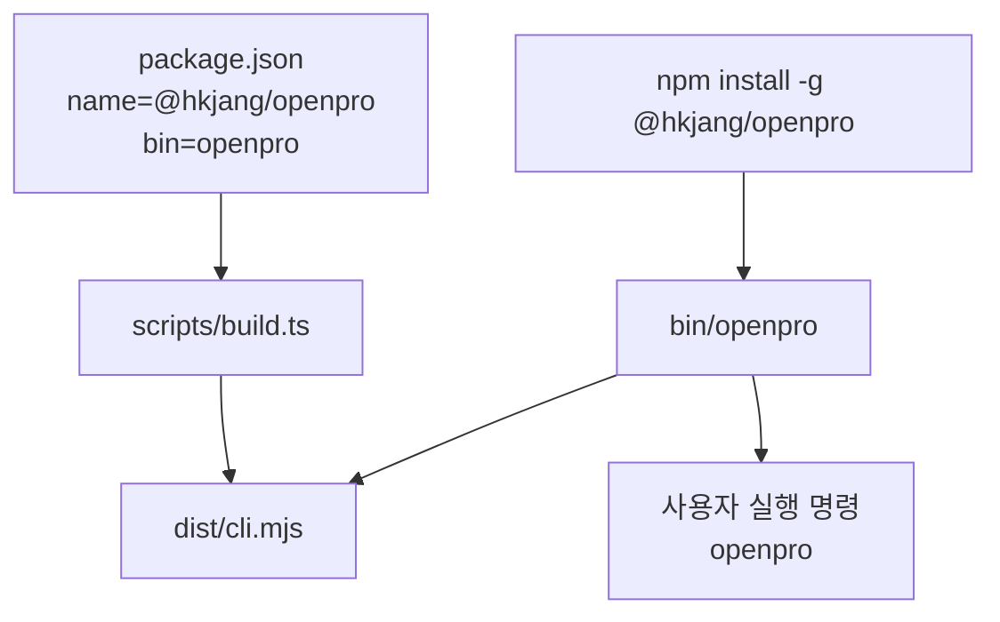

# OpenPro 릴리즈 / 패키징 / 포크 유지보수 가이드

## 1. 문서 목적

이 문서는 OpenPro를 배포하거나 포크해서 유지보수할 때 필요한 패키징 구조와 주의점을 소스 기준으로 정리한 운영형 가이드다.

특히 아래 질문에 답하도록 작성했다.

- npm 패키지와 실제 실행 파일은 어떤 경로로 연결되는가
- 왜 실행 파일 이름은 `openpro`인데 소스 곳곳에는 아직 `claude` 문자열이 남아 있는가
- 오픈 빌드는 어떤 기능을 제거하고 어떤 매크로를 주입하는가
- 포크 유지보수 시 어떤 파일과 문자열을 함께 봐야 하는가

---

## 2. 핵심 결론

1. 현재 패키지명은 `@hkjang/openpro`다.
2. 사용자가 실행하는 명령은 `openpro`다.
3. 엔트리 스크립트는 `bin/openpro`, 실제 번들 산출물은 `dist/cli.mjs`다.
4. `scripts/build.ts`는 Open build 전용 번들을 만들면서 `feature()`를 사실상 전부 꺼버린다.
5. 버전은 이중 구조다.
   내부 호환성용 `MACRO.VERSION`은 `99.0.0`, 사용자 표시용 `MACRO.DISPLAY_VERSION`은 실제 package version이다.
6. UI와 npm 패키징은 OpenPro로 브랜딩되었지만, native installer, doctor, update, 로컬 설치 wrapper에는 아직 `claude` naming이 많이 남아 있다.

---

## 3. 패키징 구조

핵심 연결:

| 단계 | 파일 | 역할 |
|---|---|---|
| 패키지 메타데이터 | `package.json` | 패키지명, 버전, bin, publish 대상 결정 |
| 빌드 | `scripts/build.ts` | TypeScript 소스를 `dist/cli.mjs`로 번들 |
| 런처 | `bin/openpro` | `dist/cli.mjs`가 있으면 실행, 없으면 build 안내 |
| 실제 CLI 엔트리 | `src/entrypoints/cli.tsx` | fast-path 처리 후 전체 CLI 로딩 |

---

## 4. `package.json`에서 결정되는 것

| 키 | 현재 값 | 의미 |
|---|---|---|
| `name` | `@hkjang/openpro` | npm 배포 패키지 이름 |
| `version` | 예: `0.1.9` | 사용자에게 보여줄 OpenPro 버전 기준 |
| `bin.openpro` | `./bin/openpro` | 전역 설치 후 생성되는 실행 명령 |
| `files` | `bin/`, `dist/cli.mjs`, `README.md` | publish에 포함될 파일 |

중요 포인트:

- `prepack`이 `npm run build`를 호출하므로 패키징 직전에 빌드가 강제된다.
- `files`에 소스 전체가 아닌 빌드 산출물만 주로 실리므로, 패키지 품질은 빌드 결과 검증이 핵심이다.

---

## 5. `bin/openpro`가 하는 일

`bin/openpro`는 매우 얇은 런처다.

동작:

1. 자신의 위치 기준으로 `../dist/cli.mjs`를 찾는다.
2. 있으면 ESM import로 실행한다.
3. 없으면 `bun run build` 또는 `bun run dev`를 안내하고 종료한다.

즉, 이 파일은 복잡한 로직이 아니라 “빌드 산출물이 있는가”만 확인한다.

---

## 6. 빌드 스크립트의 핵심 역할

핵심 파일은 `scripts/build.ts`다.

이 파일은 단순 번들러가 아니라 오픈 빌드의 제품 경계를 정의한다.

### 6.1 매크로 주입

| 매크로 | 현재 값 | 의미 |
|---|---|---|
| `MACRO.VERSION` | `99.0.0` | 내부 호환성, minimum-version guard 우회용 |
| `MACRO.DISPLAY_VERSION` | 실제 package version | 사용자 표시 버전 |
| `MACRO.PACKAGE_URL` | `@hkjang/openpro` | npm 업데이트와 설치 안내에 사용 |
| `MACRO.NATIVE_PACKAGE_URL` | `undefined` | 네이티브 패키지 경로 비활성 |

중요한 점:

- `src/entrypoints/cli.tsx`와 `src/main.tsx`는 사용자 출력에 `DISPLAY_VERSION ?? VERSION`을 사용한다.
- 따라서 사용자는 실제 버전을 보지만, 내부 호환성 로직은 높은 `VERSION` 값을 볼 수 있다.

### 6.2 기능 제거

오픈 빌드는 `feature()`를 `false`로 만드는 shim을 넣는다.  
이 때문에 코드에 있어도 최종 번들에서 빠지는 기능이 많다.

또한 일부 모듈은 stub로 대체된다.

대표 예시:

- daemon
- background sessions
- template jobs
- environment runner
- self-hosted runner

즉, 소스에 코드가 있다는 이유만으로 배포 바이너리에 기능이 남는다고 가정하면 안 된다.

---

## 7. 왜 아직 `claude` 문자열이 많이 남아 있는가

오픈 브랜딩은 많이 반영되었지만, 설치/업데이트/네이티브 경로 계층은 upstream Claude Code 구조를 상당 부분 유지한다.

대표적인 잔존 지점:

| 영역 | 예시 | 현재 의미 |
|---|---|---|
| local install wrapper | `src/utils/localInstaller.ts`의 `~/.claude/local/claude` | 로컬 설치 wrapper 파일명이 아직 `claude` |
| native installer | `src/utils/nativeInstaller/installer.ts`의 `~/.local/bin/claude`, `claude.exe` | 네이티브 설치 파일명이 `claude` 기준 |
| doctor | `src/utils/doctorDiagnostic.ts`의 `which('claude')`, `bin/claude` 탐지 | 설치 진단이 upstream naming을 많이 사용 |
| update 안내 | `src/cli/update.ts`, `src/utils/autoUpdater.ts`의 `claude update`, `claude install` | 일부 사용자 안내가 아직 `openpro`가 아님 |
| bridge 오류 | `src/bridge/bridgeEnabled.ts`, `src/bridge/envLessBridgeConfig.ts` | 원격 제어 경고 문구가 `claude update`를 안내 |

즉, 현재 구조는 아래처럼 보는 것이 정확하다.

- 사용자-facing 브랜딩: OpenPro
- npm 패키지와 bin 이름: OpenPro
- 설치/업데이트/doctor/native 경로: Claude naming 잔존

---

## 8. 버전 표시와 업데이트가 헷갈리는 이유

### 8.1 버전 출력

`openpro --version`은 `src/entrypoints/cli.tsx`에서 `MACRO.DISPLAY_VERSION ?? MACRO.VERSION`을 출력한다.  
따라서 사용자는 package version을 본다.

### 8.2 내부 버전 비교

일부 내부 로직은 여전히 `MACRO.VERSION`을 본다.  
이는 upstream minimum-version check와의 충돌을 피하기 위한 구조다.

### 8.3 업데이트 경로

`src/cli/update.ts`는 아래 특징이 있다.

1. 현재 provider가 `firstParty`가 아니면 자동 업데이트를 막는다.
2. npm 기반 업데이트는 `MACRO.PACKAGE_URL`을 사용하므로 오픈 빌드에서는 `@hkjang/openpro`를 본다.
3. native installer, doctor, completion cache, 로컬 설치 안내는 일부 `claude` 명칭을 계속 사용한다.

즉, 포크 유지보수자는 아래를 분리해서 봐야 한다.

- npm 패키지명과 실제 업데이트 대상
- 사용자-facing 브랜딩
- 내부 설치/업데이트 안내 문자열

---

## 9. 포크 유지보수 시 우선 검색할 문자열

### 9.1 사용자 명령 이름

- `claude install`
- `claude update`
- `which('claude')`
- `~/.claude/local/claude`
- `~/.local/bin/claude`
- `claude.exe`

### 9.2 패키지 / 업데이트 관련

- `@anthropic-ai/claude-code`
- `MACRO.PACKAGE_URL`
- `MACRO.NATIVE_PACKAGE_URL`
- `installMethod`

### 9.3 브랜딩 문자열

- `Claude Code`
- `Open Pro`
- `claude-code/`

우선 확인 파일:

- `src/cli/update.ts`
- `src/utils/doctorDiagnostic.ts`
- `src/utils/localInstaller.ts`
- `src/utils/nativeInstaller/installer.ts`
- `src/utils/autoUpdater.ts`
- `src/bridge/bridgeEnabled.ts`

---

## 10. 릴리즈 체크리스트

### 10.1 빌드 전

- `package.json`의 `version`이 올바른가
- `scripts/build.ts`의 `MACRO.PACKAGE_URL`이 실제 배포 패키지명과 일치하는가
- README 설치 명령이 현재 패키지명과 일치하는가

### 10.2 빌드 후

- `dist/cli.mjs`가 생성되었는가
- `openpro --version`이 기대한 버전을 출력하는가
- startup 화면 브랜딩이 Open Pro로 맞는가
- feature-stripped 명령이 의도대로 숨겨지거나 stub 처리되는가

### 10.3 패키징 전

- `npm pack --dry-run` 기준 포함 파일이 기대와 맞는가
- `bin/openpro`가 `dist/cli.mjs`를 정상 로드하는가
- `README.md`가 패키지에 포함되는가

### 10.4 운영 검증

- `openpro` 첫 실행
- `/provider`
- 기본 provider 한 종류 이상으로 대화
- `--version`
- update/doctor 안내 메시지

---

## 11. 포크 브랜딩을 더 깔끔하게 맞추고 싶다면

현재 구조를 유지해도 동작은 가능하다.  
다만 완성도를 높이려면 아래 작업을 별도 트랙으로 보는 편이 좋다.

1. local installer wrapper 이름을 `claude`에서 포크 명령명으로 바꿀지 결정
2. native installer 실행 파일 이름과 경로를 포크 명칭으로 바꿀지 결정
3. doctor 진단 로직의 `which('claude')` 탐지 기준을 포크 명칭 기준으로 확장
4. `claude update`, `claude install` 안내 문구를 `openpro` 기준으로 정리

주의:

- 이 작업은 문자열 치환만으로 끝나지 않는다.
- installer, doctor, symlink 경로, completion cache, 기존 사용자 환경과의 호환성까지 같이 설계해야 한다.

---

## 12. 결론

OpenPro의 배포 구조는 이미 오픈 브랜딩으로 동작하지만, 설치와 업데이트 계층에는 upstream Claude Code의 흔적이 아직 많이 남아 있다.  
그래서 릴리즈 유지보수는 “패키지 하나 올리기”보다 “브랜딩, installer, doctor, update 경로를 함께 이해하는 일”에 가깝다.

실무적으로는 아래 두 문장을 기억하면 충분하다.

1. 사용자에게 보이는 이름은 `openpro`지만, 내부 설치/업데이트 일부는 아직 `claude` 기준으로 움직인다.
2. 릴리즈 전에 반드시 `package.json`, `scripts/build.ts`, `bin/openpro`, `update/doctor/nativeInstaller`를 한 세트로 확인한다.
