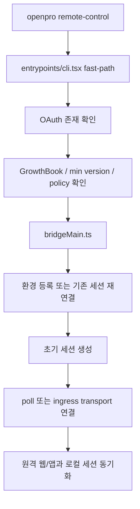

# OpenPro Remote Control / Bridge Guide

## 1. 문서 목적

이 문서는 OpenPro 소스에 구현된 Remote Control 브리지 구조를 코드 기준으로 설명하는 가이드다. 이름만 보면 단순한 원격 접속 기능처럼 보이지만, 실제로는 다음 세 가지를 분리해서 이해해야 한다.

- `openpro remote-control` 같은 standalone 브리지 실행 경로
- REPL 안에서 `/remote-control`을 켜는 always-on 브리지 경로
- direct connect용 `openpro server` 경로

이 문서는 특히 다음 질문에 답하는 데 초점을 둔다.

- Remote Control은 무엇이고, 무엇이 아닌가
- 어떤 조건을 만족해야 켜지는가
- 세션은 어디서 만들어지고 어떻게 유지되는가
- env-based 경로와 env-less v2 경로는 어떻게 다른가
- 왜 `server`와 헷갈리면 안 되는가

---

## 2. 먼저 알아야 할 핵심 결론

1. `remote-control`은 로컬 HTTP 서버를 여는 기능이 아니라 Claude.ai/code와 로컬 CLI 세션을 이어주는 브리지 런타임이다.
2. standalone 경로와 REPL `/remote-control` 경로가 둘 다 존재하지만, 목적은 같다. 로컬 세션을 원격에서 이어서 쓰게 만드는 것이다.
3. 이 기능은 build-time으로 `feature('BRIDGE_MODE')`에 묶여 있고, 살아 있는 빌드에서는 다시 구독, OAuth scope, GrowthBook, 정책, 최소 버전 조건을 통과해야 한다.
4. `openpro server`와 `openpro remote-control`은 전혀 다른 시스템이다.
5. 오픈 빌드에서는 `BRIDGE_MODE`가 기본적으로 꺼져 있어, 소스는 보여도 실제 명령은 노출되지 않을 수 있다.

---

## 3. 이 기능을 읽을 때 핵심 파일

| 파일 | 역할 |
|---|---|
| `src/entrypoints/cli.tsx` | `remote-control`, `rc`, `remote`, `sync`, `bridge` fast-path 진입 |
| `src/main.tsx` | Commander 도움말용 등록, REPL 쪽 `/remote-control` 관련 연결점 |
| `src/bridge/bridgeEnabled.ts` | build gate 이후 구독, scope, GrowthBook, min version 검사 |
| `src/bridge/bridgeMain.ts` | standalone Remote Control 본체 |
| `src/commands/bridge/bridge.tsx` | REPL의 `/remote-control` 토글 명령 |
| `src/bridge/initReplBridge.ts` | REPL 세션에서 브리지 초기화 |
| `src/bridge/replBridge.ts` | env-based 브리지 런타임 |
| `src/bridge/remoteBridgeCore.ts` | env-less v2 브리지 핵심 |
| `src/bridge/createSession.ts` | `/v1/sessions` 생성/조회/제목수정/아카이브 |
| `src/bridge/types.ts` | SpawnMode, 브리지 메시지 타입, 사용자 메시지 상수 |

---

## 4. `server`와 어떻게 다른가

가장 많이 헷갈리는 부분이라 먼저 분리한다.

| 구분 | `openpro remote-control` | `openpro server` |
|---|---|---|
| 목적 | Claude.ai/code 또는 앱에서 로컬 세션을 이어서 사용 | direct connect 클라이언트가 로컬 세션 서버에 직접 붙음 |
| 핵심 프로토콜 | OAuth + bridge 세션 + ingress/worker transport | HTTP `/sessions` + WebSocket |
| 핵심 폴더 | `src/bridge/*` | `src/server/*` |
| 인증 축 | Claude.ai OAuth, 조직/구독/정책 | bearer token 옵션 기반 |
| 사용자 경험 | 웹/앱에서 기존 로컬 작업 이어받기 | 로컬 또는 외부 클라이언트가 직접 connect URL로 붙기 |

즉, 이름만 보고 “둘 다 원격 접속”으로 묶으면 안 된다.

---

## 5. 진입 경로는 두 가지다

### 5.1 standalone 경로

`src/entrypoints/cli.tsx`는 아래 명령을 fast-path로 가로챈다.

- `remote-control`
- `rc`
- `remote`
- `sync`
- `bridge`

이 경로는 `bridgeMain(args.slice(1))`로 바로 들어간다.

### 5.2 REPL `/remote-control` 경로

REPL 안에서 `/remote-control`을 실행하면 `src/commands/bridge/bridge.tsx`가 AppState를 바꿔서 브리지를 켠다.

중요한 상태값은 다음과 같다.

- `replBridgeEnabled`
- `replBridgeExplicit`
- `replBridgeOutboundOnly`
- `replBridgeInitialName`

이 상태 변화가 실제 브리지 초기화를 시작하는 트리거다.

---

## 6. 기능이 켜지기 전에 통과해야 하는 조건

Remote Control은 build gate 하나만 통과하면 되는 기능이 아니다. 실제로는 다음 단계를 지난다.

### 6.1 build-time gate

- `feature('BRIDGE_MODE')`가 살아 있어야 한다.

이 조건이 실패하면 명령 자체가 빠지거나 dead code가 된다.

### 6.2 구독 조건

`src/bridge/bridgeEnabled.ts`는 Remote Control이 Claude.ai 구독 기반 기능이라고 명시한다.

즉, 다음 경우는 사용할 수 없다.

- Bedrock
- Vertex
- Foundry
- 일반 API key 기반 inference-only 경로

### 6.3 full-scope OAuth 토큰

`getBridgeDisabledReason()`는 단순 access token만 보지 않는다. profile scope가 포함된 full-scope login 토큰인지도 본다.

따라서 다음은 브리지에서 막힌다.

- `CLAUDE_CODE_OAUTH_TOKEN`처럼 inference-only 성격의 토큰
- `setup-token` 류 장기 토큰

### 6.4 조직 정보와 GrowthBook gate

조직 UUID를 알아낼 수 있어야 하고, GrowthBook gate도 통과해야 한다.

대표 gate:

- `tengu_ccr_bridge`
- `tengu_bridge_repl_v2`

### 6.5 최소 버전

`checkBridgeMinVersion()`와 env-less 쪽 `checkEnvLessBridgeMinVersion()`가 별도로 존재한다. 즉, v1과 v2 경로가 같은 버전 조건을 공유하지 않는다.

### 6.6 조직 정책

`allow_remote_control` 정책이 허용되어야 한다.

### 6.7 워크스페이스 신뢰

`bridgeMain.ts` 도움말과 주석은 현재 디렉터리에서 먼저 `claude`를 실행해 trust dialog를 수락하라는 운영 힌트를 준다. 브리지가 결국 현재 워크스페이스 기준으로 세션을 생성하기 때문이다.

---

## 7. standalone `remote-control` 실행 흐름

`bridgeMain.ts`의 도움말은 이 런타임을 “persistent server that accepts multiple concurrent sessions”라고 설명한다. 하지만 여기서 말하는 server는 direct connect HTTP 서버가 아니라 브리지 런타임이다.

---

## 8. REPL `/remote-control` 실행 흐름

REPL 경로는 사용감이 다르다. 이미 떠 있는 세션에 원격 접근을 붙이는 방향이다.

### 8.1 `/remote-control` 명령이 하는 일

`src/commands/bridge/bridge.tsx`는 다음을 수행한다.

1. 현재 이미 연결 중인지 확인
2. prerequisite 체크
3. 필요 시 remote callout 표시
4. AppState에서 `replBridgeEnabled=true` 설정
5. 상태 메시지 `Remote Control connecting…` 출력

### 8.2 실제 브리지 초기화

그다음 `useReplBridge` 계열 흐름에서 `initReplBridge()`가 호출된다.

`initReplBridge.ts`는 다음 정보를 모은 뒤 core에 넘긴다.

- 현재 세션 ID
- 현재 cwd
- OAuth token
- 조직 UUID
- git branch / remote URL
- 현재 대화 메시지
- 세션 제목 후보
- permission mode

### 8.3 세션 제목 결정

세션 제목은 아래 우선순위를 따른다.

1. `/remote-control <name>`으로 준 명시적 이름
2. `/rename`으로 저장된 제목
3. 현재 대화의 마지막 의미 있는 사용자 메시지
4. `remote-control-<slug>` fallback

---

## 9. env-based 경로와 env-less v2 경로

Remote Control은 하나의 구현만 있는 것이 아니다.

### 9.1 env-based 경로

전통적인 브리지 경로다.

특징:

- environment/work dispatch 개념이 있다
- poll/dispatch 흐름이 있다
- `replBridge.ts`, `bridgeMain.ts` 중심

### 9.2 env-less v2 경로

`src/bridge/remoteBridgeCore.ts`는 이를 “Env-less Remote Control bridge core”라고 설명한다.

특징:

- environments API 레이어 없이 code sessions에 더 직접 붙는다
- `POST /v1/code/sessions`
- `POST /v1/code/sessions/{id}/bridge`
- `worker_jwt`를 받아 transport를 구성한다
- REPL 전용 경로다

즉, v2는 “기능 이름이 Remote Control”인 것은 같지만, 내부 전송 구조는 더 간결해진 별도 구현이다.

---

## 10. 세션 관련 주요 API 동작

### 10.1 env-based 세션 API

`src/bridge/createSession.ts`가 다루는 주요 API는 다음과 같다.

| 메서드 | 경로 | 역할 |
|---|---|---|
| `POST` | `/v1/sessions` | 브리지 세션 생성 |
| `GET` | `/v1/sessions/{id}` | 세션 조회 |
| `PATCH` | `/v1/sessions/{id}` | 제목 갱신 |
| `POST` | `/v1/sessions/{id}/archive` | 세션 종료 후 아카이브 |

요청 헤더 특징:

- OAuth 헤더 사용
- `anthropic-beta: ccr-byoc-2025-07-29`
- `x-organization-uuid`

즉, 일반 OpenAI 호환 REST처럼 단순한 형태가 아니라 조직과 beta 헤더를 포함한 내부 계약에 가깝다.

### 10.2 env-less v2 세션 API

`src/bridge/remoteBridgeCore.ts` 기준 핵심 순서는 이렇다.

1. `POST /v1/code/sessions`
2. `POST /v1/code/sessions/{id}/bridge`
3. `worker_jwt`, `api_base_url`, `worker_epoch` 수신
4. transport 생성
5. 토큰 갱신 스케줄러로 재등록

---

## 11. Spawn mode와 멀티 세션

`bridgeMain.ts` 도움말과 `src/bridge/types.ts`의 `SpawnMode`를 보면 standalone Remote Control은 세션 생성 방식을 바꿀 수 있다.

| 모드 | 의미 | 특징 |
|---|---|---|
| `single-session` | 현재 cwd 한 세션만 사용 | 세션 종료 시 브리지도 끝나는 고전 모드 |
| `same-dir` | 여러 세션이 같은 cwd 공유 | 빠르지만 서로 충돌할 수 있음 |
| `worktree` | 세션마다 별도 git worktree | 격리가 강하지만 git/worktree 조건 필요 |

추가로 도움말에는 다음 옵션도 보인다.

- `--spawn <mode>`
- `--capacity <N>`
- `--create-session-in-dir`

즉, standalone Remote Control은 단일 세션 리모컨이 아니라 “현재 프로젝트를 원격 세션 허브처럼 운영하는 모드”까지 염두에 둔 설계다.

---

## 12. 실패 시 가장 많이 보는 패턴

| 증상 | 대표 원인 | 어디를 먼저 볼지 |
|---|---|---|
| 명령이 아예 없음 | `BRIDGE_MODE` build gate 비활성 | `scripts/build.ts`, `src/entrypoints/cli.tsx` |
| 로그인하라고 함 | Claude.ai OAuth 없음 또는 inference-only 토큰 | `src/utils/auth.ts`, `src/bridge/bridgeEnabled.ts` |
| 구독 필요 메시지 | API key 고객/3P provider 상태 | `isClaudeAISubscriber()` 경로 |
| 조직 정책 차단 | `allow_remote_control=false` | `src/services/policyLimits/index.ts` |
| 버전이 너무 낮다고 나옴 | bridge min version gate | `src/bridge/bridgeEnabled.ts`, `src/bridge/envLessBridgeConfig.ts` |
| 연결 후 세션 제목이 이상함 | 제목 유도 로직 또는 `/rename` 우선순위 | `src/bridge/initReplBridge.ts` |
| 세션은 뜨는데 원격 입출력이 불안정함 | transport 재등록, OAuth refresh, ingress 문제 | `src/bridge/remoteBridgeCore.ts`, `src/bridge/replBridge.ts` |

---

## 13. 유지보수자가 읽으면 좋은 순서

1. `src/bridge/bridgeEnabled.ts`
2. `src/entrypoints/cli.tsx`
3. `src/commands/bridge/bridge.tsx`
4. `src/bridge/initReplBridge.ts`
5. `src/bridge/createSession.ts`
6. `src/bridge/remoteBridgeCore.ts`
7. `src/bridge/bridgeMain.ts`
8. `src/bridge/types.ts`

이 순서로 보면 “노출 조건 → 진입점 → REPL 상태 변화 → 세션 API → 전송 계층”이 자연스럽게 이어진다.

---

## 14. 관련 문서

- direct connect 서버는 `openpro-server-mode-guide-ko.md`
- build flag 관점은 `openpro-feature-flag-build-guide-ko.md`
- 인증 우선순위는 `openpro-auth-credential-guide-ko.md`
- 증상별 대응은 `openpro-troubleshooting-guide-ko.md`

---

## 15. 한 줄 요약

Remote Control은 로컬 CLI 세션을 Claude.ai/code와 연결하는 브리지 계층이며, standalone 실행과 REPL 토글 두 경로를 가지지만 본질적으로는 OAuth, 조직 gate, 정책, 세션 ingress를 묶는 별도 원격 제어 서브시스템이다.
