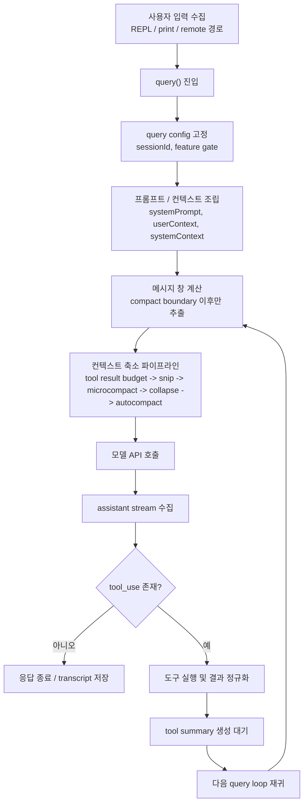
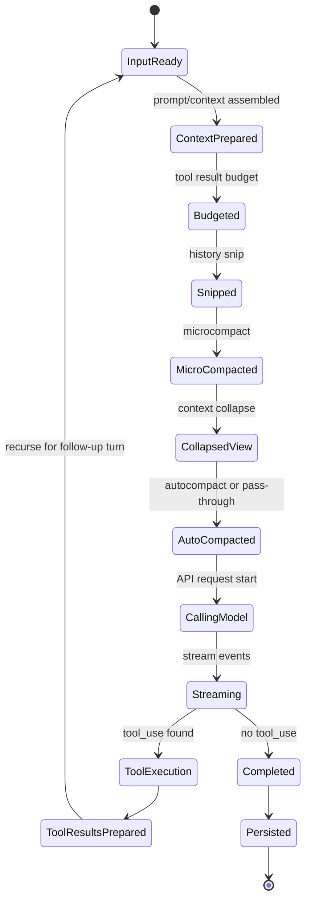

# OpenPro Request Lifecycle 시퀀스 가이드

## 1. 문서 목적

이 문서는 OpenPro에서 사용자 입력 1회가 실제로 어떤 단계들을 거쳐 처리되는지 코드 기준으로 설명하는 실행 흐름 문서다.  
단순한 개념 설명이 아니라, 한 턴 turn 이 `query()` 에 들어온 뒤 프롬프트 조립, 메모리 반영, 컨텍스트 축소, 모델 호출, 도구 실행, 요약 생성, transcript 저장까지 어떤 순서로 이어지는지 구현 관점에서 정리한다.

대상 독자:

- `query.ts` 를 처음 따라가야 하는 개발자
- 요청 지연, context overflow, tool loop 문제를 분석해야 하는 AI 엔지니어
- 회귀 테스트 범위를 기능 흐름 중심으로 잡아야 하는 QA
- 세션 저장, 재개, 로그 적재를 운영 시점에서 이해해야 하는 플랫폼 엔지니어

관련 상세 문서:

- [메모리 / 컨텍스트 압축 상세 설계](D:/project/openpro/docs/openpro-memory-context-compaction-ko.md)
- [API 가이드](D:/project/openpro/docs/openpro-api-guide-ko.md)
- [권한 / 보안 매트릭스](D:/project/openpro/docs/openpro-permission-security-matrix-ko.md)
- [트러블슈팅 가이드](D:/project/openpro/docs/openpro-troubleshooting-guide-ko.md)

---

## 2. 흐름을 읽기 전에 알아둘 핵심 7가지

1. OpenPro의 요청 처리 핵심은 `src/query.ts` 의 `query()` / `queryLoop()` 다.
2. 실제 API에 보내는 메시지는 “현재 REPL 화면에 보이는 전체 히스토리”와 항상 같지 않다.
3. compact boundary 이후 메시지만 잘라서 모델 입력 후보를 만든 뒤, tool result budget, snip, microcompact, context collapse, autocompact 를 순서대로 적용한다.
4. 컨텍스트 축소는 한 종류가 아니라 여러 단계가 겹쳐 있다.
5. 모델 응답 도중 tool_use block 이 나타나면 그 턴은 끝난 것이 아니라 후속 도구 실행 단계로 이어진다.
6. tool 실행 결과는 다시 user/tool_result 메시지로 정규화되어 다음 루프 입력으로 들어간다.
7. transcript 저장과 content replacement 기록은 resume 와 compact 복원성을 위해 중요하며, 단순 로그 적재와는 역할이 다르다.

---

## 3. 핵심 소스 파일

| 파일 | 역할 | 볼 때 집중할 지점 |
|---|---|---|
| `src/screens/REPL.tsx` | 대화형 진입점 | REPL 이 어떤 상태와 도구 집합을 준비해서 `query()` 로 넘기는지 |
| `src/query.ts` | 메인 요청 루프 | 한 턴 전체 처리 순서 |
| `src/query/config.ts` | query 시점 불변 설정 스냅샷 | feature gate 와 session 단위 플래그 |
| `src/tools.ts` | 기본 도구 목록과 feature-gated 도구 조립 | 어떤 도구가 루프에 주입되는지 |
| `src/utils/queryContext.ts` | system prompt, userContext, systemContext 조립 | 캐시 가능한 프롬프트 prefix 구성 |
| `src/utils/messages.ts` | API 입출력 메시지 정규화 | tool_use / tool_result 메시지 형태 보정 |
| `src/utils/sessionStorage.ts` | transcript 기록, content replacement 저장, resume 체인 관리 | 요청 결과가 디스크에 어떻게 남는지 |
| `src/utils/toolResultStorage.ts` | tool result 크기 예산 관리 | 큰 tool output 이 언제 치환되는지 |
| `src/services/compact/*` | microcompact, session memory compact, full compact | 문맥 축소 파이프라인 |

---

## 4. 상위 구조

---

## 5. 진입점

### 5.1 REPL 경로

대화형 사용자는 주로 `src/screens/REPL.tsx` 를 통해 진입한다.

이 단계에서 준비되는 것:

- 현재 세션 메시지 배열
- 선택된 모델과 provider
- 활성 도구 목록
- permission mode
- system prompt / user context / system context
- attachment, hook 결과, background context 같은 부가 상태

REPL 은 이 상태를 조립한 뒤 `for await (const event of query(...))` 형태로 메인 루프를 구동한다.

### 5.2 비대화형 / headless 경로

일부 출력 전용 또는 제어성 경로는 `src/cli/print.ts` 등에서 같은 query 계열 흐름을 사용한다.  
즉, UI 진입점은 다르더라도 실제 모델 호출과 tool loop 의 핵심은 `query.ts` 에서 만난다.

---

## 6. 한 턴의 상세 처리 순서

## 6.1 query config 스냅샷 고정

`src/query/config.ts` 의 `buildQueryConfig()` 는 query 시점에 필요한 불변값을 고정한다.

대표 값:

- `sessionId`
- `streamingToolExecution`
- `emitToolUseSummaries`
- `isAnt`
- `fastModeEnabled`

의미:

- 턴 도중 feature gate 가 흔들리더라도 같은 query 안에서는 일관된 동작을 유지하려는 목적이다.

## 6.2 query chain 추적 정보 생성

`query.ts` 는 각 호출에 대해 `chainId` 와 `depth` 를 관리한다.

용도:

- 재귀형 tool loop 추적
- analytics 상에서 하나의 연쇄 호출 묶음 식별
- subagent 와 main thread 구분

## 6.3 compact boundary 이후 메시지 추출

첫 번째 실제 입력 축소는 `getMessagesAfterCompactBoundary(messages)` 로 이루어진다.

의미:

- 과거 full compact 이후 요약으로 대체된 이전 구간은 직접 API에 다시 보내지 않는다.
- 현재 턴 후보는 compact boundary 이후의 살아 있는 메시지들이다.

## 6.4 tool result budget 적용

`applyToolResultBudget()` 가 aggregate tool result 크기를 제한한다.

핵심 특징:

- microcompact 보다 먼저 실행된다.
- 너무 큰 tool result 는 content replacement 로 치환될 수 있다.
- 일부 경로에서는 `recordContentReplacement()` 를 통해 이 치환 사실을 transcript 옆 저장소에 기록한다.

이 순서가 중요한 이유:

- cached microcompact 는 tool_use_id 기반으로 동작하므로, 이 단계에서 내용이 치환되어도 후속 compaction 과 충돌하지 않는다.

## 6.5 snip compact

`HISTORY_SNIP` 기능이 켜져 있으면 snip 단계가 먼저 돈다.

역할:

- 오래된 이력 일부를 잘라 토큰을 즉시 회수
- 회수한 토큰 수 `snipTokensFreed` 를 autocompact 판단에 반영
- 필요 시 boundary 안내 메시지 생성

주의:

- 현재 코드 스냅샷 기준 `snipCompact.ts` 는 stub 성격이 강한 부분이 있어, 전체 압축 전략 중 “연결 고리”로 이해하는 편이 맞다.

## 6.6 microcompact

`deps.microcompact(...)` 가 다음 단계로 실행된다.

microcompact 의 역할:

- 오래된 tool result 의 상세 내용을 줄인다.
- 캐시 편집 기반 cached microcompact 와 내용 직접 치환 방식 time-based microcompact 가 공존할 수 있다.

중요한 점:

- autocompact 보다 먼저 실행된다.
- cached microcompact 는 실제 boundary 메시지를 API 응답 후에 확정할 수도 있다.

## 6.7 context collapse

`CONTEXT_COLLAPSE` 기능이 켜진 경우, collapse store 기반의 투영 projection 이 적용된다.

이 단계의 특징:

- REPL 전체 메시지 배열을 직접 파괴하는 것이 아니라 “지금 API에 보낼 뷰”를 더 압축된 형태로 만든다.
- autocompact 전에 실행되므로, collapse 만으로도 한도 아래로 내려가면 더 비싼 full compact 를 피할 수 있다.

## 6.8 autocompact 또는 blocking limit 검사

그 다음 `deps.autocompact(...)` 가 실행된다.

가능한 결과:

- compact 불필요
- compact 성공 후 새 메시지 창 반환
- compact 실패와 함께 failure count 누적

만약 자동 compact 가 꺼져 있고 blocking limit 에 도달했다면:

- `PROMPT_TOO_LONG_ERROR_MESSAGE` 를 만든 뒤 API 호출 전 차단한다.

예외적으로 hard block 을 건너뛰는 경우:

- `querySource === 'compact'`
- `querySource === 'session_memory'`
- reactive compact 가 overflow 복구를 맡는 경우
- context collapse 가 overflow recovery 를 맡는 경우

## 6.9 system prompt 와 API 호출 준비

실제 모델 호출 직전에는 다음이 합쳐진다.

- base system prompt
- system context
- user context
- 도구 스키마
- 최신 메시지 창

`queryContext.ts` 는 이 중 캐시 안정성이 중요한 prefix 조합을 관리한다.

## 6.10 assistant 스트리밍 수집

API 호출이 시작되면 스트림을 통해 assistant 이벤트가 누적된다.

이 단계에서 수집되는 것:

- assistant text block
- tool_use block
- usage 메타데이터
- stop reason 관련 상태

`tool_use` 가 하나라도 도착하면 이 턴은 후속 도구 실행이 필요하다고 판단한다.

## 6.11 tool 실행

tool execution 은 두 갈래가 있다.

- `StreamingToolExecutor` 를 쓰는 스트리밍 실행 모드
- 일반 `runTools(...)` 실행 모드

이 단계에서 적용되는 것:

- permission check
- tool 입력 검증
- tool stdout/stderr 또는 결과 payload 수집
- hook/attachment 성격 메시지 처리
- 새 context 조각이 필요한 경우 `updatedToolUseContext` 로 반영

## 6.12 tool 결과 정규화

tool 결과는 그대로 저장되지 않고 `normalizeMessagesForAPI()` 를 거쳐 다음 턴 입력 형식으로 맞춰진다.

의미:

- tool_result block shape 보정
- API가 다시 읽을 수 있는 user message 구조로 정리
- attachment 나 특수 continuation 이벤트 분기 처리

## 6.13 tool use summary 생성

도구 배치가 끝나면, 필요 시 tool use summary 생성을 비동기로 시작한다.

조건:

- `emitToolUseSummaries` 가 켜져 있음
- tool_use block 이 존재함
- abort 상태가 아님
- subagent 가 아님

용도:

- 다음 호출이나 모바일 UI 쪽에서 tool 활동 요약 표시

## 6.14 다음 loop 재귀 또는 종료

tool_use 가 있었다면:

- assistant message
- tool_result message
- 필요 시 tool summary future

를 포함한 상태로 다시 query loop 를 돈다.

tool_use 가 없었다면:

- 최종 assistant 응답으로 턴을 마무리한다.

---

## 7. transcript 와 저장 아티팩트

요청이 끝났다고 해서 메모리에만 남는 것이 아니다. `src/utils/sessionStorage.ts` 가 다음 종류의 아티팩트를 관리한다.

| 아티팩트 | 용도 |
|---|---|
| transcript 레코드 | 세션 재개, 디버깅, 히스토리 재구성 |
| compact boundary 메타데이터 | full compact 이후 살아 있는 구간 구분 |
| content replacement 기록 | 큰 tool result 가 치환되었음을 resume 시 복원 가능하게 유지 |
| parent chain 정보 | compact 이후 체인이 잘리지 않도록 연결 관리 |
| 원격 ingress 기록 | remote 또는 web session 계열 저장 |

핵심 포인트:

- 이미 기록된 메시지는 dedupe 한다.
- compact 이후 parent chain 이 부자연스럽게 끊기지 않도록 별도 로직이 있다.
- tool result 내용이 잘려도, “잘렸다는 사실”과 식별자는 남겨 resume 가능성을 보존한다.

---

## 8. 메모리와 lifecycle 의 만나는 지점

이 문서는 실행 순서를 설명하지만, 실제 품질은 메모리 계층과 강하게 연결된다.

주요 결합 지점:

- system prompt 조립 시 `CLAUDE.md` 계열과 auto memory 가 함께 주입됨
- session memory compact 는 full compact 의 한 형태로 동작할 수 있음
- `/compact`, autocompact, reactive compact 는 모두 query loop 와 이어짐
- resume 후 다시 query 에 들어오면 compact boundary 와 replacement 기록을 반영한 상태로 시작함

자세한 메모리 구조는 [메모리 / 컨텍스트 압축 상세 설계](D:/project/openpro/docs/openpro-memory-context-compaction-ko.md)를 함께 보면 된다.

---

## 9. 상태 전이 관점 요약

---

## 10. 구현자가 자주 놓치는 지점

1. “화면에 보이는 전체 메시지”와 “모델에 실제 전달된 메시지”는 다를 수 있다.
2. tool result budget, microcompact, autocompact 는 서로 대체 관계가 아니라 누적 파이프라인이다.
3. blocking limit 는 모든 query source 에 똑같이 걸리지 않는다.
4. subagent 는 tool summary, analytics, persistence 일부가 main thread 와 다르게 동작한다.
5. content replacement 기록을 빼먹으면 resume 복원성이 무너질 수 있다.
6. context collapse 는 단순 삭제가 아니라 projection/store 구조라서, REPL 배열만 보고 동작을 판단하면 오해하기 쉽다.

---

## 11. 디버깅 순서 추천

요청이 이상하게 동작할 때는 아래 순서로 보는 것이 가장 빠르다.

1. `src/screens/REPL.tsx` 또는 요청 진입점에서 `query()` 에 어떤 상태를 넘겼는지 확인
2. `src/query.ts` 에서 compact boundary 이후 메시지 창이 어떻게 만들어졌는지 확인
3. tool result budget 과 replacement 기록이 있었는지 확인
4. microcompact / autocompact / context collapse 가 실제로 작동했는지 확인
5. API 호출 직전 system prompt 와 messagesForQuery 를 확인
6. tool_use block 이 있었는지, permission check 에 막혔는지 확인
7. `sessionStorage.ts` 에 transcript 와 compact 메타데이터가 정상 저장되었는지 확인

---

## 12. QA 테스트 포인트

### 12.1 정상 흐름

- tool_use 없는 단순 응답이 한 번의 호출로 종료되는지
- tool_use 있는 응답이 도구 실행 후 재귀 호출로 이어지는지
- streaming tool execution 켜짐/꺼짐 상태에서 모두 정상 응답하는지

### 12.2 컨텍스트 축소

- 큰 tool result 입력 시 budget 치환이 먼저 일어나는지
- microcompact 와 autocompact 가 순서대로 적용되는지
- compact 이후에도 manual `/resume` 또는 이어지는 질문이 자연스러운지

### 12.3 예외 흐름

- prompt too long 상황에서 hard block 또는 reactive compact 가 올바르게 동작하는지
- tool 실행 중 abort 시 synthetic interruption 흐름이 자연스러운지
- tool_result 형식이 꼬인 경우 normalize 단계에서 복구되는지

### 12.4 저장 / 복원

- transcript dedupe 가 중복 저장을 막는지
- content replacement 기록이 남는지
- compact boundary 이후 resume 가 올바른 parent chain 을 복원하는지

---

## 13. 문서 유지보수 기준

다음이 바뀌면 이 문서를 갱신해야 한다.

- `query.ts` 의 컨텍스트 축소 순서
- query source 별 hard block 예외 규칙
- tool execution 방식
- transcript 저장 포맷과 parent chain 로직
- tool summary 생성 조건

함께 갱신하면 좋은 문서:

- [메모리 / 컨텍스트 압축 상세 설계](D:/project/openpro/docs/openpro-memory-context-compaction-ko.md)
- [API 가이드](D:/project/openpro/docs/openpro-api-guide-ko.md)
- [트러블슈팅 가이드](D:/project/openpro/docs/openpro-troubleshooting-guide-ko.md)
