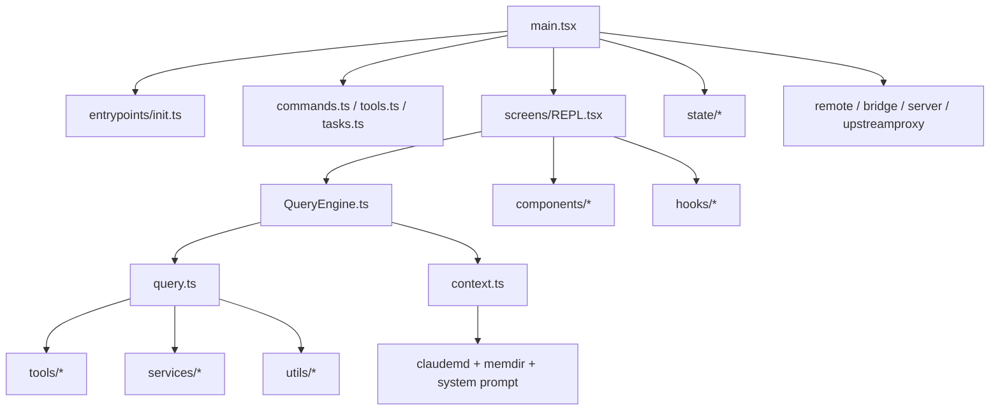

# OpenPro `src` 폴더 코드 레벨 레퍼런스

## 1. 문서 목적

이 문서는 `src` 아래의 주요 폴더와 하위 모듈을 코드 구조 기준으로 정리한 소스 레퍼런스입니다.  
기능 설명 수준이 아니라 “어떤 폴더가 어떤 책임을 갖고, 어느 파일이 진입점이며, 런타임에서 어디와 연결되는가”를 빠르게 파악할 수 있도록 작성합니다.

폴더별 개별 문서는 [index-ko.md](D:/project/openpro/docs/src-folders/index-ko.md)에서 확인할 수 있습니다.
`commands`, `services`, `tools`, `utils` 하위 폴더 단위 심화 문서는 [index-ko.md](D:/project/openpro/docs/src-subfolders/index-ko.md)에서 바로 내려갈 수 있습니다.

이 문서는 다음 상황에서 바로 활용할 수 있습니다.

- 신규 개발자가 저장소 구조를 빠르게 이해해야 할 때
- 특정 기능 변경 전에 영향 범위를 파악할 때
- 어떤 폴더가 UI 계층인지, 어떤 폴더가 도메인 서비스인지 구분해야 할 때
- 메모리, compact, remote, tool 실행, plugin/skill 확장 포인트를 찾아야 할 때

## 2. 읽는 방법

OpenPro의 `src`는 단순 MVC 구조가 아니라 아래 다층 구조에 가깝습니다.

1. 부트스트랩과 엔트리포인트
2. 화면과 상태 관리
3. 쿼리/에이전트 실행 엔진
4. 도구와 명령 레지스트리
5. 도메인 서비스
6. 범용 유틸리티
7. 원격/브리지/서버/음성 같은 옵션 기능

코드 탐색을 시작할 때는 보통 아래 순서가 가장 효율적입니다.

1. `src/main.tsx`
2. `src/entrypoints/init.ts`
3. `src/QueryEngine.ts`
4. `src/query.ts`
5. `src/commands.ts`
6. `src/tools.ts`
7. 관심 영역별 폴더

## 3. 최상위 런타임 흐름

핵심 해석은 다음과 같습니다.

- `main.tsx`는 부트스트랩과 전체 세션 구성을 담당합니다.
- `QueryEngine.ts`는 headless/SDK 친화적인 대화 엔진입니다.
- `query.ts`는 실제 모델-도구-후속 호출 루프를 수행하는 핵심 실행기입니다.
- `commands.ts`, `tools.ts`, `tasks.ts`는 런타임 레지스트리 역할을 합니다.
- `services`는 도메인별 비즈니스 로직을, `utils`는 횡단 관심사를 담당합니다.

## 4. `src` 루트 핵심 파일

| 파일 | 역할 | 읽기 포인트 |
|---|---|---|
| `src/main.tsx` | CLI 진입점, 설정/정책/원격/플러그인/스킬 초기화, REPL 실행 | 가장 먼저 읽을 파일 |
| `src/entrypoints/init.ts` | 안전한 초기화, 환경변수 적용, proxy/mTLS/LSP/scratchpad 준비 | 부트스트랩 세부 이해용 |
| `src/QueryEngine.ts` | 세션 단위 질의 엔진, SDK/headless 경로 | 상태 유지형 실행기 |
| `src/query.ts` | 실제 대화 루프, compact, tool 호출, recovery | 가장 중요한 실행 경로 |
| `src/context.ts` | system/user context 조립, git/CLAUDE.md/currentDate 주입 | 프롬프트 입력의 출발점 |
| `src/commands.ts` | slash command 레지스트리 | `/` 명령 추가 시 확인 |
| `src/tools.ts` | 모델 호출 도구 레지스트리 | 새 도구 등록 시 확인 |
| `src/tasks.ts` | 백그라운드 task 타입 레지스트리 | task 런타임 추가 시 확인 |
| `src/Tool.ts` | Tool/ToolUseContext 인터페이스, permission context, compact progress 타입 | 도구 계약의 기준점 |
| `src/Task.ts` | Task/TaskState 기본 계약, task id 정책 | 작업 실행 모델 기준 |
| `src/commands.ts` | 커맨드 라우팅과 dynamic import 경계 | 기능 플래그 영향 확인 |
| `src/main.tsx` + `src/screens/REPL.tsx` | UI 세션 시작과 렌더 루프 | REPL 동작 이해용 |

## 5. 최상위 폴더 카탈로그

아래 표는 `src` 바로 아래 폴더를 기준으로 한 역할 정리입니다.

| 폴더 | 핵심 책임 | 대표 파일 | 주로 연결되는 계층 | 변경 시 주의 |
|---|---|---|---|---|
| `assistant` | 장기 assistant/KAIROS 계열 세션 이력, 세션 선택 UI | `AssistantSessionChooser.tsx`, `sessionHistory.ts` | `main.tsx`, `commands/assistant`, 원격 세션 API | feature gate 의존성이 큼 |
| `bootstrap` | 전역 프로세스 상태, 세션 ID, cwd, 플래그, 통계 카운터 | `state.ts` | 거의 전 영역 | 순환 의존성의 중심이라 변경 주의 |
| `bridge` | 브리지 모드, 외부 컨트롤/세션 연결, 메시지 중계, 폴링, 권한 콜백 | `bridgeMain.ts`, `remoteBridgeCore.ts`, `bridgeMessaging.ts` | `remote`, `server`, `commands/bridge` | 원격 세션과 REPL 간 계약 유지 필요 |
| `buddy` | UI 보조 캐릭터/알림/프롬프트 레이어 | `companion.ts`, `CompanionSprite.tsx`, `useBuddyNotification.tsx` | `components`, `commands/buddy` | 시각 기능과 상태 갱신이 결합됨 |
| `cli` | 비대화형 CLI, structured IO, transport, handler 계층 | `structuredIO.ts`, `remoteIO.ts`, `handlers/*`, `transports/*` | `entrypoints`, `remote`, `server` | REPL 경로와 별도 계약 유지 필요 |
| `commands` | slash command 구현체와 명령 도메인별 하위 폴더 | `index.ts` 다수, 루트 direct command 파일들 | `commands.ts`, `screens/REPL.tsx`, `ToolUseContext` | 기능 플래그와 lazy import가 많음 |
| `components` | Ink/React 프리젠테이션 컴포넌트 | `App.tsx`, `CompactSummary.tsx`, `ContextVisualization.tsx` | `screens`, `state`, `hooks`, `context` | 비즈니스 로직이 섞이지 않도록 주의 |
| `constants` | 제품명, 프롬프트 문구, 도구 제한, API 제한, 키 이름 | `prompts.ts`, `tools.ts`, `product.ts`, `systemPromptSections.ts` | 전 영역 | system prompt cache와 결합된 값이 있음 |
| `context` | React context provider와 UI 전역 상태 공유 채널 | `notifications.tsx`, `modalContext.tsx`, `voice.tsx` | `components`, `screens`, `hooks` | 화면 레벨 상태와 전역 상태 경계 구분 필요 |
| `coordinator` | coordinator mode 전용 프롬프트/worker 제약/세션 mode 동기화 | `coordinatorMode.ts` | `QueryEngine.ts`, `tools/AgentTool`, `bootstrap` | 일반 모드와 재개 세션 mode mismatch 처리 중요 |
| `entrypoints` | CLI/MCP/SDK 진입점과 초기화 경계 | `cli.tsx`, `init.ts`, `mcp.ts`, `sdk/*` | `main.tsx`, `cli`, `remote` | 외부 소비 계약과 직결됨 |
| `hooks` | UI/도구/세션 동작용 React custom hook 집합 | `useCommandQueue.ts`, `useCancelRequest.ts`, `useClaudeCodeHintRecommendation.tsx` | `components`, `screens`, `state` | 렌더링 훅과 사이드이펙트 훅이 혼재 |
| `ink` | 터미널 렌더링 엔진 포크/확장본 | `ink.tsx`, `reconciler.ts`, `output.ts`, `parse-keypress.ts` | `screens`, `components`, `interactiveHelpers` | 외부 라이브러리 포크 성격이 강함 |
| `keybindings` | 키맵 스키마, 파서, resolver, provider | `defaultBindings.ts`, `resolver.ts`, `schema.ts` | `hooks`, `components`, `screens` | 기본 단축키와 사용자 설정 병합 규칙 중요 |
| `memdir` | auto memory, team memory, memory prompt, memory scan | `memdir.ts`, `paths.ts`, `findRelevantMemories.ts` | `context.ts`, `query.ts`, `services/SessionMemory` | 메모리 경로와 prompt 주입이 강하게 연결됨 |
| `migrations` | 설정값/모델명/옵션 마이그레이션 | 각 `migrate*.ts` | `main.tsx`, `config` | startup side effect이므로 안정성 중요 |
| `moreright` | external build용 stub hook 경계 | `useMoreRight.tsx` | internal-only 기능 경계 | 외부 빌드에서는 no-op |
| `native-ts` | 네이티브/고성능 보조 모듈 소스 | `color-diff`, `file-index`, `yoga-layout` | `components`, diff/검색 계열 | 플랫폼별 빌드 이슈 가능 |
| `outputStyles` | markdown 기반 custom output style 로더 | `loadOutputStylesDir.ts` | `commands/output-style`, `utils/plugins` | 사용자/프로젝트 스타일 병합 규칙 중요 |
| `plugins` | 내장 플러그인 선언과 bundled plugin 진입점 | `builtinPlugins.ts`, `bundled/index.ts` | `main.tsx`, `utils/plugins`, `commands/plugin` | plugin cache/버전/신뢰 정책과 연결 |
| `query` | query loop 보조 config, deps, stop hook, token budget | `config.ts`, `deps.ts`, `stopHooks.ts`, `tokenBudget.ts` | `query.ts`, `QueryEngine.ts` | query.ts 본체와 계약 유지 필요 |
| `remote` | 원격 세션 관리자, websocket, 원격 권한 브리지 | `RemoteSessionManager.ts`, `SessionsWebSocket.ts` | `main.tsx`, `bridge`, `server`, `cli` | reconnect와 세션 상태 계약이 중요 |
| `schemas` | 공유 schema 정의 | `hooks.ts` | `hooks`, `types`, `utils/settings` | 검증 스키마 변경 시 호환성 주의 |
| `screens` | REPL, Doctor, Resume 등 상위 화면 단위 구성 | `REPL.tsx`, `Doctor.tsx`, `ResumeConversation.tsx` | `components`, `hooks`, `state`, `commands` | 화면 진입 흐름의 중심 |
| `server` | direct connect 세션 생성/관리 | `createDirectConnectSession.ts`, `directConnectManager.ts` | `remote`, `main.tsx`, `cli` | 세션 수명주기와 인증 경계가 중요 |
| `services` | 도메인 서비스 레이어 | `api/*`, `compact/*`, `mcp/*`, `SessionMemory/*` 등 | `query.ts`, `commands`, `utils` | 실제 비즈니스 로직이 가장 많이 모임 |
| `skills` | skill 로더와 bundled skill registry | `loadSkillsDir.ts`, `bundledSkills.ts`, `bundled/*` | `commands/skills`, `tools/SkillTool`, `main.tsx` | plugin skill과 bundled skill 병합 규칙 주의 |
| `state` | AppState store, selector, 변화 전파 | `AppStateStore.ts`, `store.ts`, `selectors.ts` | `screens`, `components`, `tasks` | REPL 상태의 중심 |
| `tasks` | background/local/remote task 타입과 구현 | `LocalAgentTask.tsx`, `LocalShellTask.tsx`, `DreamTask.ts` | `tasks.ts`, `tools/Task*`, `state` | task 상태 전이와 output 파일 관리 중요 |
| `tools` | 모델 호출 가능 tool 구현 | `AgentTool/*`, `BashTool/*`, `File*Tool/*`, `MCPTool/*` | `tools.ts`, `query.ts`, `Tool.ts` | 입력 스키마와 permission 정책이 핵심 |
| `types` | 공유 타입, generated 타입 | `command.ts`, `permissions.ts`, `ids.ts`, `generated/*` | 전 영역 | 순환 의존성 완화용 타입 중심 |
| `upstreamproxy` | CCR upstream proxy bootstrap/relay | `upstreamproxy.ts`, `relay.ts` | `entrypoints/init.ts`, subprocess env | 원격 세션 전용, fail-open 설계 |
| `utils` | 횡단 관심사와 공통 인프라 | `config.ts`, `sessionStorage.ts`, `permissions/*`, `settings/*` 등 | 전 영역 | 가장 영향 범위가 넓음 |
| `vim` | Vim-like 편집 동작 파서와 motion/operator | `motions.ts`, `operators.ts`, `transitions.ts` | `keybindings`, `PromptInput` | 키 처리 충돌 주의 |
| `voice` | voice mode gate와 사용 가능 여부 판정 | `voiceModeEnabled.ts` | `commands/voice`, `components/voice` | Anthropic OAuth 의존 |

## 6. 대형 폴더 상세

### 6.1 `src/commands`

`src/commands`는 slash command 구현체 전체를 담는 폴더입니다.  
`src/commands.ts`가 이 폴더의 public registry 역할을 하며, 일부 명령은 정적 import, 일부는 feature flag 또는 lazy import로 등록됩니다.

하위 폴더별 상세 문서는 [index-ko.md](D:/project/openpro/docs/src-subfolders/commands/index-ko.md)를 참조합니다.

구조적 특징:

- `index.ts`를 가진 하위 폴더형 명령과, 루트 direct file 명령이 혼재합니다.
- `prompt`형 명령, `local` 명령, `jsx` 명령이 섞여 있습니다.
- REPL 전용 명령과 비대화형 명령이 함께 존재합니다.
- feature gate로 제거되는 내부 명령이 많습니다.

대표 direct command 파일:

- `advisor.ts`
- `commit.ts`
- `commit-push-pr.ts`
- `init.ts`
- `init-verifiers.ts`
- `review.ts`
- `security-review.ts`
- `version.ts`

하위 폴더 카탈로그:

| 폴더 | 역할 |
|---|---|
| `add-dir` | 추가 디렉터리를 CLAUDE.md 검색/컨텍스트 범위에 포함 |
| `agents` | agent 목록/설정/가시화 관련 명령 |
| `agents-platform` | 내부 agent platform 계열 명령 |
| `ant-trace` | 내부 trace/진단용 명령 |
| `assistant` | assistant mode 진입 및 선택 관련 명령 |
| `autofix-pr` | PR 기반 자동 수정 워크플로우 |
| `backfill-sessions` | 세션 데이터 보정/백필 |
| `branch` | 브랜치 관련 보조 명령 |
| `break-cache` | 캐시 브레이크/프롬프트 캐시 진단 |
| `bridge` | bridge mode 시작/연결 명령 |
| `btw` | 보조 설명/요약 계열 명령 |
| `bughunter` | 버그 헌팅/분석 워크플로우 |
| `chrome` | Claude in Chrome / 브라우저 연동 관련 명령 |
| `clear` | 대화 초기화, 상태 정리 |
| `color` | 컬러/테마 관련 REPL 설정 |
| `compact` | 수동 compact 실행 |
| `config` | 설정 조회/수정 |
| `context` | 실제 컨텍스트 사용량 분석 출력 |
| `copy` | 텍스트/결과 복사 보조 |
| `cost` | 비용/사용량 요약 |
| `ctx_viz` | 컨텍스트 시각화 |
| `debug-tool-call` | 도구 호출 디버그 |
| `desktop` | 데스크톱 연동/핸드오프 |
| `diff` | 코드 diff 출력 및 비교 |
| `doctor` | 환경/설정/의존성 진단 |
| `effort` | reasoning effort 관련 설정 |
| `env` | 현재 환경/설정 노출 |
| `exit` | 세션 종료 |
| `export` | 대화/결과 export |
| `extra-usage` | 추가 사용량/요금 관련 출력 |
| `fast` | fast mode 설정 |
| `feedback` | 피드백 제출 |
| `files` | 파일/메모리/컨텍스트 관련 보조 명령 |
| `good-claude` | 품질 관련 내부 워크플로우 |
| `heapdump` | 메모리/heap 진단 |
| `help` | 명령 도움말 |
| `hooks` | hook 조회/설정/진단 |
| `ide` | IDE 연결/진입 관련 기능 |
| `install-github-app` | GitHub App 설치 |
| `install-slack-app` | Slack App 설치 |
| `issue` | 이슈 기반 워크플로우 |
| `keybindings` | 키 바인딩 설정 |
| `login` | 로그인/OAuth 진입 |
| `logout` | 로그인 해제 |
| `mcp` | MCP 서버/자원/도구 관리 |
| `memory` | memory 파일 선택/편집 |
| `mobile` | 모바일 연동/알림 관련 기능 |
| `mock-limits` | quota/rate limit 목킹 |
| `model` | 모델 선택/설정 |
| `oauth-refresh` | OAuth 토큰 재갱신 |
| `onboard-github` | GitHub 모델/인증 온보딩 |
| `onboarding` | 초기 온보딩 흐름 |
| `output-style` | 출력 스타일 선택/적용 |
| `passes` | pass/referral 관련 기능 |
| `perf-issue` | 성능 이슈 진단/보고 |
| `permissions` | 권한 모드와 allow/deny 상태 관리 |
| `plan` | plan mode 관련 명령 |
| `plugin` | plugin 관리 |
| `pr_comments` | PR 코멘트 기반 워크플로우 |
| `privacy-settings` | 프라이버시 옵션 |
| `provider` | 모델 제공자 설정 |
| `rate-limit-options` | rate limit 정책/옵션 |
| `release-notes` | 릴리즈 노트 출력 |
| `reload-plugins` | plugin 재로드 |
| `remote-env` | remote session 환경 노출 |
| `remote-setup` | remote/CCR setup |
| `rename` | 세션 이름 변경 |
| `reset-limits` | 사용량 한도/목킹 초기화 |
| `resume` | 세션 재개 |
| `review` | 코드 리뷰 계열 명령 |
| `rewind` | 대화 rewind |
| `sandbox-toggle` | 샌드박스 모드 전환 |
| `session` | 세션 메타데이터/관리 |
| `share` | 공유/export 관련 기능 |
| `skills` | skill 조회/설치/사용 안내 |
| `stats` | 런타임 통계 |
| `status` | 현재 세션 상태 |
| `stickers` | UI 장식/표시 기능 |
| `summary` | 요약 생성 |
| `tag` | 세션 태그 관리 |
| `tasks` | task 관리 |
| `teleport` | 원격 teleport/복원 |
| `terminalSetup` | 터미널 환경 설정 |
| `theme` | 테마 변경 |
| `thinkback` | 과거 세션/회고 관련 기능 |
| `thinkback-play` | thinkback 재생 |
| `upgrade` | 업데이트/업그레이드 |
| `usage` | 사용량 정보 |
| `vim` | vim 모드 설정 |
| `voice` | voice mode 진입 |

### 6.2 `src/services`

하위 폴더별 상세 문서는 [index-ko.md](D:/project/openpro/docs/src-subfolders/services/index-ko.md)를 참조합니다.

`services`는 기능 중심 비즈니스 로직 계층입니다.  
상대적으로 UI에서 분리되어 있고, `query.ts`, `commands`, `utils`가 이 계층을 호출합니다.

대표 하위 폴더:

| 폴더 | 대표 파일 | 역할 |
|---|---|---|
| `AgentSummary` | `agentSummary.ts` | agent 실행 결과 요약 생성 |
| `analytics` | `growthbook.ts`, `config.ts`, `firstPartyEventLogger.ts` | 실험 플래그, 이벤트 로깅, telemetry |
| `api` | `client.ts`, `claude.ts`, `bootstrap.ts` | 모델 API 호출, bootstrap 데이터, retry/logging |
| `autoDream` | `autoDream.ts`, `consolidationPrompt.ts` | background memory consolidation |
| `compact` | `compact.ts`, `autoCompact.ts`, `cachedMicrocompact.ts`, `apiMicrocompact.ts` | 컨텍스트 압축 전체 |
| `contextCollapse` | `index.ts` | collapse 기반 context 관리 |
| `extractMemories` | `extractMemories.ts`, `prompts.ts` | 대화에서 memory 추출 |
| `github` | `deviceFlow.ts` | GitHub 인증/연동 |
| `lsp` | `LSPServerManager.ts`, `LSPClient.ts` | LSP 서버 생명주기와 진단 |
| `MagicDocs` | `magicDocs.ts`, `prompts.ts` | 문서 생성/가공 계열 |
| `mcp` | `auth.ts`, `claudeai.ts`, `channelPermissions.ts` | MCP 연결/인증/채널 제어 |
| `oauth` | `client.ts`, `auth-code-listener.ts` | OAuth flow |
| `plugins` | `PluginInstallationManager.ts`, `pluginOperations.ts` | plugin 설치/삭제/수정 |
| `policyLimits` | `index.ts`, `types.ts` | 정책 기반 제한 로딩 |
| `PromptSuggestion` | `promptSuggestion.ts`, `speculation.ts` | prompt suggestion과 speculative 처리 |
| `remoteManagedSettings` | `index.ts`, `syncCache.ts`, `securityCheck.tsx` | 원격 관리 설정 동기화 |
| `SessionMemory` | `sessionMemory.ts`, `sessionMemoryUtils.ts`, `prompts.ts` | 세션 요약 메모리 |
| `settingsSync` | `index.ts`, `types.ts` | 설정 동기화 |
| `teamMemorySync` | `watcher.ts`, `teamMemSecretGuard.ts` | team memory sync와 secret guard |
| `tips` | `tipRegistry.ts`, `tipScheduler.ts` | 팁 스케줄링 |
| `tools` | `toolExecution.ts`, `toolOrchestration.ts`, `toolHooks.ts` | tool 실행 orchestration |
| `toolUseSummary` | `toolUseSummaryGenerator.ts` | tool usage summary 생성 |

### 6.3 `src/tools`

하위 폴더별 상세 문서는 [index-ko.md](D:/project/openpro/docs/src-subfolders/tools/index-ko.md)를 참조합니다.

`tools`는 모델이 호출하는 기능 단위입니다.  
각 tool은 보통 다음 파일 패턴을 가집니다.

- `*Tool.ts` 또는 `*Tool.tsx`
- `prompt.ts`
- `UI.tsx`
- `constants.ts`

tool 설계 공통 포인트:

- `Tool.ts` 계약을 구현합니다.
- permission gating과 input schema validation을 거칩니다.
- 일부 tool은 background task를 만들고, 일부는 즉시 결과를 반환합니다.
- tool result가 커지면 `utils/toolResultStorage.ts`와 결합될 수 있습니다.

하위 폴더 카탈로그:

| 폴더 | 대표 파일 | 역할 |
|---|---|---|
| `AgentTool` | `AgentTool.tsx`, `agentMemory.ts`, `loadAgentsDir.ts` | subagent 생성, agent definition, agent memory |
| `AskUserQuestionTool` | `AskUserQuestionTool.tsx` | 사용자에게 질문 반환 |
| `BashTool` | `BashTool.tsx`, `bashPermissions.ts`, `bashSecurity.ts` | 셸 명령 실행 |
| `BriefTool` | `BriefTool.ts`, `attachments.ts` | brief/요약 관련 도구 |
| `ConfigTool` | `ConfigTool.ts`, `supportedSettings.ts` | 설정 조회/조정 |
| `EnterPlanModeTool` | `EnterPlanModeTool.ts` | plan mode 진입 |
| `EnterWorktreeTool` | `EnterWorktreeTool.ts` | worktree 진입 |
| `ExitPlanModeTool` | `ExitPlanModeV2Tool.ts` | plan mode 종료 |
| `ExitWorktreeTool` | `ExitWorktreeTool.ts` | worktree 종료 |
| `FileEditTool` | `FileEditTool.ts`, `constants.ts` | 부분 편집 |
| `FileReadTool` | `FileReadTool.ts`, `limits.ts` | 파일 읽기 |
| `FileWriteTool` | `FileWriteTool.ts` | 파일 쓰기 |
| `GlobTool` | `GlobTool.ts` | 파일 패턴 검색 |
| `GrepTool` | `GrepTool.ts` | 내용 검색 |
| `ListMcpResourcesTool` | `ListMcpResourcesTool.ts` | MCP resource 목록 |
| `LSPTool` | `LSPTool.ts`, `schemas.ts` | LSP 기반 코드 인텔리전스 |
| `McpAuthTool` | `McpAuthTool.ts` | MCP 인증 |
| `MCPTool` | `MCPTool.ts`, `classifyForCollapse.ts` | MCP tool 실행 |
| `NotebookEditTool` | `NotebookEditTool.ts` | notebook 편집 |
| `PowerShellTool` | `PowerShellTool.ts`, `gitSafety.ts`, `destructiveCommandWarning.ts` | Windows PowerShell 실행 |
| `ReadMcpResourceTool` | `ReadMcpResourceTool.ts` | MCP resource 읽기 |
| `RemoteTriggerTool` | `RemoteTriggerTool.ts` | 원격 trigger |
| `REPLTool` | `REPLTool.ts`, `primitiveTools.ts` | REPL 내부 primitive |
| `ScheduleCronTool` | `CronCreateTool.ts`, `CronDeleteTool.ts`, `CronListTool.ts` | 스케줄 등록/삭제/조회 |
| `SendMessageTool` | `SendMessageTool.ts` | 실행 중 worker/agent에 입력 전송 |
| `shared` | `spawnMultiAgent.ts` | 여러 tool에서 공유하는 agent spawn 보조 |
| `SkillTool` | `SkillTool.ts` | skill 검색/호출 |
| `SleepTool` | `prompt.ts` | assistant/automation 대기 |
| `SuggestBackgroundPRTool` | `SuggestBackgroundPRTool.ts` | background PR 추천 |
| `SyntheticOutputTool` | `SyntheticOutputTool.ts` | synthetic output 경계 도구 |
| `TaskCreateTool` | `TaskCreateTool.ts` | task 생성 |
| `TaskGetTool` | `TaskGetTool.ts` | task 조회 |
| `TaskListTool` | `TaskListTool.ts` | task 목록 |
| `TaskOutputTool` | `TaskOutputTool.tsx` | task 출력 읽기 |
| `TaskStopTool` | `TaskStopTool.ts` | task 종료 |
| `TaskUpdateTool` | `TaskUpdateTool.ts` | task 갱신 |
| `TeamCreateTool` | `TeamCreateTool.ts` | worker team 생성 |
| `TeamDeleteTool` | `TeamDeleteTool.ts` | worker team 삭제 |
| `testing` | `TestingPermissionTool.tsx` | 테스트 전용 도구 |
| `TodoWriteTool` | `TodoWriteTool.ts` | todo 목록 기록 |
| `ToolSearchTool` | `ToolSearchTool.ts` | deferred/dynamic tool discovery |
| `TungstenTool` | `TungstenTool.ts` | 내부 모니터링/실험 도구 |
| `VerifyPlanExecutionTool` | `VerifyPlanExecutionTool.ts` | plan 검증 |
| `WebFetchTool` | `WebFetchTool.ts`, `preapproved.ts` | 웹 fetch |
| `WebSearchTool` | `WebSearchTool.ts` | 웹 검색 |
| `WorkflowTool` | `constants.ts` | workflow script 실행 계층 |

### 6.4 `src/utils`

하위 폴더별 상세 문서는 [index-ko.md](D:/project/openpro/docs/src-subfolders/utils/index-ko.md)를 참조합니다.

`utils`는 저장소에서 가장 넓은 범용 기반 계층입니다.  
설정, 세션 저장, 권한, subprocess, git, plugin, skill, model, message, sandbox, telemetry 등이 이 폴더에 모입니다.

이 폴더의 특징:

- 순수 함수 유틸과 사실상 서비스 수준의 인프라 코드가 공존합니다.
- `main.tsx`, `query.ts`, `Tool.ts`, `commands`, `services`가 모두 의존합니다.
- 영향 범위가 매우 넓으므로 수정 시 회귀 가능성이 큽니다.

주요 하위 디렉터리:

| 폴더 | 역할 |
|---|---|
| `background` | background 세션/작업 보조 |
| `bash` | bash 실행 보조 로직 |
| `claudeInChrome` | Claude in Chrome 연동 |
| `computerUse` | 컴퓨터 사용/자동화 관련 유틸 |
| `deepLink` | deep link 생성/배너 |
| `dxt` | 특정 확장/배포 형식 보조 |
| `filePersistence` | 파일 지속성/캐시 보조 |
| `git` | git 보조 로직 |
| `github` | GitHub 연동 유틸 |
| `hooks` | hook 실행/도우미 |
| `mcp` | MCP 유틸 |
| `memory` | memory 관련 공통 유틸 |
| `messages` | 메시지 변환/맵퍼/시스템 메시지 조합 |
| `model` | 모델명, capability, provider, deprecation 처리 |
| `nativeInstaller` | 네이티브 의존 설치 |
| `permissions` | 권한 판정, 규칙, path safety |
| `plugins` | plugin 로딩, 캐시, 디렉터리, trust |
| `powershell` | PowerShell 관련 보조 |
| `processUserInput` | 사용자 입력을 API 메시지와 툴 호출 준비 상태로 변환 |
| `sandbox` | 샌드박스 런타임 어댑터 |
| `secureStorage` | keychain/credential 저장 |
| `settings` | settings 파서, 캐시, validation, source merge |
| `shell` | 셸 선택과 tool enable 로직 |
| `skills` | skill 로딩, 변경 감지, telemetry |
| `suggestions` | 추천/제안 UI 및 데이터 |
| `swarm` | 팀/worker/swarm 관련 유틸 |
| `task` | task 디스크 출력과 관리 유틸 |
| `telemetry` | telemetry 전송/보조 |
| `teleport` | 원격 teleport API/복원 |
| `todo` | todo 관련 보조 |
| `ultraplan` | ultraplan 전용 보조 유틸 |

특히 자주 읽게 되는 단일 파일:

- `config.ts`
- `sessionStorage.ts`
- `permissions/filesystem.ts`
- `settings/settings.ts`
- `claudemd.ts`
- `systemPrompt.ts`
- `toolResultStorage.ts`
- `conversationRecovery.ts`

### 6.5 `src/components`

`components`는 Ink/React UI 구성 요소를 담습니다.  
REPL 화면, 대화 메시지, 권한 다이얼로그, 설정 UI, MCP/skill/task UI 등이 모두 여기에 있습니다.

하위 디렉터리 카탈로그:

| 폴더 | 역할 |
|---|---|
| `agents` | agent 상태/진행/카드 UI |
| `ClaudeCodeHint` | 힌트/추천 UI |
| `CustomSelect` | 커스텀 선택 컴포넌트 |
| `design-system` | 공통 디자인 시스템 primitive |
| `DesktopUpsell` | 데스크톱 유도 UI |
| `diff` | diff 렌더링 |
| `FeedbackSurvey` | 피드백 설문 UI |
| `grove` | 특정 UI 실험/기능 묶음 |
| `HelpV2` | 도움말 UI |
| `HighlightedCode` | 코드 하이라이트 렌더 |
| `hooks` | component-level helper hook |
| `LogoV2` | 로고 UI |
| `LspRecommendation` | LSP 추천 UI |
| `ManagedSettingsSecurityDialog` | managed settings 보안 다이얼로그 |
| `mcp` | MCP 관련 UI |
| `memory` | memory 파일 선택/업데이트 알림 UI |
| `messages` | 대화 메시지 블록 렌더러 |
| `Passes` | pass/referral UI |
| `permissions` | 권한 프롬프트 UI |
| `PromptInput` | 입력창 관련 UI |
| `sandbox` | sandbox 상태 UI |
| `Settings` | 설정 화면 요소 |
| `shell` | shell 출력/UI |
| `skills` | skill UI |
| `Spinner` | 스피너/로딩 UI |
| `StructuredDiff` | 구조화 diff 렌더 |
| `tasks` | task 상태/출력 UI |
| `teams` | team/swarm UI |
| `TrustDialog` | trust dialog |
| `ui` | 공통 UI 유틸 컴포넌트 |
| `wizard` | 온보딩/설치 wizard UI |

대표 direct file:

- `App.tsx`
- `ContextVisualization.tsx`
- `CompactSummary.tsx`
- `BridgeDialog.tsx`
- `DevBar.tsx`

### 6.6 `src/hooks`

`hooks`는 REPL 및 화면 동작을 구성하는 custom hook 레이어입니다.

주요 특징:

- 입력 처리, 인터럽트, 추천, background task navigation, IDE 연동, command queue, clipboard, diff, dynamic config, 알림 등 UI 동작을 세분화합니다.
- `hooks/notifs`, `hooks/toolPermission` 하위 영역은 기능별 보조 훅을 묶습니다.

대표 훅:

- `useCommandQueue.ts`
- `useCancelRequest.ts`
- `useCanUseTool.tsx`
- `useDynamicConfig.ts`
- `useDiffInIDE.ts`
- `useBackgroundTaskNavigation.ts`

### 6.7 `src/tasks`

`tasks`는 백그라운드 또는 장기 실행 unit의 실제 구현을 담습니다.

| 폴더 | 대표 파일 | 역할 |
|---|---|---|
| `DreamTask` | `DreamTask.ts` | memory consolidation/background dream |
| `InProcessTeammateTask` | `InProcessTeammateTask.tsx` | process 내부 teammate 실행 |
| `LocalAgentTask` | `LocalAgentTask.tsx` | 로컬 subagent task |
| `LocalShellTask` | `LocalShellTask.tsx`, `killShellTasks.ts` | 로컬 셸 task |
| `RemoteAgentTask` | `RemoteAgentTask.tsx` | 원격 agent task |

## 7. 나머지 폴더 상세

### 7.1 `src/bootstrap`

- `state.ts` 하나로 전역 상태를 관리합니다.
- cwd, original cwd, project root, session id, API metrics, invoked skill, post-compaction flag 등을 가집니다.
- `query.ts`, `main.tsx`, `sessionStorage.ts`, compact/skill/memory 계열이 모두 의존합니다.

### 7.2 `src/context`

- React context provider 집합입니다.
- notifications, modal, overlay, voice, mailbox, queued message, prompt overlay 등 화면 공유 상태를 담습니다.
- `state`와 함께 UI 트리의 전역 제어면을 형성합니다.

### 7.3 `src/constants`

- 값 정의만 있는 폴더가 아니라, system prompt 조각과 제품 동작의 공통 계약을 담습니다.
- `prompts.ts`는 system prompt 구성의 핵심 문구를 담고, `tools.ts`, `toolLimits.ts`, `apiLimits.ts`는 제약 조건의 기준이 됩니다.

### 7.4 `src/entrypoints`

- CLI, MCP, SDK 경계입니다.
- `sdk/*`는 structured schema와 runtime type 계약을 제공합니다.
- 외부 프로세스나 다른 앱이 OpenPro를 포함할 때 이 계층을 먼저 보게 됩니다.

### 7.5 `src/ink`

- 일반 app 코드가 아니라 터미널 렌더 엔진 포크에 가까운 층입니다.
- layout, focus, measure, reconciler, output, parse-keypress 같은 저수준 구현이 모입니다.
- 버그 수정 시 UI 전체에 영향이 갈 수 있습니다.

### 7.6 `src/keybindings`

- 단축키 스키마 정의, 파싱, 충돌 검사, resolver를 제공합니다.
- `useKeybinding.ts`, `KeybindingContext.tsx`, `KeybindingProviderSetup.tsx`가 화면 계층과 연결됩니다.

### 7.7 `src/memdir`

- auto memory와 team memory의 실제 파일 경로, prompt, memory scan 로직이 모입니다.
- memory prompt가 system prompt에 들어가는 시작점입니다.
- memory 검색은 `findRelevantMemories.ts`와 `memoryScan.ts`가 담당합니다.

### 7.8 `src/migrations`

- startup 시 구버전 설정이나 모델명을 현재 스키마로 맞춥니다.
- 예: Sonnet/Opus 계열 명칭 migration, auto updates/permissions 관련 migration.

### 7.9 `src/native-ts`

- 네이티브/고성능 모듈 소스 보관소입니다.
- `color-diff`, `file-index`, `yoga-layout` 등 성능 민감 영역의 기반입니다.

### 7.10 `src/outputStyles`

- `.claude/output-styles/*.md`와 `~/.claude/output-styles/*.md`를 읽어 custom style을 만듭니다.
- frontmatter 기반 이름, 설명, coding instructions 유지 여부를 해석합니다.

### 7.11 `src/plugins`

- bundled plugin 진입점과 builtin plugin 정의가 있습니다.
- 실제 설치/버전/캐시는 `utils/plugins`와 `services/plugins` 쪽이 더 중요하지만, 이 폴더가 시작점 역할을 합니다.

### 7.12 `src/query`

- `query.ts` 본체에 비해 작은 보조 폴더지만 중요도가 높습니다.
- query dependencies 분리, stop hook 처리, task token budget 계산을 캡슐화합니다.

### 7.13 `src/remote`

- 원격 세션 관리, WebSocket 연결, 권한 브리지, 메시지 adapter를 담당합니다.
- `RemoteSessionManager.ts`가 원격 세션 수명주기의 중심입니다.

### 7.14 `src/schemas`

- 현재는 hook schema 중심의 작은 폴더입니다.
- 규모는 작지만 type-safe validation의 기준이 됩니다.

### 7.15 `src/screens`

- REPL, Doctor, ResumeConversation 세 개의 상위 화면을 담습니다.
- 하위 components와 hooks를 조합하는 composition layer입니다.

### 7.16 `src/server`

- direct connect 세션 생성과 manager가 있습니다.
- remote 모드, desktop/bridge 경로와 연결됩니다.

### 7.17 `src/skills`

- skill 디렉터리 로더, bundled skill registry, plugin skill 병합이 핵심입니다.
- `SkillTool`과 `commands/skills`가 이 계층을 읽습니다.

### 7.18 `src/state`

- REPL 애플리케이션 상태를 저장하는 store 계층입니다.
- `AppStateStore.ts`가 중심이고, selector와 onChange 핸들러가 붙습니다.
- background tasks와 UI 상태가 이 계층에서 만납니다.

### 7.19 `src/types`

- 명령, 권한, ID, 플러그인, logs, 입력 타입 같은 공통 타입이 있습니다.
- 순환 의존을 줄이기 위한 “중립 타입 계층” 역할도 수행합니다.

### 7.20 `src/upstreamproxy`

- CCR 세션 안에서 upstream proxy를 초기화하는 특수 폴더입니다.
- 세션 토큰 읽기, CA bundle 구성, relay 기동, subprocess env 노출을 담당합니다.
- fail-open 설계로, 실패해도 세션 전체는 유지하는 것이 기본 원칙입니다.

### 7.21 `src/vim`

- motion/operator/text object/transition 구현을 담습니다.
- PromptInput과 keybinding 계층의 편집 체험을 담당합니다.

### 7.22 `src/voice`

- voice mode의 가시성 및 사용 가능 여부 판정만 담당하는 작은 폴더입니다.
- GrowthBook kill-switch와 Anthropic OAuth 보유 여부를 동시에 봅니다.

### 7.23 `src/bridge`

- bridge mode의 실제 메시징/세션 생성/권한 콜백/상태 갱신이 모입니다.
- 파일 수가 많고 성격상 `remote`, `server`, `cli`와 함께 봐야 합니다.
- 원격 제어 UI와 메시지 인바운드/아웃바운드 연결을 담당합니다.

### 7.24 `src/cli`

- REPL이 아닌 CLI 호출과 출력 형식을 다룹니다.
- handler가 명령별 처리, transport가 스트리밍/배치 전송을 담당합니다.

### 7.25 `src/coordinator`

- coordinator mode 전용 정책 폴더입니다.
- worker에게 노출할 도구, scratchpad 사용, 세션 재개 시 mode 일치 보정이 이곳에 있습니다.

### 7.26 `src/buddy`

- UI companion과 관련된 시각 보조 계층입니다.
- 기능 자체보다 사용자 경험 계층에 가깝습니다.

### 7.27 `src/assistant`

- assistant/KAIROS 계열 세션 history fetch와 chooser UI가 있습니다.
- 일반 REPL 경로와는 별도 세션 경험을 구성합니다.

### 7.28 `src/moreright`

- 외부 빌드용 stub 훅 폴더입니다.
- 현재 소스에서는 internal-only 기능을 막기 위한 no-op placeholder 역할입니다.

## 8. 변경 작업별 진입 폴더

| 작업 유형 | 먼저 볼 폴더/파일 |
|---|---|
| REPL 시작 흐름 변경 | `src/main.tsx`, `src/entrypoints/init.ts`, `src/screens/REPL.tsx` |
| slash command 추가 | `src/commands`, `src/commands.ts`, 필요 시 `src/components` |
| 새로운 tool 추가 | `src/tools/<NewTool>`, `src/tools.ts`, `src/Tool.ts`, `src/utils/permissions` |
| 세션 저장/resume 수정 | `src/utils/sessionStorage.ts`, `src/utils/sessionStoragePortable.ts`, `src/screens/ResumeConversation.tsx` |
| memory/compact 수정 | `src/memdir`, `src/services/SessionMemory`, `src/services/compact`, `src/query.ts` |
| plugin/skill 확장 | `src/plugins`, `src/skills`, `src/utils/plugins`, `src/tools/SkillTool` |
| remote/bridge 문제 | `src/remote`, `src/bridge`, `src/server`, `src/upstreamproxy` |
| 권한/보안 문제 | `src/utils/permissions`, `src/tools/BashTool`, `src/tools/PowerShellTool`, `src/services/policyLimits` |
| UI/단축키 문제 | `src/components`, `src/hooks`, `src/context`, `src/keybindings`, `src/vim` |

## 9. 유지보수 메모

- `bootstrap/state.ts`, `Tool.ts`, `QueryEngine.ts`, `query.ts`, `utils/sessionStorage.ts`는 영향 범위가 매우 넓으므로 변경 전후 회귀 점검이 필요합니다.
- `commands.ts`, `tools.ts`, `tasks.ts`는 레지스트리 계층이므로 새 기능을 만들어도 이 파일에 연결하지 않으면 런타임에 보이지 않습니다.
- `utils` 수정은 대부분 다수 계층에 파급되므로, 새 유틸을 추가할 때도 `services` 또는 도메인 폴더로 올릴 수 있는지 먼저 검토하는 편이 좋습니다.
- `ink`, `native-ts`, `upstreamproxy`, `moreright`는 일반 기능 개발보다 플랫폼/빌드/실험 성격이 강하므로 수정 시 환경별 테스트가 중요합니다.

## 10. 요약

OpenPro의 `src`는 다음 네 층으로 이해하면 가장 빠릅니다.

1. `main.tsx`, `entrypoints`, `screens`, `state`
2. `QueryEngine.ts`, `query.ts`, `commands.ts`, `tools.ts`, `tasks.ts`
3. `commands`, `tools`, `services`
4. `utils`, `types`, `constants`, `memdir`, `remote`, `bridge`, `plugins`, `skills`

가장 자주 코드를 읽게 되는 경로는 아래 조합입니다.

- 명령 수정: `commands -> commands.ts -> screens/REPL.tsx`
- 도구 수정: `tools -> tools.ts -> query.ts -> Tool.ts`
- memory/compact 수정: `memdir -> services/SessionMemory -> services/compact -> query.ts`
- 세션/복원 수정: `bootstrap/state.ts -> utils/sessionStorage.ts -> screens/ResumeConversation.tsx`

이 문서는 폴더 단위 소스 네비게이션 문서이므로, 실제 구현 변경 시에는 반드시 각 폴더의 대표 엔트리 파일부터 읽고, 그 다음 `utils`와 `services`의 연결 파일을 따라가는 방식으로 탐색하는 것을 권장합니다.
